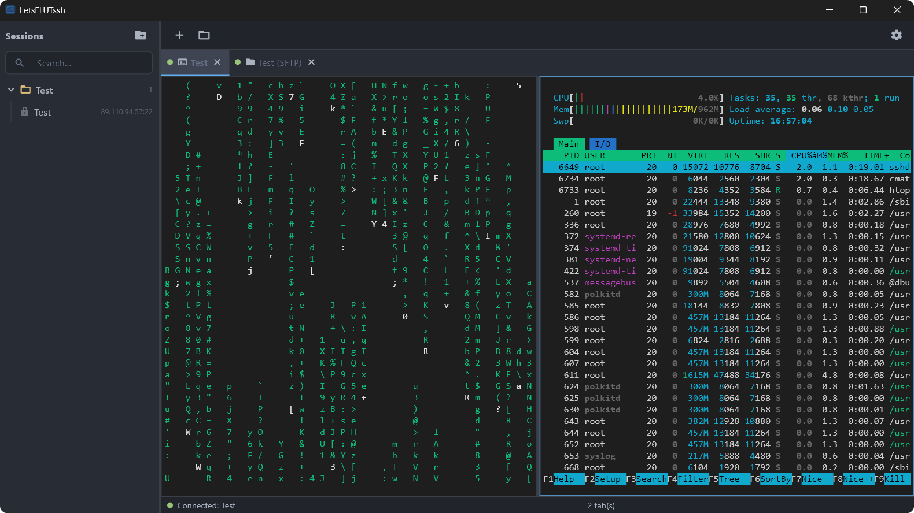
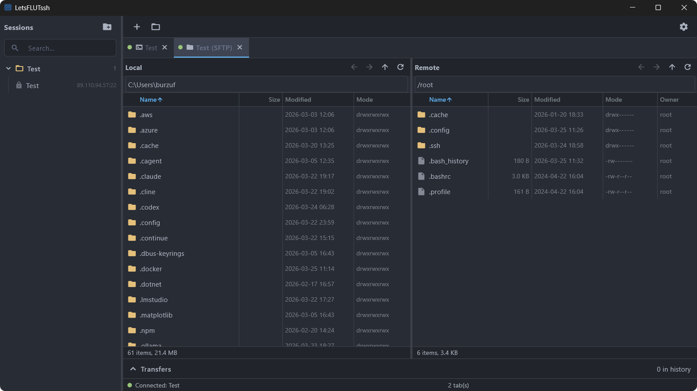

# LetsFLUTssh

 
 

 

 

> **Disclaimer:** This is a functional neuroslop pet project — built with AI assistance under the supervision and direction of a real developer, for personal use, self-education, and fun. Use at your own risk.

Lightweight cross-platform SSH/SFTP client with GUI, built with Flutter.

Open-source alternative to Xshell and Termius — runs on Windows, Linux, macOS, Android, and iOS.

## Tech Stack

- **Flutter** — cross-platform UI framework (Skia/Impeller rendering)
- **dartssh2** — SSH2 protocol implementation (auth, shell, SFTP, port forwarding)
- **xterm.dart** — terminal emulator widget (VT100/xterm, 256-color, RGB, mouse)
- **Riverpod** — state management
- **pointycastle** — AES-256-GCM encryption (pure Dart, no native deps)
- **permission_handler** — runtime permission requests (Android storage access)

## Features

### SSH Terminal

- Full xterm/VT100 terminal emulation (256-color, RGB, curses apps)
- Password, key file, PEM text, and SSH agent authentication
- Keep-alive and auto-reconnect
- Scrollback buffer (configurable, default 5000 lines)
- Text selection, copy/paste
- Mouse reporting for TUI apps (htop, vim, mc)
- Tiling / split panes — split vertically or horizontally (like tmux), recursive nesting, drag-to-resize
- Terminal search (Ctrl+Shift+F) with match highlighting
- Right-click context menu (Copy / Paste / Split / Close Pane)

### Session Manager

- Save and organize SSH sessions
- Nested group folders (e.g. `Production/Web/nginx1`) with create/rename/delete
- Search and filter by label, group, host, user
- Unified New Session dialog (connect without saving, or save & connect)
- Drag & drop sessions and folders to reorganize
- Context menu: SSH, SFTP, edit, delete, duplicate
- Indent guide lines for nested groups
- Host key verification (TOFU) with SHA256 fingerprint dialog

### SFTP File Browser

- Dual-pane layout: local files | remote files
- Upload, download, rename, delete, create folders
- Drag & drop between panes and from OS file manager
- Rubber-band (marquee) multi-select
- Transfer queue with parallel workers
- Transfer history with Local/Remote paths, size, duration details
- Sortable columns (name, size, modified, mode, owner) with column dividers
- Mouse back/forward button navigation

### Multi-Tab Interface

- Multiple terminal and SFTP tabs
- Drag-to-reorder tabs
- Multiple SFTP tabs per SSH connection
- SFTP-only connections (no terminal)

### Security & Data Portability

- Credentials encrypted with AES-256-GCM (stored separately from session metadata)
- File permissions restricted (chmod 600) on Unix systems
- Known hosts verification (TOFU) — explicit user confirmation required, no auto-accept
- Data export/import to `.lfs` archive (ZIP + AES-256-GCM, PBKDF2-SHA256 600k iterations)
- Import modes: merge (add new) or replace (overwrite all)
- Auto-migration from plaintext to encrypted storage on upgrade

### Appearance

- **OneDark theme** — Atom OneDark Pro color palette (dark mode)
- **One Light theme** — matching light variant
- System theme auto-detection
- Configurable font size, scrollback, keep-alive, and more
- About section with version and GitHub link

### Mobile

- Bottom navigation (Sessions / Terminal / Files)
- SSH virtual keyboard — Esc, Tab, Ctrl, Alt, arrows, F1-F12, sticky modifiers
- Pinch-to-zoom terminal font size
- Single-pane SFTP with Local/Remote toggle
- Long-press context menu for session management (connect, edit, delete, move to folder)
- Long-press selection mode with bulk actions in file browser
- Swipe left/right to switch navigation tabs
- Deep link: `letsflutssh://connect?host=X&user=Y`
- Open SSH key files (.pem/.key) and .lfs archives directly from file manager

### Cross-Platform

- **Windows:** 10+ (x64) — **primary test platform**
- **Linux:** x64, GTK 3 (Ubuntu 20.04+, Fedora 33+, Arch, etc.) — occasionally tested
- **macOS:** 10.15 Catalina+ (universal — Intel + Apple Silicon) — occasionally tested
- **Android:** 7.0 Nougat+ (API 24) — **primary test platform**
- **iOS:** 13.0+ — **not tested** (builds are provided as-is)
- Native rendering via Flutter (Skia/Impeller) — no WebView

## Installation

### Pre-built Binaries

Download from [Releases](https://github.com/Llloooggg/LetsFLUTssh/releases):

- **Linux:** AppImage, .deb, tar.gz
- **Windows:** EXE installer, portable zip
- **macOS:** dmg, tar.gz
- **Android:** APK (arm64, arm, x64)

To build from source, see [CONTRIBUTING.md](docs/CONTRIBUTING.md).

## Security

See [SECURITY.md](docs/SECURITY.md) for vulnerability reporting and security scope.

## License

GPL-3.0 — see [LICENSE](LICENSE) for details.

## Contributing

Contributions welcome — see [CONTRIBUTING.md](docs/CONTRIBUTING.md) for build instructions, dev workflow, and PR guidelines.
