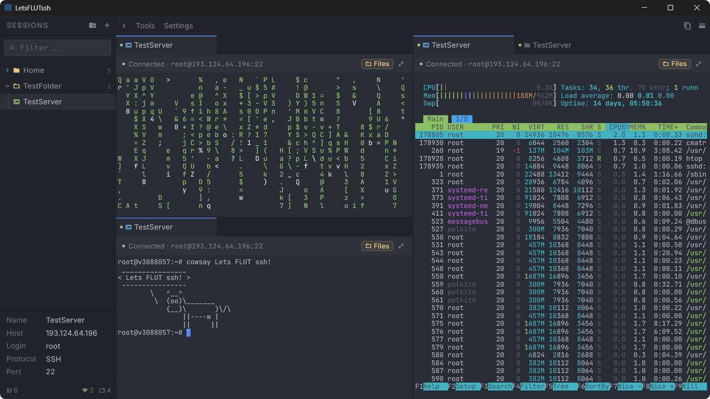
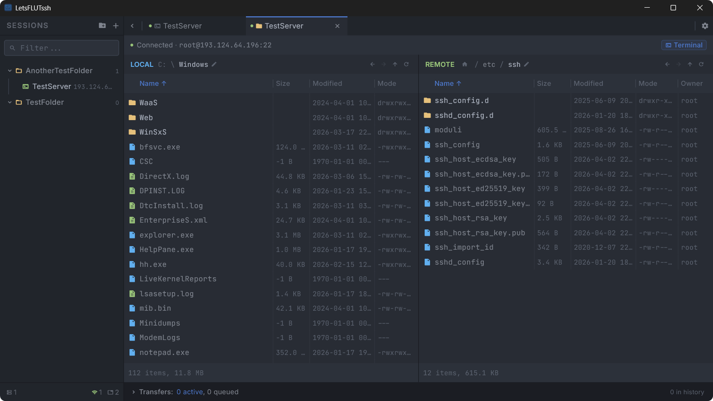

# LetsFLUTssh

 
 

 

 

> **Disclaimer:** This is a functional neuroslop pet project — built with AI assistance under the supervision and direction of a real developer, for personal use, self-education, and fun. Use at your own risk.

Lightweight cross-platform SSH/SFTP client with GUI, built with Flutter.

Open-source alternative to Xshell and Termius — runs on Windows, Linux, macOS, Android, and iOS.

## Features

- **SSH** — xterm/VT100 terminal (256-color, RGB, mouse), tiling with recursive splits, search, multi-tab, keep-alive & reconnect
- **SFTP** — dual-pane file browser, drag & drop, transfer queue with parallel workers
- **Sessions** — tree with nested folders, search, drag & drop, QR code sharing, host key verification
- **Snippets** — reusable command snippets, pin to sessions, one-click terminal injection (now also reachable from the mobile SSH keyboard bar)
- **Tags** — color-coded tags for sessions and folders, visual dots in tree view; assign right inside Edit Session
- **Security** — encrypted SQLite storage (AES-256-GCM via SQLite3MultipleCiphers), OS keychain or master password, encrypted `.lfs` export/import, TOFU host key verification
- **Import/export** — encrypted `.lfs` archives, QR sharing for small exports, paste-deep-link import (no camera), in-app QR scanner (AndroidX CameraX + ZXing on Android, AVFoundation on iOS — no Google Play Services / MLKit)
- **Mobile** — virtual keyboard (Esc/Tab/Ctrl/Alt/F1-F12), pinch-to-zoom, deep links
- **Auth** — password, key file, PEM text
- **Themes** — OneDark / One Light, system auto-detection

### Platforms

| Platform | Version | Status |
|---|---|---|
| **Windows** | 10+ (x64) | primary test platform |
| **Android** | 7.0+ (API 24) | primary test platform |
| **Linux** | x64, GTK 3 | occasionally tested |
| **macOS** | 10.15+ (Intel + Apple Silicon) | occasionally tested |
| **iOS** | 13.0+ | not built |

## Installation

### Pre-built Binaries

Download from [Releases](https://github.com/Llloooggg/LetsFLUTssh/releases):

- **Linux:** AppImage, .deb, tar.gz
  > Optional: `libsecret-1-0` for OS keychain encryption (`sudo apt install libsecret-1-0`). Without it the app works fine — only plaintext and master password modes are available.
- **Windows:** EXE installer, portable zip
- **macOS:** dmg, tar.gz
- **Android:** APK (arm64, arm, x64)

To build from source, see [CONTRIBUTING.md](docs/CONTRIBUTING.md).

## Security

See [SECURITY.md](docs/SECURITY.md) for vulnerability reporting and security scope.

## License

GPL-3.0 — see [LICENSE](LICENSE) for details.

## Architecture

For detailed technical documentation — module structure, data models, data flow diagrams, API references, design decisions, and CI/CD pipeline — see [ARCHITECTURE.md](docs/ARCHITECTURE.md).

## Contributing

Contributions welcome — see [CONTRIBUTING.md](docs/CONTRIBUTING.md) for build instructions, dev workflow, and PR guidelines.

## Support

If you find this project useful, you can support its development:

