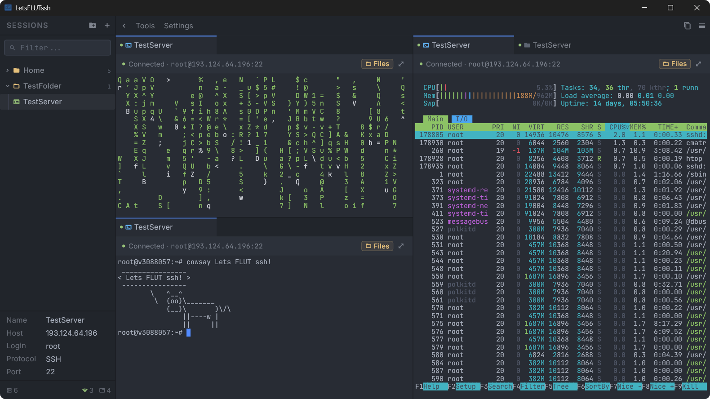
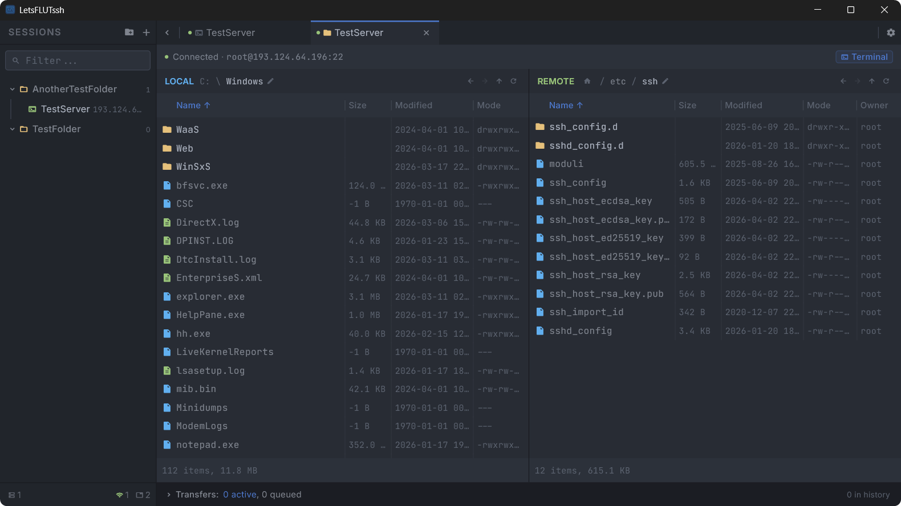

# LetsFLUTssh

[](https://github.com/Llloooggg/LetsFLUTssh/releases)
[](https://github.com/Llloooggg/LetsFLUTssh)
[](LICENSE)<br>
[](https://www.bestpractices.dev/projects/12283)<br>
[](https://github.com/Llloooggg/LetsFLUTssh/actions/workflows/ci.yml)
[](https://github.com/Llloooggg/LetsFLUTssh/actions/workflows/cfl-fuzz.yml)
[](https://github.com/Llloooggg/LetsFLUTssh/actions/workflows/build-release.yml)
<br>
[](https://github.com/Llloooggg/LetsFLUTssh/actions/workflows/osv.yml)
[](https://github.com/Llloooggg/LetsFLUTssh/actions/workflows/codeql.yml)
[](https://github.com/Llloooggg/LetsFLUTssh/actions/workflows/semgrep.yml)<br>
[](https://sonarcloud.io/summary/new_code?id=Llloooggg_LetsFLUTssh)
[](https://sonarcloud.io/summary/new_code?id=Llloooggg_LetsFLUTssh)
[](https://sonarcloud.io/summary/new_code?id=Llloooggg_LetsFLUTssh)
[](https://scorecard.dev/viewer/?uri=github.com/Llloooggg/LetsFLUTssh)

> **Disclaimer:** This is a functional neuroslop pet project — built with AI assistance under the supervision and direction of a real developer, for personal use, self-education, and fun. Use at your own risk.

Lightweight cross-platform SSH/SFTP client with GUI, built with Flutter.

Open-source alternative to Xshell and Termius — runs on Windows, Linux, macOS, Android, and iOS.




## Features

- **SSH** — xterm/VT100 terminal (256-color, RGB, mouse), tiling with recursive splits, search, multi-tab, keep-alive & reconnect
- **SFTP** — dual-pane file browser, drag & drop, transfer queue with parallel workers
- **Sessions** — tree with nested folders, search, drag & drop, QR code sharing, host key verification
- **Snippets** — reusable command snippets, pin to sessions, one-click terminal injection (now also reachable from the mobile SSH keyboard bar)
- **Tags** — color-coded tags for sessions and folders, visual dots in tree view; assign right inside Edit Session
- **Security** — encrypted SQLite storage via SQLCipher 4.x (AES-256-CBC for confidentiality + HMAC-SHA512 per-page MAC + 256 000 PBKDF2-SHA512 iterations on the page-cipher key; bundled in-tree via `rusqlite`'s `bundled-sqlcipher-vendored-openssl` Cargo feature — both SQLCipher and the OpenSSL it depends on are statically linked, no separate native blob, no submodule, no system-library prereqs on any cross-compile target). Three security tiers with a separate Paranoid alternative (T0 plaintext / T1 OS keychain / T2 hardware-bound key in Secure Enclave, StrongBox, or TPM 2.0 / Paranoid: master-password-derived, no OS storage). Two orthogonal modifiers on T1 / T2: password (pre-vault HMAC gate) and biometric (OS-biometric shortcut releasing the stored password — never a replacement for it). Atomic re-encryption on every tier or modifier change. Page-locked in-memory secrets (`mlock` / `VirtualLock`), startup process hardening (`prctl PR_SET_DUMPABLE`, `ptrace PT_DENY_ATTACH`). Argon2id-only `.lfs` export / import. TOFU host-key verification. Full threat model in [SECURITY.md](docs/SECURITY.md)
- **Import/export** — encrypted `.lfs` archives, QR sharing for small exports, paste-deep-link import (no camera), in-app QR scanner (AndroidX CameraX + ZXing on Android, AVFoundation on iOS — no Google Play Services / MLKit)
- **Mobile** — virtual keyboard (Esc/Tab/Ctrl/Alt/F1-F12), terminal font slider in Settings, deep links
- **Auth** — password, key file, PEM text
- **Themes** — OneDark / One Light, system auto-detection

### Platforms

| Platform | Version | Status |
|---|---|---|
| **Windows** | 10+ (x64 + ARM64)¹ | primary test platform — x64 fully tested, ARM64 builds via CI but binary may run through Prism on Snapdragon X if Flutter SDK fell back to x64 Dart |
| **Android** | 9.0+ (API 28) | primary test platform — three per-ABI APKs (`arm64`, `arm32`, `x64`) |
| **Linux** | x64 + ARM64, GTK 3 | occasionally tested — both architectures shipped; ARM64 covers Raspberry Pi 5, Asahi Linux, AWS Graviton |
| **macOS** | 10.15+ (Intel + Apple Silicon) | occasionally tested — universal binary in one `.dmg` / `.tar.gz` |
| **iOS** | 13.0+ | **unsigned `.ipa` shipped** — re-sign locally to install (no Apple Developer Program account on the project side) |

¹ Windows 10 RTM launches, but the optional biometric-unlock path (Windows Hello via `Windows.Security.Credentials.UI.UserConsentVerifier`, called directly from Rust through the `windows` crate) needs Windows 10 version **1809 (build 17763)** or newer because it calls into WinRT Hello APIs introduced in that release.

## Installation

Download the build for your platform from [Releases](https://github.com/Llloooggg/LetsFLUTssh/releases), then follow the per-platform steps below. To build from source instead, see [CONTRIBUTING.md](docs/CONTRIBUTING.md).

> **Looking for usage docs?** See [`docs/USER_GUIDE.md`](docs/USER_GUIDE.md) — step-by-step walkthroughs for every shipped feature (sessions, terminal, SFTP, port forwarding, ProxyJump, snippets, recordings, security tiers, import/export) with worked examples and platform notes.

### Linux

Available formats: **AppImage**, **.deb**, **tar.gz** — each shipped per architecture as `letsflutssh-<version>-linux-x64.<ext>` (Intel / AMD / Linux on x86_64) or `-linux-arm64.<ext>` (aarch64 — Raspberry Pi 5, Asahi Linux, AWS Graviton, Ampere Altra). Pick by `uname -m` (`x86_64` → `linux-x64`, `aarch64` → `linux-arm64`).

```bash
# AppImage — single self-contained file, no install
chmod +x LetsFLUTssh-*.AppImage
./LetsFLUTssh-*.AppImage

# .deb — Debian / Ubuntu / Mint
sudo apt install ./letsflutssh_*.deb

# tar.gz — portable, extract anywhere
tar xzf letsflutssh-*.tar.gz
cd letsflutssh && ./letsflutssh
```

> Optional: `libsecret-1-0` for the T1 OS-keychain tier (`sudo apt install libsecret-1-0`). Without it the app still works — the wizard falls back to T0 plaintext, T2 hardware (if a TPM 2.0 is present + `tpm2-tools` installed), or the Paranoid master-password alternative. Biometric modifier on Linux additionally requires `fprintd` with at least one enrolled finger.

> Optional: `fprintd` for biometric unlock in master-password mode (fingerprint reader required). Install + enrol one finger once, the Settings toggle picks it up on next launch. Without it the biometric toggle stays disabled with a clear reason; master-password unlock keeps working.
>
> ```bash
> # Debian / Ubuntu / Mint
> sudo apt install fprintd libpam-fprintd
> # Fedora
> sudo dnf install fprintd fprintd-pam
> # Arch / Manjaro
> sudo pacman -S fprintd
> # openSUSE
> sudo zypper install fprintd fprintd-pam
>
> # one-off: enrol a finger (any distro)
> fprintd-enroll
> ```
>
> Optional (upgrades the biometric-unlock backing from software to TPM2-hardware): a TPM 2.0 chip (`ls /dev/tpmrm0` → exists) plus **either** `tpm2-tools` (the historical subprocess path, still the default) **or** `libtss2-dev` (for the native `tss-esapi` Rust backend, opt-in via `LFS_TPM_BACKEND=native` env var). Both backends produce byte-identical sealed envelopes — choose the subprocess path for simplicity, the native path for lower per-operation latency. The Settings biometric row labels itself `Hardware-backed` when both TPM2 and `fprintd` are available; any biometric-enrolment change invalidates the sealed blob the next time around (equivalent to Apple's `biometryCurrentSet`).
>
> ```bash
> # Debian / Ubuntu / Mint
> sudo apt install tpm2-tools
> # Fedora
> sudo dnf install tpm2-tools
> # Arch / Manjaro
> sudo pacman -S tpm2-tools
> # openSUSE
> sudo zypper install tpm2.0-tools
>
> # one-off: make sure the current user can talk to the TPM
> sudo usermod -aG tss "$USER"
> # log out + back in for the group change to take effect
> ```

### Windows

Available formats:
- **`letsflutssh-<version>-windows-x64-setup.exe`** — Inno Setup installer for Intel / AMD x86_64.
- **`letsflutssh-<version>-windows-x64.zip`** — portable zip, x64.
- **`letsflutssh-<version>-windows-arm64.zip`** — portable zip for Snapdragon X / Surface Pro X / Windows-on-ARM. The .exe inside may be either native ARM64 (preferred — runs at full speed) or x64 (runs via the OS's Prism emulation layer, ~10-20% slower for compute-heavy work but still fully functional). Both ship under the same artefact name because Windows 11 ARM64 runs both transparently.

- **Installer:** double-click the `.exe`, follow the wizard. Adds Start Menu entry and uninstaller.
- **Portable:** extract the zip anywhere, run `letsflutssh.exe` directly. No install, no registry writes.

### macOS

Available formats: **.dmg**, **tar.gz**. Universal binary (Intel + Apple Silicon).

- **.dmg:** open, drag `LetsFLUTssh.app` to `/Applications/`.
- **tar.gz:** extract, move `LetsFLUTssh.app` to `/Applications/`.

The build is **ad-hoc signed**, not Developer-ID signed (no Apple account). On first launch macOS Gatekeeper will block it — right-click the app and choose **Open**, then confirm. Or remove the quarantine attribute once:

```bash
xattr -dr com.apple.quarantine /Applications/LetsFLUTssh.app
```

**Keychain tier (T1) is enabled from inside the app.** The ad-hoc Code Directory hash changes every release, and macOS Keychain Services bind stored items to that hash — without a stable signing identity the first T1 write fails with `errSecMissingEntitlement` and the wizard shows T1 greyed out. The app handles the re-sign itself: the first-launch wizard offers an **Enable Keychain** action that creates a personal self-signed cert in your login keychain, trusts it for `codeSign` only, and re-signs the installed bundle under that cert. macOS surfaces a native password prompt once (the trust-DB write is auth-gated by the OS); subsequent updates re-sign silently using the same cert.

The cert stays in your login keychain and is reused across releases, so T1-stored secrets survive updates. A "Reset secure identity" action in Settings removes the cert + trust entry when you want to rotate; if you never enable T1, no cert is created and nothing is modified outside the app's own data dir.

If you do not want T1 unlock, the **Paranoid** tier (master password, Argon2id-derived DB key) works with no cert and gives stronger encryption at the cost of a password prompt on every launch.

### Android

Available format: **APK**, shipped as three per-ABI variants named `letsflutssh-<version>-android-arm64.apk` (64-bit ARM — pick this for any modern device), `-android-arm32.apk` (32-bit ARMv7), and `-android-x64.apk` (emulator / x86_64 tablets).

In Android Settings, enable **Install unknown apps** for the file manager or browser you'll use to open the APK. Tap the `.apk` file and confirm. No Google Play Services required, no MLKit, no GPS dependency.

### iOS

Available format: **unsigned `.ipa`** — `letsflutssh-<version>-ios-unsigned.ipa`. The project does not have an Apple Developer Program account, so the `.ipa` ships without a code-signing identity and **cannot be installed as-is**. Two paths to install on a device:

- **Free Apple ID + Xcode (personal use, 7-day cert).** Drop the `.app` bundle from inside the `.ipa` (`unzip ...ipa` → `Payload/Runner.app`) into Xcode → *Window → Devices and Simulators*. Xcode signs with your free personal team certificate and pushes to the connected device. The signature expires after 7 days; re-sign + reinstall to renew.
- **Paid Apple Developer Program ($99/yr).** Sign the `.app` bundle with your developer cert, repack as `.ipa`, and install via Xcode, TestFlight, or any standard MDM channel. Sketch:
  ```bash
  unzip letsflutssh-<version>-ios-unsigned.ipa
  codesign -f -s "Apple Development: <your name>" \
           --entitlements <your-entitlements.plist> \
           Payload/Runner.app
  zip -r resigned.ipa Payload/
  ```

The CI artifact compiles against iOS 13.0+ (matches the platform table above).

### User Data & Uninstalling

Sessions, credentials, known hosts, snippets, tags, and app config live in the OS per-app data directory (`logs/` subfolder for logs, `updates/` subfolder for cached update binaries — deleted after install). The data directory is **separate from the app binary**, so removing the app does **not** wipe data by design (protects against accidental loss on reinstall / upgrade or release-key rotation). For a clean reset, delete the data path manually after uninstalling.

| Platform | Data path | Uninstall app | Data wiped on uninstall? |
|---|---|---|---|
| **Linux** | `~/.local/share/com.llloooggg.letsflutssh/` | AppImage: delete the file • .deb: `sudo apt remove letsflutssh` • tar.gz: delete the extracted folder | No — wipe data path manually |
| **macOS** | `~/Library/Application Support/com.llloooggg.letsflutssh/` | Drag `/Applications/LetsFLUTssh.app` to Trash | No — wipe data path manually |
| **Windows** | `%APPDATA%\com.llloooggg.letsflutssh\` | Installer: Settings → Apps → LetsFLUTssh → Uninstall (offers an "Also delete user data" checkbox, off by default) • Portable: delete the extracted folder | Only if installer checkbox ticked |
| **Android** | sandbox (no user-reachable path) | Long-press app icon → Uninstall (or Settings → Apps → LetsFLUTssh → Uninstall) | Yes — sandbox is wiped |
| **iOS** | sandbox (no user-reachable path) | Long-press icon → Remove App → Delete App | Yes — sandbox is wiped |

> [!WARNING]
> Wiping the data directory deletes **all** saved sessions and any unexported credentials. Export your data first via **Settings → Export** if you want to keep it.

## Security

See [SECURITY.md](docs/SECURITY.md) for vulnerability reporting and security scope.

## License

GPL-3.0 — see [LICENSE](LICENSE) for details.

## Architecture

For detailed technical documentation — module structure, data models, data flow diagrams, API references, design decisions, and CI/CD pipeline — see [ARCHITECTURE.md](docs/ARCHITECTURE.md).

## Contributing

Contributions welcome — see [CONTRIBUTING.md](docs/CONTRIBUTING.md) for build instructions, dev workflow, and PR guidelines.

## Support

If you find this project useful, you can support its development:

[](https://www.donationalerts.com/r/llloooggg)
