# LetsFLUTssh — Architecture & Technical Reference

## Table of Contents

- [1. High-Level Overview](#1-high-level-overview)
- [2. Module Map](#2-module-map)
- [3. Core Modules](#3-core-modules)
  - [3.1 SSH (`core/ssh/`)](#31-ssh-coressh)
  - [3.2 SFTP (`core/sftp/`)](#32-sftp-coresftp)
  - [3.3 Transfer Queue (`core/transfer/`)](#33-transfer-queue-coretransfer)
  - [3.4 Session Management (`core/session/`)](#34-session-management-coresession)
  - [3.5 Connection Lifecycle (`core/connection/`)](#35-connection-lifecycle-coreconnection)
  - [3.6 Security & Encryption (`core/security/`)](#36-security--encryption-coresecurity)
  - [3.7 Configuration (`core/config/`)](#37-configuration-coreconfig)
  - [3.8 Deep Links (`core/deeplink/`)](#38-deep-links-coredeeplink)
  - [3.9 Import (`core/import/`)](#39-import-coreimport)
  - [3.10 Update (`core/update/`)](#310-update-coreupdate)
  - [3.11 Keyboard Shortcuts (`core/shortcut_registry.dart`)](#311-keyboard-shortcuts-coreshortcut_registrydart)
- [4. State Management — Riverpod](#4-state-management--riverpod)
  - [4.1 Provider Dependency Graph](#41-provider-dependency-graph)
  - [4.2 Provider Catalog](#42-provider-catalog)
- [5. Feature Modules](#5-feature-modules)
  - [5.1 Terminal with Tiling (`features/terminal/`)](#51-terminal-with-tiling-featuresterminal)
  - [5.2 File Browser (`features/file_browser/`)](#52-file-browser-featuresfile_browser)
  - [5.3 Session Manager UI (`features/session_manager/`)](#53-session-manager-ui-featuressession_manager)
  - [5.4 Tab System (`features/tabs/`)](#54-tab-system-featurestabs)
  - [5.5 Settings (`features/settings/`)](#55-settings-featuressettings)
  - [5.6 Mobile (`features/mobile/`)](#56-mobile-featuresmobile)
- [6. Widgets — Public API Reference](#6-widgets--public-api-reference)
- [7. Utilities — Public API Reference](#7-utilities--public-api-reference)
- [8. Theme System](#8-theme-system)
- [9. Data Flow Diagrams](#9-data-flow-diagrams)
  - [9.1 SSH Connection Flow](#91-ssh-connection-flow)
  - [9.2 SFTP Init Flow](#92-sftp-init-flow)
  - [9.3 Session CRUD Flow](#93-session-crud-flow)
  - [9.4 File Transfer Flow](#94-file-transfer-flow)
- [10. Data Models](#10-data-models)
- [11. Persistence & Storage](#11-persistence--storage)
- [12. Platform-Specific Behavior](#12-platform-specific-behavior)
- [13. Security Model](#13-security-model)
- [14. Testing Patterns & DI Hooks](#14-testing-patterns--di-hooks)
- [15. CI/CD Pipeline](#15-cicd-pipeline)
  - [15.1 Workflow Graph](#151-workflow-graph)
  - [15.2 Workflow Catalog](#152-workflow-catalog)
  - [15.3 Makefile Targets](#153-makefile-targets)
- [16. Design Decisions & Rationale](#16-design-decisions--rationale)
  - [16.1 Architecture Choices](#161-architecture-choices)
  - [16.2 API Gotchas](#162-api-gotchas)
  - [16.3 Security Decisions](#163-security-decisions)
  - [16.4 Platform Decisions](#164-platform-decisions)
- [17. Dependencies](#17-dependencies)

---

## 1. High-Level Overview

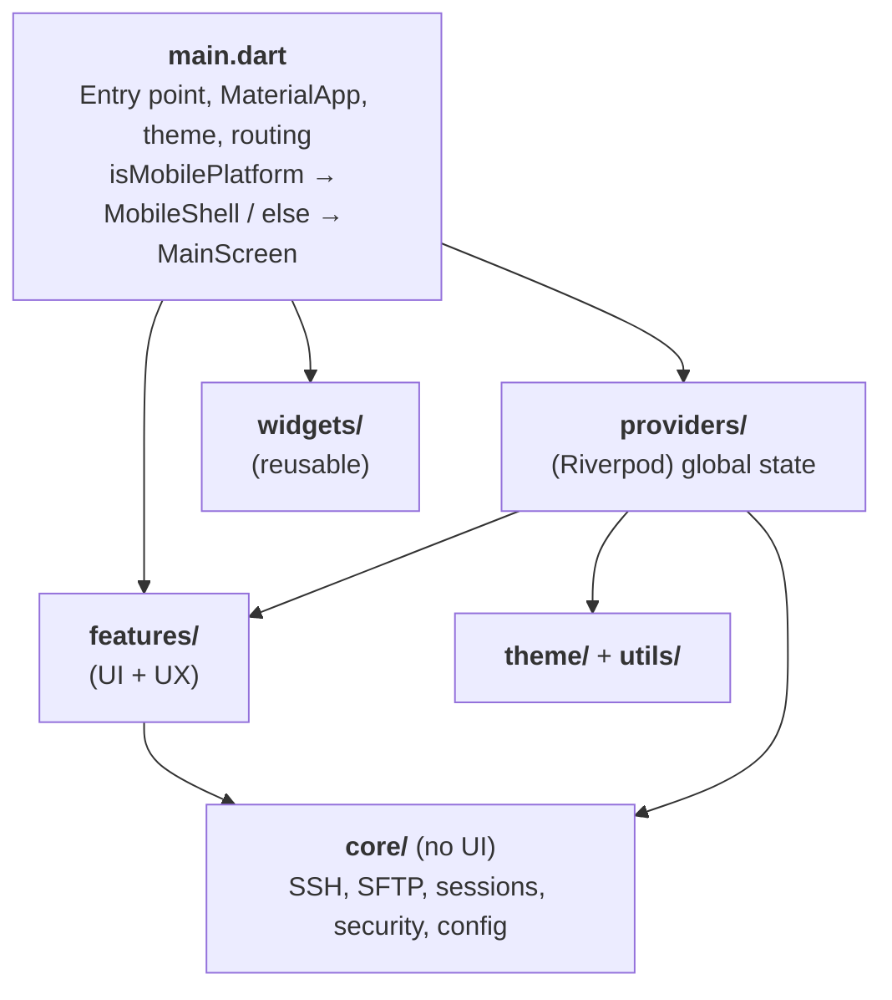

**Layering principle:** `core/` does not import Flutter. `features/` accesses `core/` through `providers/`. `widgets/` are reusable UI components with no business logic.

**Self-contained-binary principle:** the released artefact must be **runnable by an end-user with zero manual setup beyond extracting / installing the bundle.** No "first install Python", no "first install JRE", no "first apt install …" as a hard requirement. External OS-level dependencies are allowed **only** when both conditions hold:

1. The app **degrades gracefully** without the dependency, with a clear in-UI message naming what's missing and what's lost (canonical example: Linux without `libsecret-1-0` → OS-keychain mode disabled, plaintext + master-password modes still available).
2. The user-facing `README.md` **Installation** section documents how to install the optional dependency per platform with a copy-pasteable command.

Order of preference when a feature needs OS capability: **bundle it** (e.g. SQLite via `sqlite3` build hooks, QR scanner via system frameworks `AVFoundation` / `AndroidX CameraX`) > **fall back to a built-in alternative** (e.g. master password instead of keychain) > **document an optional install** (last resort, only if the first two are impossible). Never ship a build that hard-requires a manual install step.

**Reuse principle:** the codebase favours **shared modules over local one-offs** at every layer, not just UI. Repeated logic lives in named, parameterised primitives that can be extended; a second caller is the trigger to extract a shared helper, a third caller makes it mandatory. Concrete patterns this principle has produced:

- **UI primitives** in `lib/widgets/` — `AppIconButton`, `AppDialog` (+ `AppDialogHeader`/`Footer`/`Action`), `HoverRegion`, `AppDataRow`, `AppDataSearchBar`, `StyledFormField`, `SortableHeaderCell`, `ColumnResizeHandle`, `StatusIndicator`, `MobileSelectionBar`. No widget that has more than one caller is duplicated.
- **Theme primitives** in `lib/theme/` — `AppTheme.radius{Sm,Md,Lg}`, `AppTheme.barHeight*`, `AppTheme.controlHeight*`, `AppTheme.itemHeight*`, `AppTheme.*ColWidth`, `AppFonts.{tiny,xxs,xs,sm,md,lg,xl}`. Hardcoded sizes/radii/heights are treated as bugs.
- **Cross-feature mixins and helpers** in `lib/core/**` — `SftpBrowserMixin` (shared SFTP init/upload/download for desktop + mobile browsers), `key_file_helper.dart` (PEM detection shared by importer / `~/.ssh` scanner / file picker), `breadcrumb_path.dart`, `column_widths.dart`, `progress_writer.dart`, `shell_helper.dart`. New cross-cutting logic gets a `*_helper.dart` or mixin instead of being inlined per call site.
- **DAO + Store layering** — every persisted entity has the same `Store → DAO` shape ([§11](#11-persistence--storage)); a new entity follows the existing template, not its own ad-hoc pattern.

The practical upshot: before adding a widget, helper, style constant, or store, search `lib/widgets/`, `lib/theme/`, and `lib/core/**` for an existing equivalent; if behaviour is close but not identical, extend the shared primitive (add a parameter) rather than fork it. Local one-offs are allowed only when the shared pattern genuinely doesn't fit, and the reason should be obvious from the code.

---

## 2. Module Map

```
lib/
├── main.dart                         # Entry point
├── core/                             # Business logic (no Flutter imports)
│   ├── db/                           # Drift database (SQLite + SQLite3MultipleCiphers)
│   │   ├── database.dart             # AppDatabase definition + lazy DAO getters
│   │   ├── database.g.dart           # Drift codegen (do not edit)
│   │   ├── database_opener.dart      # Database initialization + encryption setup
│   │   ├── tables.dart               # All table definitions
│   │   ├── mappers.dart              # Domain ↔ DB conversion, folder path↔tree
│   │   └── dao/                      # Data Access Objects
│   │       ├── session_dao.dart      # Session CRUD
│   │       ├── folder_dao.dart       # Folder tree CRUD
│   │       ├── ssh_key_dao.dart      # SSH key CRUD
│   │       ├── known_host_dao.dart   # Known hosts CRUD
│   │       ├── config_dao.dart       # Single-row config blob
│   │       ├── tag_dao.dart          # Tags + M2M junctions
│   │       ├── snippet_dao.dart      # Snippets + session linking
│   │       └── sftp_bookmark_dao.dart # SFTP path bookmarks
│   ├── ssh/                          # SSH client, config, TOFU, errors
│   ├── sftp/                         # SFTP operations, file models, FileSystem
│   ├── transfer/                     # File transfer queue
│   ├── session/                      # Session model, persistence, tree, QR, history
│   ├── connection/                   # Connection lifecycle, progress tracking
│   ├── security/                     # AES-256-GCM, master password, keychain
│   ├── migration/                    # Versioned-artefact migration framework (runner, Artefact/Migration interfaces, VersionedBlob envelope, SchemaVersions). Full description: §3.7
│   ├── config/                       # App configuration (file-based, loaded before DB)
│   ├── snippets/                     # Snippet model + SnippetStore
│   ├── tags/                         # Tag model + TagStore
│   ├── deeplink/                     # Deep link handling
│   ├── import/                       # Data import (.lfs, key files)
│   ├── single_instance/              # Single-instance lock (desktop)
│   ├── update/                       # Update checking
│   └── shortcut_registry.dart        # Centralized keyboard shortcut definitions
├── features/                         # UI modules
│   ├── terminal/                     # Terminal with tiling
│   ├── file_browser/                 # Dual-pane SFTP browser
│   ├── session_manager/              # Session management panel
│   ├── snippets/                     # Snippet manager + terminal picker
│   ├── tags/                         # Tag manager + assignment dialog
│   ├── tools/                        # Desktop Tools dialog (SSH Keys, Snippets, Tags)
│   ├── tabs/                         # Tab model (TabEntry, TabKind)
│   ├── workspace/                    # Workspace tiling (panels, tab bars, drop zones)
│   ├── settings/                     # Settings + export/import
│   └── mobile/                       # Mobile version (bottom nav)
├── l10n/                             # Internationalization (15 languages: en, ru, zh, de, ja, pt, es, fr, ko, ar, fa, tr, vi, id, hi)
├── providers/                        # Riverpod providers (global state)
├── widgets/                          # Reusable UI components
│   ├── app_dialog.dart              # Unified dialog shell, header, footer, action buttons, progress dialog
│   ├── app_icon_button.dart         # Rectangular hover button (replaces Material IconButton)
│   ├── app_bordered_box.dart        # Bordered container with guaranteed radius
│   ├── app_data_row.dart            # Shared row for list / table dialogs — icon + title + secondary + tertiary + trailing actions, min-height-padded
│   ├── app_data_search_bar.dart     # Shared search input for list / table dialogs (known hosts, snippets, tags)
│   ├── app_divider.dart             # Standardized 1px divider
│   ├── app_shell.dart               # Desktop layout shell (toolbar, sidebar, body, status bar)
│   ├── clipped_row.dart             # Overflow-clipping Row replacement
│   ├── column_resize_handle.dart    # Draggable column-resize handle for table headers
│   ├── confirm_dialog.dart          # Confirmation dialog (delete, destructive actions)
│   ├── connection_progress.dart     # Terminal-styled progress for non-terminal tabs
│   ├── context_menu.dart            # Custom context menu with keyboard nav
│   ├── error_state.dart             # Error display with retry/secondary actions
│   ├── file_conflict_dialog.dart    # Destination-exists prompt (Skip / Keep both / Replace / Cancel + apply-to-all)
│   ├── form_submit_chain.dart       # FocusNode + Enter-to-next/submit wiring for multi-field input dialogs
│   ├── host_key_dialog.dart         # TOFU dialogs (new host / key changed)
│   ├── passphrase_dialog.dart      # Interactive SSH key passphrase prompt
│   ├── unlock_dialog.dart          # Master password unlock dialog (startup)
│   ├── hover_region.dart            # MouseRegion + GestureDetector replacement
│   ├── lfs_import_dialog.dart       # .lfs import password + mode dialog
│   ├── lfs_import_preview_dialog.dart # .lfs archive preview before import
│   ├── link_import_preview_dialog.dart # letsflutssh:// link / QR payload preview (flags + merge/replace)
│   ├── data_checkboxes.dart          # Shared collapsible checkbox grid used by export + import dialogs
│   ├── marquee_mixin.dart           # Drag-select mixin for list/table widgets
│   ├── mobile_selection_bar.dart    # Mobile bulk-action toolbar
│   ├── mode_button.dart             # Shared pill-shaped toggle button (import mode)
│   ├── readonly_terminal_view.dart  # Read-only terminal display widget
│   ├── sortable_header_cell.dart    # Column header with sort indicator
│   ├── split_view.dart              # Horizontal resizable split
│   ├── status_indicator.dart        # Icon + count indicator with tooltip
│   ├── styled_form_field.dart       # Shared form field (StyledFormField, FieldLabel, StyledInput)
│   ├── threshold_draggable.dart     # Draggable with minimum distance threshold
│   ├── tag_dots.dart                # Colored tag dots for session/folder tree rows
│   ├── toast.dart                   # Stacked notification toasts
│   ├── unified_export_controller.dart # Headless selection / options / sizing
│   └── unified_export_dialog.dart   # Unified QR and .lfs export dialog
├── theme/                            # OneDark / One Light palettes
└── utils/                            # Utilities: logger, format, platform
```

---

## 3. Core Modules

### 3.1 SSH (`core/ssh/`)

#### Files and responsibilities

| File | Class/Function | Purpose |
|------|---------------|---------|
| `ssh_client.dart` | `SSHConnection` | Wrapper over dartssh2: connect, auth, openShell, resize, keepalive, disconnect |
| `ssh_config.dart` | `SSHConfig` | Config model (host, port, user, password, keyPath, keyData, passphrase, keepAliveSec, timeoutSec) |
| `openssh_config_parser.dart` | `parseOpenSshConfig()` | OpenSSH `~/.ssh/config` parser — Host/HostName/User/Port/IdentityFile. Wildcards and global scope skipped. Used by the one-time SSH config importer |
| `known_hosts.dart` | `KnownHostsManager` | TOFU: host key verification, fingerprint storage, callback on unknown/changed, CRUD management (remove/import/export/clear) |
| `shell_helper.dart` | `openShellWithRetry()`, `ShellConnection` | Shared SSH shell open logic with retry; `ShellConnection` wraps shell + terminal callbacks, clears them on `close()` |
| `errors.dart` | `ConnectError`, `AuthError`, `HostKeyError` | Typed SSH error hierarchy with structured fields (host, port, user) for localization |

#### SSHConnection — lifecycle

```dart
class SSHConnection {
  SSHConnection({
    required SSHConfig config,
    required KnownHostsManager knownHosts,
    SSHSocketFactory? socketFactory,   // DI hook for testing
    SSHClientFactory? clientFactory,   // DI hook for testing
  });

  Future<void> connect({ConnectionProgressCallback? onProgress});
  // 1. TCP socket (via socketFactory)
  // 2. SSH handshake (via clientFactory)
  // 3. Auth chain: keyFile → keyText → password → interactive
  // 4. Host key verification (via knownHosts)
  // 5. Keep-alive if keepAliveSec > 0

  Future<SSHSession> openShell({int cols, int rows});
  void resizeTerminal(int cols, int rows);
  void disconnect();

  SSHClient? get client;        // dartssh2 client
  bool get isConnected;

  PassphraseCallback? onPassphraseRequired;  // interactive passphrase prompt
  static const maxPassphraseAttempts = 3;
}
```

#### Auth chain — attempt order

```
1. keyPath → read file, resolve passphrase → SSHKeyPair
2. keyData → resolve passphrase, parse PEM → SSHKeyPair
3. password → SSHPasswordAuth
4. interactive → keyboard-interactive prompt (fallback)
Each step is skipped if the parameter is empty.
On failure of any step → AuthError.

Passphrase resolution (for encrypted keys):
  1. If config.passphrase is set → use it (stored or cached)
  2. Try SSHKeyPair.fromPem(pem, null) → if unencrypted, succeed
  3. If encrypted + no callback → AuthError
  4. Invoke onPassphraseRequired(host, attempt) up to 3 times
  5. User cancel (null) → AuthError; wrong passphrase → retry
  6. Correct passphrase → use it; cached via Connection.cachedPassphrase
```

#### KnownHostsManager

```dart
class KnownHostsManager {
  KnownHostsManager(String knownHostsPath);

  Future<void> load();  // safe to call concurrently — first call does I/O, subsequent await same future
  FutureOr<bool> verify(String host, int port, String type, Uint8List fingerprint);
  // → true: key matches / user accepted
  // → false: user rejected / key changed and rejected

  // Callbacks (invoked via global navigatorKey):
  // onUnknownHost → HostKeyDialog.showNewHost()
  // onHostKeyChanged → HostKeyDialog.showKeyChanged()

  // Public read access:
  Map<String, String> get entries;  // unmodifiable {hostPort → "keyType base64Key"}
  int get count;
  static String fingerprint(List<int> keyBytes);  // SHA256 fingerprint

  // CRUD operations (each persists to file via _saveAll):
  Future<void> removeHost(String hostPort);
  Future<void> removeMultiple(Set<String> hostPorts);
  Future<void> clearAll();
  Future<int> importFromFile(String path);  // merge from OpenSSH file, returns added count
  String exportToString();                  // serialize to OpenSSH format

  // Concurrency: _loadFuture pattern (first call loads, later calls reuse).
  // Write lock: _withWriteLock() serializes file writes via chained futures.
}
```

**Why global `navigatorKey`:** dartssh2 callback arrives from async context without BuildContext. Global key allows showing a dialog from anywhere.

---

### 3.2 SFTP (`core/sftp/`)

#### Files and responsibilities

| File | Class | Purpose |
|------|-------|---------|
| `sftp_client.dart` | `SFTPService` | Operations: list, stat, mkdir, remove, removeDir, upload, download, chmod |
| `sftp_models.dart` | `FileEntry` | File/directory model (name, path, size, mode, modTime, isDir, owner) |
| `file_system.dart` | `FileSystem`, `LocalFS`, `RemoteFS` | File system interface (local/remote abstraction) |

#### SFTPService API

```dart
class SFTPService {
  SFTPService(SftpClient client);

  Future<List<FileEntry>> list(String path);       // sorted: dirs first
  Future<FileEntry> stat(String path);
  Future<void> mkdir(String path);
  Future<void> remove(String path);                // files only
  Future<void> removeDir(String path);             // recursive, depth limit 100
  Future<void> chmod(String path, int mode);
  Future<void> downloadFile(String remote, String local, ProgressCallback? cb);
  Future<void> uploadFile(String local, String remote, ProgressCallback? cb);
  // upload: 64 KiB chunks via RandomAccessFile + try/finally
}
```

#### FileSystem interface

```dart
abstract class FileSystem {
  Future<List<FileEntry>> list(String path);
  Future<void> mkdir(String path);
  Future<void> delete(String path, {bool recursive = false});
  Future<void> rename(String oldPath, String newPath);
  Future<int> dirSize(String path);  // recursive size in bytes
  String get separator;
}

class LocalFS implements FileSystem { ... }   // dart:io
class RemoteFS implements FileSystem { ... }  // SFTPService wrapper, dirSize capped at 64 levels
```

**Why an interface:** Allows FilePaneController to work identically with local and remote panes. Simplifies testing — mocks can be substituted.

---

### 3.3 Transfer Queue (`core/transfer/`)

#### Files and responsibilities

| File | Class | Purpose |
|------|-------|---------|
| `transfer_manager.dart` | `TransferManager` | Task queue, parallel workers, history, cancellation |
| `transfer_task.dart` | `TransferTask`, `TransferDirection`, `HistoryEntry` | Task model, direction enum, history entry |
| `conflict_resolver.dart` | `ConflictAction`, `ConflictDecision`, `BatchConflictResolver` | User decision for destination-exists conflicts, with "apply to all remaining" caching across a batch |
| `unique_name.dart` | `uniqueSiblingName()` | Compute a non-colliding destination path (`file.txt` → `file (1).txt`) for the "Keep both" conflict action |

#### TransferManager — architecture

**`TransferManager`** runtime shape:

- Queue: `[task1, task2, task3, ...]`
- Workers: `2` (configurable)
- Max history: `500` entries
- Timeout: `30 min` per task
- States: `queued → running → completed / failed / cancelled`
- Streams: `onChange → UI updates`, `onHistoryChange → history`

```dart
class TransferManager {
  TransferManager({int parallelism = 2, int maxHistory = 500, Duration taskTimeout = 30 min});

  String enqueue(TransferTask task);          // returns task ID
  void cancel(String taskId);
  void cancelAll();
  void clearHistory();

  Stream<void> get onChange;                  // broadcasts on any state change
  List<ActiveEntry> get activeEntries;        // running + queued tasks with progress
  List<HistoryEntry> get history;             // completed/failed/cancelled
  ({int running, int queued}) get status;
}
```

**Cancellation:** Marks the task as cancelled via `_cancelledIds` set; on the next progress callback invocation the flag is checked and CancelException is thrown. Timeout also adds to `_cancelledIds` for cooperative cancellation.

**Queue processing:** `_processQueue` returns void and fires tasks via `unawaited()` — errors are caught internally per-task.

**Task lifecycle**:

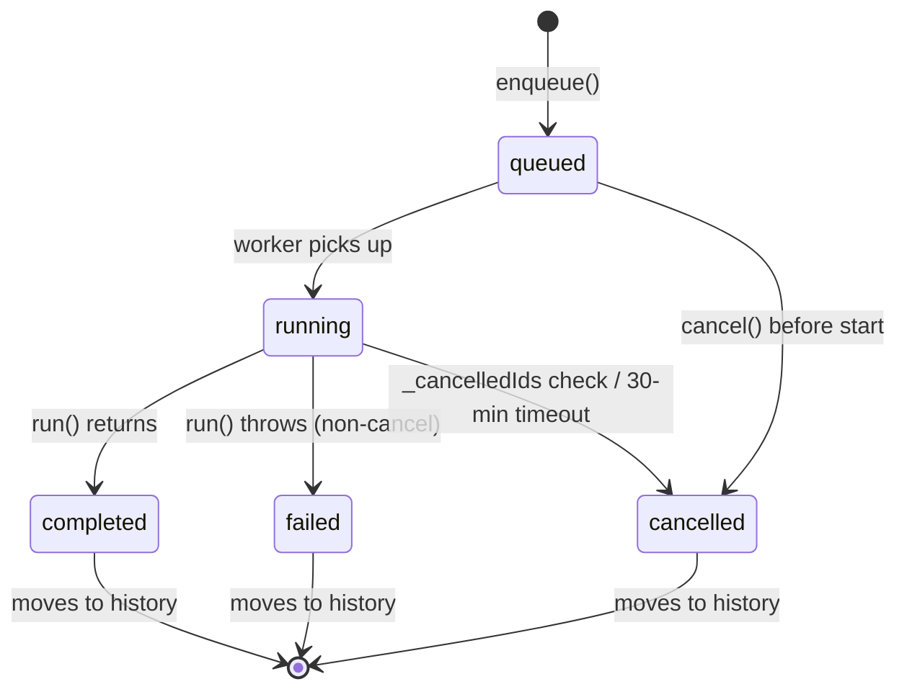

#### TransferPanel — UI

The `TransferPanel` (`features/file_browser/transfer_panel.dart`) is a collapsible bottom panel unified with the file browser table pattern:

- **Resizable columns** — Local, Remote, Size, and Time columns have drag handles (shared `ColumnResizeHandle` widget, same as `FilePane`)
- **Column dividers** — Vertical 1px dividers between columns (same `_colDivider` as `FileRow`)
- **Sorting** — Click column headers to sort history entries. Default: Time descending. Enum: `TransferSortColumn` (name, local, remote, size, time)
- **Time column** — Replaces old Duration column. Shows `formatTimestamp` + `(formatDuration)` for completed entries. Tooltip shows created/started/ended/duration breakdown
- **Left-aligned sizes** — Size column uses default left alignment (no `textAlign: TextAlign.right`)

---

### 3.4 Session Management (`core/session/`)

#### Files and responsibilities

| File | Class | Purpose |
|------|-------|---------|
| `session.dart` | `Session`, `ServerAddress`, `SessionAuth`, `AuthType` | Session model with all fields |
| `session_store.dart` | `SessionStore` | CRUD via drift DAOs, search, folder tree management |
| `session_tree.dart` | `SessionTree`, `TreeNode` | Hierarchical tree built from flat session list |
| `session_history.dart` | `SessionHistory` | Undo/redo snapshots (stores credentials separately) |
| `qr_codec.dart` | Free functions | Export payload encoding/decoding (QR, `.lfs` files). Versioned format (`v: 4`), deflate compressed, key map deduplication. Decoder rejects payloads with `v > 4` to avoid silently dropping unknown fields. Public API: `encodeExportPayload()`, `decodeExportPayload()`, `calculateExportPayloadSize()`, `encodeSessionCompact()`, `wrapInDeepLink()`, `decodeImportUri()`. Supports sessions, empty folders, passwords, SSH keys (embedded + manager), config, known_hosts, tags, snippets. Max ~2000 bytes for QR. |

#### QR payload format (v4)

JSON → deflate → base64url. Top-level keys:

| Key | Type | Description |
|-----|------|-------------|
| `v` | `int` | Format version (`4`) |
| `km` | `Map<shortId, PEM>` | Deduplicated key map (embedded + manager private keys) |
| `mk` | `Map<shortId, {l, t, p}>` | Manager key metadata: label, keyType, publicKey |
| `s` | `List<Map>` | Sessions (compact encoding). Manager-key sessions have `mg: 1` flag, `ki` = shortId |
| `eg` | `List<String>` | Empty folder paths |
| `c` | `Map` | App config JSON |
| `kh` | `String` | Known hosts (OpenSSH format) |
| `tg` | `List<{i, n, cl?}>` | Tags (id, name, optional color) |
| `st` | `List<{si, ti}>` | Session→tag links |
| `ft` | `List<{fi, ti}>` | Folder→tag links (folderPath, tagId) |
| `sn` | `List<{i, t, cm, d?}>` | Snippets (id, title, command, optional description) |
| `ss` | `List<{si, ni}>` | Session→snippet links |

`ExportOptions` controls which keys are emitted: `includeSessions`, `includePasswords`, `includeEmbeddedKeys`, `includeManagerKeys` (session-bound only), `includeAllManagerKeys` (entire key store), `includeConfig`, `includeKnownHosts`, `includeTags`, `includeSnippets`.

#### Session model

```dart
class Session {
  final String id;            // UUID
  final String label;         // display name
  final String folder;        // folder path: "Production/Web" (separator /)
  final ServerAddress server; // host, port, user
  final SessionAuth auth;     // authType, password, keyPath, keyData, passphrase
  final DateTime createdAt;
  final DateTime updatedAt;
  bool get hasCredentials;    // true if password, keyData, keyId, or keyPath is set
  bool get isValid;           // true if host, port, user, and hasCredentials (highlighted orange when false)

  SSHConfig toSSHConfig();    // conversion for connection
  Session copyWith({...});    // preserves id, updates updatedAt
  Session duplicate();        // new id, "(copy)" suffix, preserves authType
  Map<String, dynamic> toJson();
  factory Session.fromJson(Map<String, dynamic> json);
}
```

#### SessionStore — drift-backed persistence

All session data (including credentials) is stored in a single drift (SQLite) database. Encryption is handled at the DB level via SQLite3MultipleCiphers — stores no longer manage encryption themselves.

```dart
class SessionStore {
  void setDatabase(AppDatabase db); // injected at startup

  Future<List<Session>> load();     // reads from SessionDao + FolderDao
  Future<void> add(Session session);
  Future<void> update(Session session);
  Future<void> delete(String id);
  List<Session> search(String query);  // by label, folder, host, user

  Set<String> get emptyFolders;
  Future<void> addEmptyFolder(String path);
  Future<void> renameFolder(String oldPath, String newPath);
  Future<void> deleteFolder(String path);
  String? folderIdByPath(String path); // resolve path to DB folder ID
}
```

**Folder tree:** UI uses string paths ("Production/EU"), DB uses a `Folders` table with self-referencing `parentId`. `mappers.dart` handles conversion: `resolveFolderPath()` creates missing folder nodes, `findFolderIdByPath()` resolves path → ID. In-memory `_folderMap` cache rebuilt on `load()`.

**Concurrent load guard:** `load()` uses a `_loadFuture` guard — concurrent callers await the same future instead of starting a second load.

**Atomicity:** Handled by SQLite transactions. No separate save order — all data is in one DB file.

#### SessionTree

```dart
class SessionTree {
  static List<SessionTreeNode> build(List<Session> sessions, List<String> emptyFolders);
  // Builds hierarchy: "Production/Web/nginx" → [Production] → [Web] → [nginx]
  // Empty folders are included in the tree
}

class SessionTreeNode {
  final String name;
  final String path;         // full path from root
  final Session? session;    // null for folders
  final List<SessionTreeNode> children;

  bool get isGroup => session == null;
  bool get isSession => session != null;
}
```

---

### 3.5 Connection Lifecycle (`core/connection/`)

#### Files and responsibilities

| File | Class | Purpose |
|------|-------|---------|
| `connection.dart` | `Connection` | Connection model (id, label, sshConnection, state, error, ready completer, progress stream) |
| `connection_step.dart` | `ConnectionStep` | Progress step model — phase (`socketConnect` / `hostKeyVerify` / `authenticate` / `openChannel`) × status (`inProgress` / `success` / `failed`) |
| `progress_tracker.dart` | `ProgressTracker` | Subscribes to `Connection.progressStream`, replays history for late subscribers, notifies listeners |
| `progress_writer.dart` | `ProgressWriter` | Writes ANSI-styled progress steps to an xterm `Terminal` (shared by desktop and mobile terminal views) |
| `connection_manager.dart` | `ConnectionManager` | Active connection management, creation, disconnection, stream |
| `foreground_service.dart` | `ForegroundServiceManager` | Android: foreground service for SSH keep-alive on screen lock |

#### Connection model

```dart
class Connection {
  final String id;           // UUID (tab-specific)
  final String label;
  SSHConfig sshConfig;       // mutable — refreshed from session store on reconnect
  final String? sessionId;   // links back to saved Session (null for quick-connect)
  final KnownHostsManager knownHosts;  // for host key verification
  SSHConnection? sshConnection;
  SSHConnectionState state;  // disconnected | connecting | connected
  Object? connectionError;
  String? cachedPassphrase;  // interactively entered, reused on reconnect

  Stream<ConnectionStep> progressStream;  // broadcasts steps during connect
  List<ConnectionStep> progressHistory;   // buffered for late subscribers

  Future<void> waitUntilReady();   // waits for connect attempt to finish (success or error)
  void completeReady();            // called by ConnectionManager — also closes progressStream
  void addProgressStep(step);      // buffers + broadcasts a progress step
  void resetForReconnect();        // closes old progress controller, then fresh completer + stream, clears history/error
}
```

**Deferred Init pattern:** Connection is created instantly in state=`connecting`. The actual SSH handshake runs in the background. UI immediately opens a tab and shows a connecting indicator.

**State transitions** (terminal states in bold — a connection can leave `disconnected` only via `reconnect` on the same `Connection` object; a fresh `connectAsync` produces a new one):

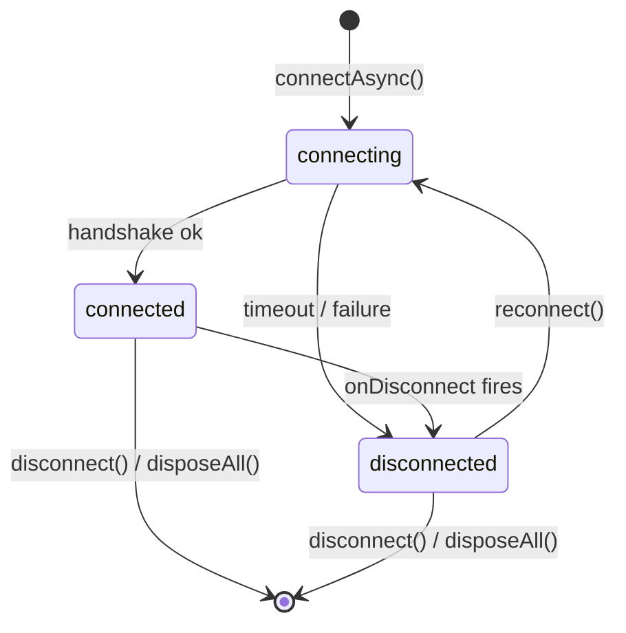

#### ConnectionManager

```dart
class ConnectionManager {
  ConnectionManager({
    required KnownHostsManager knownHosts,
    SSHConnectionFactory? connectionFactory,
    ActiveCountCallback? onActiveCountChanged,  // notifies foreground service
  });

  PassphrasePromptCallback? onPassphraseRequired;  // set by UI layer (main.dart)

  Connection connectAsync(SSHConfig config, {String? label, String? sessionId});
  // Returns Connection immediately in state=connecting. SSH handshake runs in background.
  // _doConnect injects cachedPassphrase into config and wires onPassphraseRequired
  // onto the SSHConnection before connect(). If user checks "remember", the passphrase
  // is stored in Connection.cachedPassphrase for automatic reuse on reconnect.
  void disconnect(String connectionId);
  void disconnectAll();  // also completes pending ready futures for in-progress connections

  List<Connection> get connections;
  Stream<List<Connection>> get onChange;

  // Reconnect race prevention: per-connection generation counter (_connectGeneration).
  // _doConnect checks its generation is still current before applying results.
  // Rapid reconnects increment the counter, making in-flight results stale.
}
```

#### ForegroundServiceManager (Android only)

```dart
class ForegroundServiceManager {
  ForegroundServiceManager({
    @visibleForTesting ForegroundServiceBinding? binding,
  });
  // Android → real foreground service via binding
  // Other platforms → no-op internally

  void onConnectionCountChanged(int count);
  // count > 0 → starts foreground service with notification
  // count == 0 → stops service
}
```

**Why foreground service:** Android kills background processes. Without a foreground service, SSH connections drop on screen lock or app switch.

---

### 3.6 Security & Encryption (`core/security/`)

#### Five-Tier Security Model (L0–L3 + Paranoid)

All data lives in one drift (SQLite) database. Encryption runs at the database level through SQLite3MultipleCiphers. The user picks one of four **numbered tiers** on the linear ladder, plus one **alternative branch** ("Paranoid") shown separately for users who do not trust the OS at all:

| Tier | Label | DB key location | User-typed secret | Where the secret is stored |
|---|---|---|---|---|
| **L0** | Plaintext | — | — | — |
| **L1** | Keychain | OS keychain (Keychain / Credential Manager / libsecret / EncryptedSharedPreferences) | — | — |
| **L2** | Keychain + password | OS keychain | Short password (UX gate) | Salted HMAC split across disk (`security_pass_hash.bin`) and keychain (`letsflutssh_l2_pepper`) |
| **L3** | Hardware + PIN | Hardware-bound vault (Secure Enclave / StrongBox / TPM2 / Windows Hello) | 4–6 digit PIN | Hardware module itself; `hardware_vault.bin` on disk carries only the sealed blob + salt |
| **Paranoid** | Master password | Derived fresh per unlock; never stored in the OS | Long password | Argon2id salt + verifier in `credentials.kdf`; key material lives only in `SecretBuffer` |

Each tier carries orthogonal modifiers (biometric shortcut on L1/L2/L3; PIN length for L3). `SecurityTier` enum values are deliberately unordered — no `<`/`>` comparisons anywhere in the codebase. Feature-gating uses predicates on `SecurityConfig` (`usesKeychain`, `usesHardwareVault`, `hasUserSecret`, `isParanoid`, `isPlaintext`).

Stores (`SessionStore`, `KeyStore`, `KnownHostsManager`, `SnippetStore`, `TagStore`) receive the opened `AppDatabase` via `setDatabase()` and delegate persistence to DAOs. They do not handle encryption — the active tier is opaque to them.

**Tier resolution at startup** (`main._initSecurity`):

1. If the `SecurityTierSwitcher` pending marker exists → log + clear it (the previous run died mid-switch; the standard unlock path below will either succeed under the target credential or fall through to reset).
2. Read `AppConfig.security` (persisted as `security_tier` + `security_modifiers` in `config.json`). When null **and** any legacy pre-tier state exists on disk → show `TierResetDialog` (breaking change: wipe-and-setup-fresh or quit).
3. When the config has a tier, dispatch to the matching unlock path: `_unlockParanoid`, `_unlockKeychainWithPassword`, `_unlockHardware`, `_unlockKeychain`, or the plaintext short-circuit.
4. When the DB file exists but the tier field does not (legacy installs between model iterations) → legacy-infer fall-through: PBKDF2-reject → master-password probe → keychain-key probe → plaintext.
5. When no DB file exists → first-launch `SecuritySetupDialog` (the wizard), then persist the chosen `SecurityTier` into `config.json`.

First launch is detected by the combination "no `config.security` **and** no DB file **and** no legacy state." Any single-signal detector was too fragile against partial installs and mid-switch crashes.

**Key-derivation pipeline** (only the master-password branch derives; keychain stores the DB key directly, plaintext has no key):

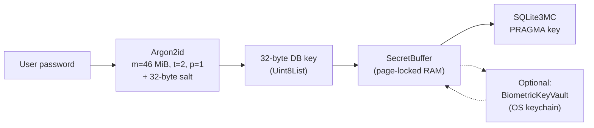

**KDF file format** (`credentials.kdf`, v1):

| Offset | Size | Field |
|---|---|---|
| 0 | 4 | Magic `'LFKD'` (0x4C 0x46 0x4B 0x44) |
| 4 | 1 | File version (`0x01`) |
| 5 | 1 | KDF algorithm id (mirror of params[0]) |
| 6 | 10 | Argon2id params: `memoryKiB` (u32 BE), `iterations` (u32 BE), `parallelism` (u8), plus algorithm id byte prefix |
| 16 | 32 | Random salt |

The algorithm id + params block is defined in [`KdfParams`](../lib/core/security/kdf_params.dart) — new algorithms can be added without changing the file-layout header. Production defaults are [`KdfParams.productionDefaults`](../lib/core/security/kdf_params.dart) (Argon2id m=46 MiB t=2 p=1, chosen as the OWASP 2024 recommended floor that balances mid-tier mobile wall-clock against GPU/ASIC resistance).

**Legacy PBKDF2 migration (force-breaking)**: installs from before the Argon2id rollout carry an older `credentials.salt` file with raw PBKDF2 salt (no header). [`MasterPasswordManager.hasLegacyFormat()`](../lib/core/security/master_password.dart) detects this at startup and `main._initSecurity()` shows the non-dismissible [`LegacyKdfDialog`](../lib/widgets/legacy_kdf_dialog.dart) — the user must choose *Reset & Continue* (wipes encrypted stores, fresh start with default keychain mode) or *Quit LetsFLUTssh* (leaves the old data intact so the user can reinstall a previous build and export their credentials first). PBKDF2 key derivation code is no longer on any runtime path for the DB key. The `.lfs` archive decryption retains its own PBKDF2 code path for backward compatibility — see §3.7.

#### In-memory DB key (page-locked)

The live DB key lives in a [`SecretBuffer`](../lib/core/security/secret_buffer.dart) — native memory allocated with `calloc`, pinned to physical RAM with `mlock` on POSIX / `VirtualLock` on Windows, and zeroed + unlocked + freed on dispose. `SecurityStateNotifier` owns the buffer's lifecycle: every `set()` / `clearEncryption()` disposes the previous buffer before allocating a new one, and the provider's tear-down disposes the final one. Lock failures (RLIMIT_MEMLOCK exhausted, unusual libc) are logged and swallowed — the buffer still works, just isn't pinned. The same pattern is used for the PBKDF2-derived key inside `ExportImport._encryptWithPassword/_decryptWithPassword` so `.lfs` archive keys don't linger on the Dart heap either.

#### Unlock-path single KDF

Every master-password unlock must verify the password *and* produce the derived DB key. The legacy code called `verify()` then `deriveKey()` — two isolate spawns + two KDF runs, adding up to several seconds on mid-tier mobiles. [`MasterPasswordManager.verifyAndDerive(password)`](../lib/core/security/master_password.dart) runs one KDF inside a single isolate and returns the derived key on success or `null` on wrong password. `UnlockDialog`, `LockScreen`, and the biometric-enable flow all use it. `verify()` stays available as the thin `verifyAndDerive(...) != null` wrapper for call sites that do not need the key (e.g. the remove-master-password confirm). Argon2id is CPU + memory-heavy, so this single-call optimisation matters even more than it did for PBKDF2.

#### Switching tiers on the fly — always-rekey invariant

Every tier switch — L0↔L1↔L2↔L3↔Paranoid, **including modifier-only changes on the same tier** — generates a fresh random 32-byte DB key and rekeys the whole DB under it. The previous wrapper (keychain entry, hardware-sealed blob, Argon2id verifier) is invalidated by the rekey, so a previously leaked wrapper cannot decrypt post-switch data.

[`SecurityTierSwitcher.switchTier`](../lib/features/settings/security_tier_switcher.dart) owns the orchestration order:

1. Generate a fresh 32-byte key via `Random.secure()` (CSPRNG-backed — `/dev/urandom` on POSIX, `BCryptGenRandom` on Windows).
2. Write `.tier-transition-pending` marker with the target tier's JSON payload. Marker lives in app-support, hardened to 0600.
3. `rekeyDatabase(db, newKey)` — atomic `PRAGMA rekey` transaction. On failure the DB is still under the source key; the marker points at the unfinished target so startup notices.
4. `applyWrapper(newKey)` — tier-specific: write to `SecureKeyStorage`, `HardwareTierVault.store`, `MasterPasswordManager.enable`, etc.
5. `persistConfig(newKey)` — update `securityStateProvider` + mirror the new tier into `config.json`.
6. `clearPrevious()` — tier-specific cleanup: delete the previous keychain entry, clear the hardware vault, clear the password gate, disable the master-password manager, clear the biometric vault.
7. Delete the marker as the last step; its absence is the "all good" signal the next startup relies on.

A crash between steps 3 and 7 leaves the marker on disk. `main._initSecurity` logs and clears the marker on the next launch; the standard unlock path then succeeds under whichever credential the user can supply (source or target), or falls through to reset. This tolerates the 25-pair tier-transition matrix without needing per-pair recovery logic.

Settings exposes the switcher through a single "Change Security Tier" action that reopens the wizard pre-marked with the current tier and routes the result through `_applyTierChange` (`settings_sections_security.dart`) — every on-disk tier switch goes through the same orchestration path.

#### L2 keychain-password gate (`KeychainPasswordGate`)

L2 layers a UX-only short password in front of the L1 keychain-stored DB key. The password is **not** a cryptographic layer: an attacker who can read both the disk and the OS keychain already has every ingredient for the DB key, password or not. The gate exists to deny a coworker at the desk, not to resist offline attack.

State layout:

- `security_pass_hash.bin` on disk holds `{salt, HMAC-SHA256(pepper, salt || password)}` as JSON.
- OS keychain holds the pepper under `letsflutssh_l2_pepper`.

`setPassword` rotates both salt and pepper atomically; a stale pepper without a fresh disk write (or vice versa) fails `verify` — the split storage is the tamper surface. `verify` uses constant-time compare. A persistent rate limiter (see below) is keyed by the stored HMAC, so any offline attempt to reset the limiter to zero-failures requires forging a HMAC whose key the attacker already has the pieces of.

#### L3 hardware vault (`HardwareTierVault`)

L3 seals the DB key inside a hardware module under an auth value derived as `HMAC-SHA256(pin, salt)`. The hardware module enforces rate-limiting and lockout after N failed attempts — that is what makes a 4–6 digit PIN cryptographically meaningful; dictionary attack against such a short secret is infeasible only because the hardware refuses retries.

Per-platform dispatch:

| Platform | Binding | File | PIN channel |
|---|---|---|---|
| **Linux** | TPM2 via `tpm2-tools` shell-out in [`TpmClient`](../lib/core/security/linux/tpm_client.dart) | `hardware_vault.bin` (salt + sealed blob) | PIN HMAC goes to TPM `-p hex:<digest>` as the unseal auth value — TPM lockout is the rate limiter |
| **iOS / macOS** | P-256 in Secure Enclave (`kSecAttrTokenIDSecureEnclave`) with `.biometryCurrentSet` via [`HardwareVaultPlugin.swift`](../ios/Runner/HardwareVaultPlugin.swift) / [`macos/Runner/HardwareVaultPlugin.swift`](../macos/Runner/HardwareVaultPlugin.swift) | `hardware_vault_apple.bin` (native side) + `hardware_vault_salt.bin` (Dart side) | PIN HMAC is an external gate — SE accepts only biometrics for release |
| **Android** | AES-256-GCM in Keystore with `setUserAuthenticationRequired(true)` + `setInvalidatedByBiometricEnrollment(true)` + StrongBox preferred, via [`HardwareVaultPlugin.kt`](../android/app/src/main/kotlin/com/llloooggg/letsflutssh/HardwareVaultPlugin.kt) | `hardware_vault_android.bin` + salt file | PIN HMAC is an external gate — Keystore requires `BiometricPrompt.CryptoObject` for release |
| **Windows** | `KeyCredentialManager` (Windows Hello) with `RequestSignAsync` wrapping, via [`hardware_vault_plugin.cpp`](../windows/runner/hardware_vault_plugin.cpp) | `hardware_vault_windows.bin` + salt file | PIN HMAC is an external gate — Hello prompts for the user's gesture before signing |

The PIN is the user-facing secret on every platform, but the binding path diverges: Linux alone is hardware-auth-value-native (TPM accepts arbitrary HMAC bytes as the unseal password). Apple / Android / Windows APIs gate the hardware key release on biometrics / Hello, so the PIN runs as a local HMAC gate that is checked *before* the biometric prompt fires; a wrong PIN fails without waking the user's sensor. Salt lives in Dart-owned `hardware_vault_salt.bin` so two installs with the same PIN produce different gates.

Native plugin code is shipped but has not been validated on real hardware — the plan's "manual device-testing pass" acceptance is still outstanding. CI compiles each plugin on its own runner (macos-latest / windows-latest / ubuntu-latest + Android SDK) but cannot exercise biometric / Hello / StrongBox prompts. iOS is not in the release matrix; the project file carries the entries so `flutter build ios` works when invoked on a developer's Mac.

Per-install salt is generated on `store()` and written alongside the sealed blob in `hardware_vault.bin`. Two devices with the same PIN never end up with the same sealed blob.

#### Rate limiters — per-tier matrix

[`PasswordRateLimiter`](../lib/core/security/password_rate_limiter.dart) is the abstract base; three concrete variants cover the tier matrix:

| Tier | Limiter | Persistence | Rationale |
|---|---|---|---|
| **L0 / L1** | none | n/a | L0 has no user secret; L1 auto-unlocks via keychain, no retry surface |
| **L2** | `PersistedRateLimiter` | disk, HMAC-authenticated | UX-gate password has no cryptographic strength; a process-restart reset would be free for an attacker |
| **L3** | `HardwareRateLimiter` | in-memory | Thin software counter on top of the platform's hardware lockout — defense-in-depth if the hardware layer is misconfigured |
| **Paranoid** | `InMemoryRateLimiter` | in-memory | Argon2id is the real brake; persisting a forgot-password wait across restarts is user-hostile for no extra safety |

All three share the backoff schedule `[0, 1, 2, 4, 8, 16, 32, 60, 60, 60] s` — capped at 60 s so a legitimate user who genuinely forgot their password never waits more than a minute between retries.

`PersistedRateLimiter` writes `{failureCount, nextRetryAtMillis}` to `rate_limit_state.bin` framed with an HMAC-SHA256 tag under the L2 gate's own stored HMAC as key. Tamper detection: a mismatch on load clamps the counter to the schedule cap and sets `nextRetryAt` to `now + 60 s`, so an attacker who overwrites the state file with garbage lands in max cooldown rather than zero-failures. Writes are serialised on a `Future` chain so back-to-back `recordFailure` / `recordSuccess` calls never race at the filesystem.

The unlock dialogs (`UnlockDialog`, `TierSecretUnlockDialog`) consult `rateLimitStatus()` on mount, refuse `verify` while locked, start a 1-Hz `Timer.periodic` to refresh the countdown, and disable the submit button until the cooldown clears. The rendered label uses the `tierCooldownHint(seconds)` l10n key in all 15 locales.

#### Biometric unlock

Optional in master-password mode. [`BiometricAuth`](../lib/core/security/biometric_auth.dart) wraps `local_auth` for the availability probe + prompt; [`BiometricKeyVault`](../lib/core/security/biometric_key_vault.dart) stores the already-derived DB key in `flutter_secure_storage` under a platform keychain slot (iOS/macOS Keychain, Windows Credential Manager, Android EncryptedSharedPreferences). At startup, `_tryBiometricUnlock()` in `main.dart` runs the biometric prompt first and skips the master-password dialog on success.

**Apple platforms — Secure Enclave binding.** On iOS and macOS the vault stores the DB key with a `SecAccessControl` that stacks `kSecAttrAccessibleWhenPasscodeSetThisDeviceOnly` with `SecAccessControlCreateFlags.biometryCurrentSet` — exposed through `BiometricKeyVault.iosOptions` / `macOsOptions`. Two consequences follow: (a) the key material is held in the Secure Enclave, so even a device-level RAM compromise cannot exfiltrate it; and (b) any change to the biometric enrolment (added or removed fingerprint, re-enrolled Face ID) invalidates the stored key, forcing the user back through the master-password dialog on the next unlock. Android still rides on `flutter_secure_storage`'s default EncryptedSharedPreferences until a dedicated Keystore + `BiometricPrompt.CryptoObject` plugin lands. When it fails (cancel, wrong finger) the fallback is `UnlockDialog` — which itself auto-triggers biometric on first frame as long as `autoTriggerBiometric` is true. `main.dart` passes `false` when it already attempted biometric to prevent a double-cancel loop; the retry button inside the dialog stays available either way, so the user can re-invoke biometrics without relaunching the app. `LockScreen` (mid-session re-lock overlay) follows the same auto-trigger + retry pattern.

`BiometricAuth.availability()` returns a `BiometricUnavailableReason?` (null when biometrics work). The probe goes beyond `canCheckBiometrics + getAvailableBiometrics().isNotEmpty` — a Windows Hello PIN alone satisfies those two checks and would falsely report biometrics as ready. The probe additionally filters the enrolled list for a real bio type (`fingerprint` / `face` / `iris` / `strong`) so PIN-only Hello is correctly reported as `notEnrolled`. The settings UI uses this multi-state result to show a reason tooltip on a disabled toggle instead of hiding the option.

`BiometricUnavailableReason` also carries `systemServiceMissing` — the rung-3 reason for the Linux path: the toggle is disabled with a `fprintd is not installed. See README → Installation.` reason whenever the OS-level fingerprint daemon is absent.

**Linux — `fprintd` D-Bus binding.** On Linux `BiometricAuth.availability()` delegates to [`FprintdClient`](../lib/core/security/linux/fprintd_client.dart), a thin wrapper over the `net.reactivated.Fprint` system bus. The ladder is strict: if the daemon is not registered (`GetDefaultDevice` fails or the bus name is unknown) → `systemServiceMissing`; if the default device reports an empty `ListEnrolledFingers("")` → `notEnrolled`; otherwise biometrics are ready. `authenticate()` on Linux issues a `Claim` → subscribes to `VerifyStatus` → calls `VerifyStart("any")` → awaits the terminal signal with a 30 s timeout, and always `Release`s the device in `finally` so a failed verify does not leave the reader stuck. The `dbus` pub.dev package is used over a native Kotlin/Rust plugin per [§ Native Over Dart](AGENT_RULES.md#native-over-dart-when-better-and-zero-install) — an fprintd call is once-per-unlock IPC through the same system-bus socket either way; a native wrapper would offer no measurable performance or functionality win.

**Linux — TPM2 seal layer (`tpm2-tools`).** When `/dev/tpmrm0` is present and the optional `tpm2-tools` package is installed, `BiometricKeyVault` stores the DB key via a TPM-sealed blob instead of libsecret. The seal flow: `FprintdClient.getEnrolmentHash()` returns the SHA-256 of the sorted enrolled-finger list; that digest is handed to [`TpmClient.seal`](../lib/core/security/linux/tpm_client.dart) as the auth value, which shells out to `tpm2 createprimary` + `tpm2 create -p hex:<digest>`; the resulting `{pub, priv}` pair is framed with 4-byte length prefixes and written to `biometric_vault.tpm` under the app-support dir. Unseal runs the mirror sequence (`tpm2 createprimary` + `tpm2 load` + `tpm2 unseal -p hex:<digest>`) against a freshly probed enrolment hash; any change to the biometric enrolment flips the digest, the unseal fails, and the user is back on master password — the Linux equivalent of Apple's `biometryCurrentSet`. TPM2 policy via shell-out was chosen over FFI to `libtss2-esys` per [§ Native Over Dart](AGENT_RULES.md#native-over-dart-when-better-and-zero-install): the seal/unseal flow runs once per unlock, ESAPI is a thick C API, and `tpm2-tools` already ships a battle-tested wrapper the user installs via README. The backing-level label on Linux flips from `software` to `hardware` as soon as the TPM probe succeeds.

`BiometricAuth.backingLevel()` reports how the active biometric vault is protecting the cached DB key — `hardware` on iOS/macOS (Secure Enclave via `biometryCurrentSet`), `software` on Android/Windows/Linux until the respective hardware-binding path lands (dedicated Keystore + `BiometricPrompt.CryptoObject` on Android; `KeyCredentialManager` on Windows; TPM2 seal bound to the fprintd enrolment hash on Linux). The Settings biometric toggle concatenates the localised backing-level label into its subtitle when the toggle is on, so the user can tell hardware binding apart from software fallback without opening the source.

Platform requirements: iOS `Info.plist` carries `NSFaceIDUsageDescription`; Android manifest holds `USE_BIOMETRIC` + `USE_FINGERPRINT` and `MainActivity` extends `FlutterFragmentActivity` (required by `BiometricPrompt`'s Fragment host).

#### Android hardware-backed L3 vault (shipped; device-testing pass pending)

[`HardwareVaultPlugin.kt`](../android/app/src/main/kotlin/com/llloooggg/letsflutssh/HardwareVaultPlugin.kt) exposes the Keystore-backed L3 path over the `com.letsflutssh/hardware_vault` MethodChannel. `MainActivity` registers the plugin in `configureFlutterEngine`; `build.gradle.kts` pins `androidx.biometric:1.1.0` + `androidx.fragment:1.6.2` so the `BiometricPrompt` + `FragmentActivity` surfaces compile cleanly.

1. **Key creation.** `KeyGenParameterSpec.Builder` with `setUserAuthenticationRequired(true)` + `setInvalidatedByBiometricEnrollment(true)` — the key *must* be presented inside a `BiometricPrompt.CryptoObject` session, and any change to the device's enrolled biometrics atomically invalidates the key. This is the Android-native equivalent of `.biometryCurrentSet`.
2. **Storage backing.** `setIsStrongBoxBacked(true)` is attempted on SDK ≥ 28; the Keystore silently falls through to TEE-backed storage on devices that do not expose a StrongBox chip. `KeyInfo.securityLevel` (SDK ≥ 31) + `isInsideSecureHardware` (pre-31) drive the `backingLevel` return value — `hardware_strongbox` / `hardware_tee` / `software`.
3. **Wrapping.** The DB key is AES-GCM-encrypted under the CryptoObject key on `store`; the IV + ciphertext + PIN-HMAC frame lands in `hardware_vault_android.bin` under the app's files dir, 0600. Unlock presents `BiometricPrompt` → receives the authed `Cipher` → decrypts.

**Outstanding device-testing pass:** StrongBox presence varies by OEM (Pixel 3+, recent Samsung flagships), the `setInvalidatedByBiometricEnrollment` contract is subtly different on pre-Android-11 builds, and the `FragmentActivity` host dependency of `BiometricPrompt` interacts with Flutter's `MainActivity` in ways that the emulator matrix does not exercise. The unit-test suite covers the Dart dispatch contract (see `test/core/security/hardware_tier_vault_test.dart`); runtime validation on real hardware is the remaining acceptance item.

#### Windows Hello `KeyCredentialManager` integration (shipped; device-testing pass pending)

[`windows/runner/hardware_vault_plugin.cpp`](../windows/runner/hardware_vault_plugin.cpp) binds the same MethodChannel contract to WinRT Hello via `winrt::Windows::Security::Credentials::KeyCredentialManager`. Registered from `flutter_window.cpp` alongside the generated plugin registrant; `CMakeLists.txt` links `WindowsApp.lib` for the WinRT projection and adds the plugin source to the runner target.

1. On `store(dbKey)`, `KeyCredentialManager::RequestCreateAsync` returns a credential keyed by the stable identifier `letsflutssh_hw_vault_l3`. `KeyCredential::RequestSignAsync(dbKey)` signs the payload; the signature serves as the wrapped ciphertext, stored alongside the PIN-HMAC in `hardware_vault_windows.bin` under `%LOCALAPPDATA%\LetsFLUTssh`.
2. Unseal presents the Hello gesture → `RequestSignAsync(payload)` produces the same signature (deterministic per credential) → comparison against the stored signature yields the unwrapped DB key.
3. `backingLevel` calls `GetAttestationAsync` — `KeyCredentialAttestationStatus::Success` reports `hardware_tpm`, a `TemporaryFailure` / `NotSupported` outcome reports `software`, and a host without Hello configured at all reports `unavailable` through the earlier `KeyCredentialManager::IsSupportedAsync` probe.

**Outstanding device-testing pass:** the WinRT `.get()` calls currently block the calling thread; the CI compiler is happy but a real Hello prompt on the platform thread may hang the UI — the fix is to move each WinRT await onto a `std::thread` and post the `MethodResult` back from there. Plus a Windows 10 / 11 host *with* Hello + TPM has to exercise `backingLevel == hardware_tpm`, and a host *without* Hello needs to verify that `IsSupportedAsync` correctly disables the L3 wizard row.

#### FIDO2 / hardware-security-key unlock (deferred — upstream library gap)

A `.2fa` / YubiKey flow was scoped as an optional unlock factor alongside the master password: plug / tap the key, the app takes that as proof-of-presence and decrypts the DB. The intent was multiplatform from day one — Android USB/NFC, iOS Lightning/NFC, desktops via USB HID.

**Why the feature is not shipped:** the pub.dev landscape for FIDO2 in Dart is immature for the constraint "end-user installs nothing via README" that [§ Self-Contained Binary](AGENT_RULES.md#self-contained-binary--end-user-installs-nothing) imposes. Candidates reviewed and their failure mode:

- `fido2` (pub.dev) — WebAuthn client surface only; no HID transport, no NFC transport, no PC/SC transport. Dead for desktop USB, dead for Android NFC, dead for iOS Lightning.
- `yubikit_flutter` — Yubico-only (skip other FIDO2 keys), hard-requires a native plugin per platform, and the desktop builds pull in PC/SC-Lite (Linux needs `libpcsclite1` installed, which breaks zero-install).
- Platform-native paths — Android `fido.U2fApi` lives in Google Play Services (incompatible with the project's no-GMS stance), iOS `AuthenticationServices.ASAuthorizationSecurityKeyPublicKeyCredential` works only for WebAuthn challenges and requires an `ASAuthorizationController`, no cross-platform wrapper exists.
- Rolling our own HID+APDU layer — feasible in pure Dart via `libusb`/`hidraw`, but every platform has its own permission model (Linux udev rules, macOS entitlements, Windows driver). That pushes the feature back into rung 3 with a README install snippet for `libpcsclite1` / `libhidapi` / driver install on Windows, which is exactly the matrix [§ Fallbacks Are Last Resort](AGENT_RULES.md#fallbacks-are-last-resort-not-default) told us to walk before committing.

**Current status:** feature is **deferred**, not cancelled. Master-password + biometric unlock already covers the user-visible use cases; a YubiKey factor would be a nice-to-have, not a closing-the-gap-at-any-cost. Revisit when a multiplatform Dart library surfaces that works across all 5 desktops + Android + iOS without mandatory native-dep installs (a realistic candidate: a future `flutter_webauthn` that wraps each platform's native authenticator surface). Until then the table-stakes master-password path is the sole secret boundary and that is fine for the project's threat model (lost device, hostile same-UID process — **not** kernel-level attackers or advanced persistent threats).

#### SQLCipher cipher choice — AES-CBC+HMAC vs AES-GCM vs ChaCha20-Poly1305 (decision doc, not a rewrite)

SQLite3MultipleCiphers supports several cipher schemes for at-rest DB encryption. A review pass evaluated whether the project should migrate from the default `sqlcipher` scheme (AES-256-CBC + HMAC-SHA512, encrypt-then-MAC per page) to an AEAD construction (`aes256gcm` or `chacha20`).

**Inputs to the decision:**

- *Security posture.* The current `sqlcipher` scheme is encrypt-then-MAC under a 64-byte HMAC tag per 4 KiB page, with per-page random IVs derived from the page number + a database-wide random salt. This is structurally equivalent to an AEAD: confidentiality from AES-256-CBC, integrity + authenticity from HMAC-SHA512. No known cryptanalytic weakness justifies a migration on security grounds alone.
- *Performance.* AES-256-CBC throughput on AES-NI silicon is ~2–3 GiB/s. AES-256-GCM can be ~30 % faster on the same silicon because GCM parallelises cleanly and avoids the HMAC pass. On non-AES-NI devices (Arm mobile without the crypto extensions — increasingly rare but still present) ChaCha20-Poly1305 outperforms both AES variants by 2–4×. The project is not CPU-bound on DB I/O at current workload — logs, sessions, snippets, known-hosts entries are all sub-100-KiB tables with low page-churn, so the wall-clock win from a cipher switch is in the millisecond range on typical user flows.
- *Format compatibility.* Migration requires a full rekey under the new cipher (`PRAGMA cipher_migrate`-style flow): every page is re-encrypted on disk, the legacy cipher header is rewritten, and any existing `.lfs` archive exports produced under the old scheme decrypt *only* with the old code path (need a version-guarded reader).
- *Binary size / build surface.* All three schemes are already compiled into the SQLite3MC binary the project bundles — no new C dependencies, no `pubspec.yaml` changes.
- *Blast radius of a bad migration.* A crash mid-rekey corrupts every page that has been re-encrypted so far. Mitigation would require a tmp-file + atomic-rename flow (similar to `_applyAlwaysRekey` in settings). Non-trivial.

**Recommendation — stay on `sqlcipher` (AES-CBC+HMAC) for now.** The performance delta is small on current workloads, the security posture is equivalent, and the migration cost is real: a user-visible re-encryption step with a non-negligible crash window. Revisit if a concrete signal appears — a benchmark showing the DB I/O path is user-visible, or a CVE against the current scheme. If a switch does happen, **ChaCha20-Poly1305 beats AES-GCM** for the project's target device mix: it's faster on Arm-without-crypto-extensions (where Android mid-tiers still live) and the constant-time implementation is less footgun-prone than nonce-managed GCM.

**Authorised follow-up** if and when the switch lands:
1. Gate the new cipher behind a schema/version marker in the DB header, so `database_opener.dart` can pick the right `PRAGMA cipher` at open time;
2. Reuse the `rekeyDatabase()` atomic-tmp flow already used for master-password rotation;
3. Version-bump the `.lfs` archive format to mirror the new cipher header;
4. Migration UI should be opt-in — never run on app startup by surprise.

#### Password strength meter

Informational-only indicator on the Paranoid branch of `SecuritySetupDialog`. Uses a coarse length + character-class heuristic in [`assessPasswordStrength`](../lib/core/security/password_strength.dart) — five-tier enum, pure function, no `zxcvbn` wordlist (would bloat the binary for a feature that never blocks Save). The [`PasswordStrengthMeter`](../lib/widgets/password_strength_meter.dart) widget listens on the password controller and renders a coloured bar + localised label, hiding itself when the field is empty. The meter never blocks submit: a four-character password shows a red bar and still commits on OK, by design — users who want short passwords get a warning, not a wall. Labels are localised across all 15 locales (`passwordStrengthWeak` / `Moderate` / `Strong` / `VeryStrong`). The short-password and PIN forms (L2 / L3) do not render the meter — those tiers are governed by the rate limiter + hardware lockout, not entropy.

#### Auto-lock

Opt-in, off by default. `autoLockMinutesProvider` (0 = off; presets 1/5/15/30/60) arms an idle timer in [`AutoLockDetector`](../lib/widgets/auto_lock_detector.dart) that wraps the app root. The value lives in the encrypted DB (`AppConfigs.auto_lock_minutes`, schema v2) — moving it out of plaintext `config.json` was deliberate so an attacker with disk access cannot weaken the security control by editing a config file. A one-shot migration on first DB unlock copies any pre-existing value from the legacy `config.json` field into the DB. On expiry `securityStateProvider.clearEncryption()` zeros the in-memory key and [`lockStateProvider`](../lib/core/security/lock_state.dart) flips to `true`; the root widget overlays [`LockScreen`](../lib/widgets/lock_screen.dart) blocking interaction until the user re-authenticates (biometric first, MP form as fallback). The tile is always rendered — muted with a tooltip reason when the user is not in master-password mode — so the option never silently disappears.

**Backgrounding lock**: `AutoLockDetector.didChangeAppLifecycleState` locks on `paused` / `inactive` / `hidden` **only when the idle timer is greater than zero**. Locking unconditionally on every minimize was the #1 user complaint with an "Off" timer still triggering lockouts. Treating backgrounding as idle once the user has opted in matches their intent (protect against leaving the screen visible) without surprising users who have explicitly turned the feature off.

**Known scope**: the drift database handle is *not* closed on lock. SQLite3MultipleCiphers keeps its cipher key in internal page-cipher state, so DB reads continue to work after lock. Closing + reopening the DB would require disconnecting every live SSH/SFTP session. The auto-lock zeroes the explicit public handle used by rekey / export / config code paths and blocks UI input; it does not fully purge the SQLCipher runtime state.

**Encrypted log sink scaffolding (follow-on wiring).** Two classes are in tree ahead of the drift schema + DAO + UI rewire for moving the log target into the encrypted DB:

* [`LogBatchQueue<T>`](../lib/core/db/log_batch_queue.dart) — bounded batching in front of the (future) `app_logs` DAO. Flushes on whichever of *size ≥ 100 events* or *time ≥ 500 ms since the first event* fires first. Flush failures preserve the batch for retry; `dispose()` flushes and blocks further adds.
* [`BootstrapLogBuffer<T>`](../lib/core/db/bootstrap_log_buffer.dart) — ring buffer for the bootstrap window before the DB is unlocked. Capacity default is 512, oldest-first eviction on overflow (the last seconds before a crash matter more than the very first init line). Drains FIFO into the live sink when the DB-backed [`LogBatchQueue`](../lib/core/db/log_batch_queue.dart) comes online.

Neither class is wired yet — `AppLogger` still writes to the file sink. The wiring commit will (a) add an `app_logs` table + schema bump in drift, (b) swap `AppLogger._sink` for a `LogBatchQueue` once `_injectDatabase` is called, (c) rewrite the Settings → Logging live-log viewer to stream via the DAO, and (d) drop the file target except during bootstrap. Landing the queue + buffer now keeps the scaffolding commit small and the schema-bump commit focused on migration mechanics.

**Write-buffer scaffolding (follow-on wiring).** A dedicated [`DbWriteBuffer`](../lib/core/db/db_write_buffer.dart) is in tree ahead of the close-on-lock + drain-on-unlock wiring. The class is a bounded FIFO of `Future<void> Function(AppDatabase)` closures (cap: 500 entries, FIFO eviction with a warning log on overflow) and exposes three methods: `append(op)`, `drain(db)` (runs every queued op inside a single drift `transaction`, preserves the queue on failure for retry), and `clear()`. The wiring that actually makes auto-lock close the DB handle and unlock replay the buffer is a follow-on commit — touching `main._injectDatabase`, every store's `setDatabase`, `UnlockDialog`, `LockScreen`, and the auto-lock trigger is large enough that it ships on its own. The buffer class landing now means the encrypted-log-sink work (its most likely first consumer) can be built against a stable interface without waiting for the close-on-lock wiring to finish.

#### Process hardening

[`ProcessHardening.applyOnStartup()`](../lib/core/security/process_hardening.dart) is called from `main.dart` before any secrets touch RAM:

* Linux / Android — `prctl(PR_SET_DUMPABLE, 0)`: kernel skips core-dump generation on SIGSEGV and another process under the same UID can no longer `gdb -p` to read our memory without `CAP_SYS_PTRACE`.
* Linux / Android / macOS — `setrlimit(RLIMIT_CORE, {0, 0})`: belt-and-braces against accidental core dumps. `prctl`/`ptrace` above block the attack-paths they target, but on macOS and on a Linux shell that already ran `ulimit -c unlimited` a SIGSEGV would still write `/cores/<pid>.core` or `./core.<pid>`. Zeroing the soft *and* hard limits from inside the process closes that window without touching the user's shell config.
* macOS — `ptrace(PT_DENY_ATTACH, 0, NULL, 0)`: refuses subsequent debugger attach.
* Windows — `SetErrorMode(SEM_FAILCRITICALERRORS | SEM_NOGPFAULTERRORBOX | SEM_NOOPENFILEERRORBOX)`: suppresses the "stopped working" dialog and tells Windows Error Reporting (WER) not to capture a crash dump for our process. Without this, WER can write a heap snapshot (and optionally upload it to Microsoft) that contains the live SQLite cipher key and decrypted credentials.
* iOS — no-op; sandboxing already covers the relevant attacks.

All calls are wrapped in try/catch; a failed hardening call never blocks startup.

**Process-hardening audit findings.** A pass against the checklist (core dumps, ptrace attach, `mlock` coverage, stack canaries, isolate cross-talk) confirmed the current surface is sound:

* *Core dumps* — covered on every POSIX target (prctl + setrlimit on Linux/Android, ptrace PT_DENY_ATTACH + setrlimit on macOS). Windows WER is disabled for the process via SetErrorMode. No gap.
* *Ptrace attach* — Linux requires `CAP_SYS_PTRACE` after `PR_SET_DUMPABLE, 0`; macOS blocked via `PT_DENY_ATTACH`; Windows equivalent is covered by the WER disable + the debugger-detection Windows already surfaces. No gap.
* *mlock coverage* — every long-lived DB/crypto secret (`SecurityStateNotifier`'s current DB key, `MasterPasswordManager.verifyAndDerive` intermediate, `ExportImport._encryptWithPassword` / `_decryptWithPassword` PBKDF2-derived keys) lives in a [`SecretBuffer`](../lib/core/security/secret_buffer.dart) that `mlock`s / `VirtualLock`s the page. Short-lived values routed through the Dart heap (password entry `TextEditingController`, `Uint8List` arguments to factories) are unavoidable without a wholesale isolate rewrite; the `SecretBuffer.fromBytes` call at every entry point zeros the source after copy.
* *Stack canaries* — the Dart VM + `flutter` engine are compiled with `-fstack-protector-strong` by upstream; the project does not link any native code of its own that would opt out. No action.
* *Isolate cross-talk* — Dart isolates have isolated heaps by design; the project uses one secondary isolate (`MasterPasswordManager.verifyAndDerive` spawns a short-lived isolate for Argon2id) and explicitly disposes its secret buffers before the isolate terminates. No cross-talk surface.
* *Android manifest debuggable flag* — Flutter release builds set `debuggable=false` by default via Gradle; the project never overrides it. No action.

Any finding that would have been expensive (signing / anti-tamper, runtime integrity checks, syscall filtering) is deliberately out of scope — the threat model is a lost device / hostile same-UID process, not a kernel-level attacker.

#### AesGcm

Shared AES-256-GCM utility used by all encrypted stores.

```dart
class AesGcm {
  static Uint8List encrypt(String plaintext, Uint8List key);
  static String decrypt(Uint8List data, Uint8List key);
  static Uint8List generateKey(); // 32-byte random key
  // Wire format: [IV (12 bytes)] [ciphertext + GCM authentication tag]
}
```

**Why pointycastle:** `encrypt` package has version conflicts with dartssh2. pointycastle is pure Dart, transitive dependency via dartssh2.

#### SecureKeyStorage

Thin wrapper around `flutter_secure_storage` for OS keychain access. All methods catch exceptions and return null/false — graceful fallback to plaintext or master-password mode.

```dart
class SecureKeyStorage {
  Future<bool> isAvailable();      // write+read+delete probe
  Future<Uint8List?> readKey();    // null on failure
  Future<bool> writeKey(Uint8List key); // false on failure
  Future<void> deleteKey();
}
```

OS keychain backends: Keychain (macOS/iOS), Credential Manager (Windows), libsecret (Linux), EncryptedSharedPreferences (Android). All are **optional** — the app works without them.

**Linux gating:** libsecret emits a non-recoverable `g_warning` to stderr on any call that tries to unlock a locked keyring, and Dart cannot intercept the warning. To keep the console quiet for users who never opt into keychain storage, `SecureKeyStorage` tracks opt-in with a marker file (`keychain_enabled`) inside the app-support dir: `writeKey` creates it on success, `deleteKey` clears it, and `readKey` / the `isAvailable` probe refuse to touch libsecret on Linux until the marker is present. First `writeKey` after opt-in still talks to libsecret so any real failure surfaces through the normal error path.

#### KeyStore

Central SSH key store backed by drift DAO.

```dart
class KeyStore {
  void setDatabase(AppDatabase db);   // injected at startup
  Future<Map<String, SshKeyEntry>> loadAll();
  Future<Map<String, SshKeyEntry>> loadAllSafe(); // returns {} on error
  Future<SshKeyEntry?> get(String id);
  Future<void> save(SshKeyEntry entry);
  Future<void> delete(String id);
  SshKeyEntry importKey(String pem, String label);
  static SshKeyEntry generateKeyPair(SshKeyType, label); // Ed25519 or RSA
}

class SshKeyEntry {
  final String id, label, privateKey, publicKey, keyType;
  final DateTime createdAt;
  final bool isGenerated;
}

enum SshKeyType { ed25519, rsa2048, rsa4096 }
```

**Session integration:** `SessionAuth.keyId` references a key by ID. Resolved in `SessionConnect._resolveConfig()` — key's PEM injected into `SSHConfig.auth.keyData` before connecting. SSH layer receives plain PEM text, unchanged.

---

### 3.7 Configuration (`core/config/`)

#### AppConfig model

```dart
class AppConfig {
  final TerminalConfig terminal;
  //   fontSize: 6-72 (default 14.0, type double)
  //   theme: 'dark'|'light'|'system'
  //   scrollback: ≥100 (default 5000)

  final SshDefaults ssh;
  //   keepAliveSec: default 30
  //   defaultPort: default 22
  //   sshTimeoutSec: default 10

  final UiConfig ui;
  //   windowWidth/Height
  //   uiScale: 0.5-2.0
  //   showFolderSizes: bool
  //   toastDurationMs: int (default 4000)

  final int transferWorkers;      // 1+ (default 2)
  final int maxHistory;           // ≥0 (default 500)
  final bool enableLogging;
  final bool checkUpdatesOnStart;
  final String? skippedVersion;
  final String? locale;             // null = OS auto-detect, or any of 15 supported locale codes

  // copyWith uses sentinel pattern for nullable fields:
  // copyWith(skippedVersion: null) clears, omitting preserves
  // copyWith(locale: null) clears, omitting preserves
}
```

#### ConfigStore

```dart
class ConfigStore {
  ConfigStore(String dataDir);

  Future<AppConfig> load();       // JSON → AppConfig + sanitize
  Future<void> save(AppConfig config);  // atomic write

  // Sanitize: clamps values to valid ranges
  // e.g.: fontSize < 6 → 6, fontSize > 72 → 72
}
```

---

### 3.8 Deep Links (`core/deeplink/`)

```dart
class DeepLinkHandler {
  // Scheme: letsflutssh://connect?host=X&user=Y&port=Z
  // Scheme: letsflutssh://import?d=BASE64URL (QR import, deflate compressed)
  // .lfs files: app_links file open intent
  // .pem/.key files: file open intent

  // Validation:
  // - host/port sanitization, null byte rejection
  // - scheme whitelist (letsflutssh, file, content)

  // Callbacks:
  //   onConnect(ConnectUri data) — host, port, user from connect URI
  //   onQrImport(ExportPayloadData data) — sessions, config, known_hosts, tags, snippets from QR
  //   onQrImportVersionTooNew(found, supported) — QR was valid but carries
  //     a payload schema newer than this build understands; surfaced as an
  //     "update the app" toast instead of a generic "invalid QR" error.

  // QR import UX: the main screen handler shows LinkImportPreviewDialog
  // before calling ImportService.applyResult, giving the user the same
  // merge/replace + per-type opt-in/out picker as the .lfs and paste-link
  // flows. Skipping the preview would silently commit whatever the QR
  // author chose to include (including, potentially, session passwords —
  // see `includePasswords` in ExportOptions, which QR mode defaults ON).

  // Deduplication: time-limited (2 s) to cover the cold-start race
  // (getInitialLink + uriLinkStream). After the window, the same URI
  // is processed again (e.g. re-scanning the same QR from background).

  // Background safety: all callbacks in _MainScreenState use
  // addPostFrameCallback to defer UI-dependent work. Data-only
  // operations (QR session import) run immediately without context.

  void dispose(); // cancels subscription, nulls all callbacks
}
```

---

### 3.9 Import (`core/import/`)

| File | Purpose |
|------|---------|
| `import_service.dart` | Import .lfs archives (ZIP + AES-256-GCM, PBKDF2 600k iterations). `applyConfig` callback is typed `AppConfig` (not `dynamic`). Callbacks for tags (`saveTag`, `tagSession`, `tagFolder`) and snippets (`saveSnippet`, `linkSnippetToSession`) with ID remapping via oldId→newId maps. Merge-mode ID collisions on sessions/tags/snippets are resolved by minting a fresh UUID and suffixing the label/name with `(copy)` — mirrors session duplication. Optional `existingTagIds`/`existingSnippetIds`/`getCurrentConfig` callbacks enable copy-on-conflict detection and full config rollback in replace mode |
| `key_file_helper.dart` | Shared helpers for SSH key files on disk: `tryReadPemKey`, `isEncryptedPem` (decodes OpenSSH v1 KDF-name field, or sniffs PKCS#1 / PKCS#8 armor), `basename`, `isSuspiciousPath` — centralises the rules used by the OpenSSH-config importer, the `~/.ssh` scanner, and the settings file-picker |
| `openssh_config_importer.dart` | Build `ImportResult` from `~/.ssh/config`. Pure — takes a `PemKeyReader` for file isolation. Dedups identity keys within the import by SHA-256 fingerprint; hosts with unreadable IdentityFiles are still imported (blank credentials) and reported via `hostsWithMissingKeys`. Entry point for [ssh config import UI](#312-user-interface-libfeatures) in Settings → Data |
| `ssh_dir_key_scanner.dart` | Scan a directory (typically `~/.ssh`) for PEM private-key files. Pure — takes a `DirectoryLister` + `PemKeyReader` for full test isolation. Skips obvious non-keys (`*.pub`, `known_hosts*`, `config`, `authorized_keys*`). Used by the "Import SSH keys from ~/.ssh" tile — selected candidates are persisted through `KeyStore.importForMerge` so fingerprint-duplicate keys are not re-added |

#### .lfs format

```
[salt 32B] [IV 12B] [encrypted payload + GCM tag 16B]

payload = ZIP archive:
  manifest.json           ← schema_version, app_version, created_at (see below)
  sessions.json           ← session metadata with credentials (toJsonWithCredentials)
  empty_folders.json      ← list of empty folder paths
  keys.json               ← manager SSH keys (label, type, public/private key)
  config.json             ← app configuration
  known_hosts             ← TOFU host key database (OpenSSH format)
  tags.json               ← tag definitions (id, name, color)
  session_tags.json       ← session→tag assignments
  folder_tags.json        ← folder→tag assignments
  snippets.json           ← snippet definitions (id, title, command, description)
  session_snippets.json   ← session→snippet links

Encryption: AES-256-GCM
Key: Argon2id(password, salt, m=46 MiB, t=2, p=1) — see
  [`KdfParams.productionDefaults`](../lib/core/security/kdf_params.dart)

Wire format for v3 encrypted archives (current writer):
  [ 'LFSE' (4) | version = 0x02 (1) | KdfParams block (≤ 16) |
    salt (32) | iv (12) | ciphertext + GCM tag ]

The KdfParams block carries the algorithm id (1 byte, `0x01` = Argon2id)
followed by the algorithm-specific parameters (for Argon2id: memoryKiB
u32 BE + iterations u32 BE + parallelism u8 = 9 bytes). The reader picks
up the exact cost used to write the archive — a future release can tune
parameters without having to break or re-encrypt existing files.

Argon2id is the only supported KDF since the pre-v1 back-compat drop.
Pre-v1 archives (headerless PBKDF2 and `0x01` v2 PBKDF2 header) are
rejected at import with `UnsupportedLfsVersionException` — users on
those archives must re-export from the current app version. Future
breaking format changes ship a `Migration` registered in
`lib/core/migration/archive_registry.dart` (see §3.7) rather than
another read-only back-compat path.

| On-disk form | Version byte | KDF | Notes |
|---|---|---|---|
| v1 (LFSE) | `0x02` | Argon2id @ header params | Current writer and the only supported reader. |

Import caps bound Argon2id params from an untrusted header
(`maxImportArgon2idMemoryKiB = 1 GiB`, `maxImportArgon2idIterations =
20`, `maxImportArgon2idParallelism = 16`) so a hostile archive cannot
pin the isolate into swap. Unencrypted ZIP archives keep their
`PK\x03\x04` magic and are handled separately.

Unencrypted variant: export dialog accepts an empty master password after
a confirmation step. ExportImport.export() then writes the raw ZIP
bytes (the `PK\x03\x04` local-file-header magic) instead of the
header + salt + IV + ciphertext + tag layout.

Import-side validation: `ExportImport.probeArchive(path)` classifies the
picked file into `{unencryptedLfs, encryptedLfs, notLfs}` before any
password prompt:
  * ZIP magic + at least one marker entry (`manifest.json`,
    `sessions.json`, `config.json`, `keys.json`) → `unencryptedLfs`,
    password prompt skipped.
  * ZIP magic but no marker → `notLfs`, rejected with a localized
    `errLfsNotArchive` toast. This catches e.g. an `.apk` picked by
    mistake on Android SAF, which ignores the `allowedExtensions: ['lfs']`
    filter for unregistered MIME types and lets the user select any file.
  * Non-ZIP header → `encryptedLfs`; password prompt runs and the manifest
    check inside `_decryptAndParseArchive` is the final arbiter.
```

Schema versioning: `ExportImport.currentSchemaVersion` (currently **v1**). The
manifest is written on every export and validated on import — archives with a
higher `schema_version` throw `UnsupportedLfsVersionException` rather than
silently dropping unknown fields. Archives without a manifest are treated as
legacy v1 (back-compat). GCM's auth tag already protects archive integrity
end-to-end, so no separate content hash is stored in the manifest.

#### Import modes

| Mode | Behavior |
|------|----------|
| **Merge** | Adds new sessions; on id collision, inserts a fresh UUID with a `(copy)` suffix (same semantics for tags/snippets). Manager keys deduplicate by private-key fingerprint via `KeyStore.importForMerge()` — identical keys reuse the existing id. Config apply failure is logged but doesn't abort the merge |
| **Replace** | Full replacement of sessions from archive. Tags / snippets / known_hosts are additionally wiped when the corresponding `includeX` flag from the preview dialog is set — so a user who checks "Tags" with an empty archive ends up with zero tags. Unchecked types are left untouched. A failure at any step triggers a full rollback of the snapshot (sessions + folders + config + tags + snippets + known_hosts) |

#### Import service

`ImportService` applies import results with:
- Manager key import first — builds oldId→newId map, remaps session `keyId` fields. Sessions pointing to a key that wasn't imported get `keyId` nulled out so the session still inserts without hitting `FOREIGN KEY constraint failed` on `Sessions.keyId → SshKeys.id`
- Session import with graceful skip on failure
- Empty folder restoration
- Tag import with ID remapping, then session→tag and folder→tag link creation. Links referencing a tag that wasn't imported are silently skipped (otherwise the FK on `SessionTags.tagId` / `FolderTags.tagId` would fail)
- Snippet import with ID remapping, then session→snippet link creation. Links referencing a snippet that wasn't imported are silently skipped

**Session reload after linked-entity delete:** `Sessions.keyId` is declared with `onDelete: KeyAction.setNull`, and `SessionTags` / `SessionSnippets` cascade on FK, so deleting a key / tag / snippet in the DB is correct on its own. The in-memory `sessionProvider` cache doesn't see the cascade, though — the delete UI handlers (`key_manager_dialog`, `tag_manager_dialog`, `snippet_manager_dialog`) each call `sessionProvider.notifier.load()` after the delete so the session tree picks up the nulled `keyId` (the "invalid session" warning icon appears immediately) and the derived tag / snippet lists drop the stale link

The OpenSSH config parser honours wildcard defaults. `Host *` / `Host *.internal` blocks emit no entries of their own, but their directives cascade onto every concrete host matching the pattern using OpenSSH's first-value-wins rule — so the common idiom "put `Host *` at the end of ~/.ssh/config for defaults that concrete hosts override" works as expected. Negation patterns (`!pattern`) block a wildcard block from applying to a matching host. `IdentityFile` entries accumulate across every matching block in file order (OpenSSH tries them sequentially at connect time).

`Include` directives are expanded against an injectable `IncludeReader`, with relative paths anchored at `~/.ssh` and glob patterns (`config.d/*`) resolved against the real filesystem. Nested includes are honoured up to a depth limit (default 8) and a visited-set guards against self-referencing loops. Missing includes are logged and skipped, not fatal — a deleted helper file does not break the whole import.

`PreferredAuthentications` is parsed into an ordered list of `AuthType` values (publickey ↔ `AuthType.key`, password / keyboard-interactive ↔ `AuthType.password`, gssapi/hostbased ignored). The importer consults this list first — an entry that explicitly prefers password auth keeps `AuthType.password` even when an `IdentityFile` is readable, matching OpenSSH's runtime choice instead of forcing key auth on hosts where it would be rejected.

Encrypted `IdentityFile` keys are detected by `KeyFileHelper.isEncryptedPem` (decoding the OpenSSH v1 binary frame for the KDF-name field, or sniffing PKCS#1 / PKCS#8 armor headers) and surfaced via `hostsWithEncryptedKeys` — a subset of the existing `hostsWithMissingKeys` list, so the old UI warning still fires but callers who care can tell "needs passphrase" from "truly missing" without re-reading the file.

Both `applyResult()` paths return an `ImportSummary` with per-type row counts and `configApplied` / `knownHostsApplied` flags. `formatImportSummary()` in `utils/format.dart` renders it as the success toast (`Imported N sessions, K SSH keys, T tags, S snippets, …`) so users see what was actually persisted instead of only the session count. `SqliteException`s that carry a PEM private key in their bound parameters are run through `redactSecrets()` in `utils/sanitize.dart` before reaching the toast or the log file
- Config application via typed `AppConfig` callback
- Known hosts import via `KnownHostsManager.importFromString()`
- Rollback support in replace mode via `restoreSnapshot` callback — snapshot includes sessions, empty folders, and (when `getCurrentConfig` is provided) the pre-import `AppConfig`, so a failed import restores atomically
- Manager-key rollback — replace mode never wipes the key store (keys are deduped by fingerprint on merge), so instead the snapshot captures `existingManagerKeyIds()` before the import runs. If the import fails, the rollback path enumerates the store again and deletes any id that wasn't in the pre-import set. Pre-existing keys stay untouched. Tests without a wired `KeyStore` leave the callbacks null and this step is skipped

---

### 3.10 Update (`core/update/`)

```dart
class UpdateService {
  // Checks GitHub Releases API
  // Compares current version with latest release
  // User can skip a version (skippedVersion in config).
  // Stale skip auto-clears when a newer version supersedes the skipped one.
  //
  // DI: HttpFetcher, FileDownloader, ProcessRunner, ReleaseArtifactVerifier.
  // Download: follows redirects (max 10), validates trusted hosts, and
  //   verifies every downloaded artefact twice before extract —
  //   (a) SHA-256 from the Releases JSON and
  //   (b) Ed25519 signature against pinned public keys (release_signing.dart).
  // openFile(): platform launcher, validates Windows paths against shell metacharacters.
  // Progress: throttled to 1% increments in UpdateNotifier to reduce state churn.
  //
  // Changelog: fetched once during check(), stored in UpdateInfo.changelog,
  // preserved across state transitions (downloading → downloaded) via copyWith.
}
```

Supporting classes in the same directory:

- **`ReleaseSigning`** (`release_signing.dart`) — holds the pinned Ed25519
  public keys (current + backup) as hex byte arrays and verifies a
  `<artifact>.sig` file against them via `pinenacl`. Multi-pin so the
  maintainer can rotate a leaked key without breaking already-installed
  builds. See [§13 Update channel integrity](#update-channel-integrity)
  for the end-to-end picture and `.github/SECURITY.md` for the rotation
  playbook.
- **`CertPinning`** (`cert_pinning.dart`) — installs a
  `badCertificateCallback` on the update-download HTTP client that
  checks the leaf cert's SPKI against a per-host pin set. Pin map is
  empty by default (falls back to system CA); populating it flips the
  updater into strict-pinning mode. Defence against DNS / CA
  compromise of `api.github.com` / `objects.githubusercontent.com`.
- **`InvalidReleaseSignatureException`** — thrown from
  `UpdateService.downloadAsset` when the signature check fails. Distinct
  from network errors so the UI can surface a "security-coloured" toast
  instead of a retry prompt.

### 3.11 Keyboard Shortcuts (`core/shortcut_registry.dart`)

Central registry for all app keyboard shortcuts. Every shortcut is an `AppShortcut` enum value with a default `SingleActivator` binding.

```dart
enum AppShortcut {
  newSession(SingleActivator(LogicalKeyboardKey.keyN, control: true)),
  terminalCopy(SingleActivator(LogicalKeyboardKey.keyC, control: true, shift: true)),
  // ... 29 shortcuts total (global, terminal, file browser, session panel, dialog)
  ;
  const AppShortcut(this.defaultBinding);
  final SingleActivator defaultBinding;
}

class AppShortcutRegistry {
  static final instance = AppShortcutRegistry._();

  SingleActivator binding(AppShortcut shortcut);

  // For CallbackShortcuts widgets:
  Map<ShortcutActivator, VoidCallback> buildCallbackMap(Map<AppShortcut, VoidCallback> actions);

  // For onKeyEvent handlers (e.g. inside xterm where CallbackShortcuts can't intercept):
  bool matches(AppShortcut shortcut, KeyEvent event);
}
```

**Usage patterns:**
- `CallbackShortcuts` widgets → `AppShortcutRegistry.instance.buildCallbackMap({...})`
- `onKeyEvent` handlers (xterm, file browser, session panel) → `reg.matches(AppShortcut.x, event)`
- Dialogs → `buildCallbackMap({AppShortcut.dismissDialog: ...})`

**Note:** `matches()` only checks ctrl/shift modifiers (not alt/meta) to tolerate phantom modifier flags on some platforms (e.g. WSLg).

---

## 4. State Management — Riverpod

### 4.1 Provider Dependency Graph

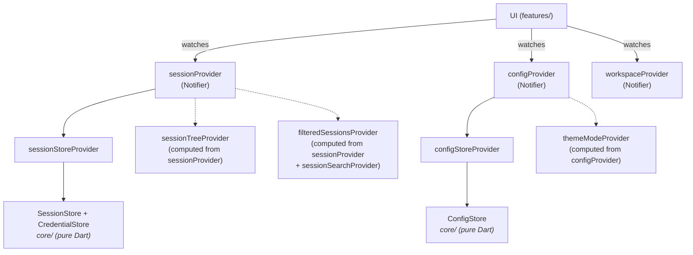

Independent provider groups:

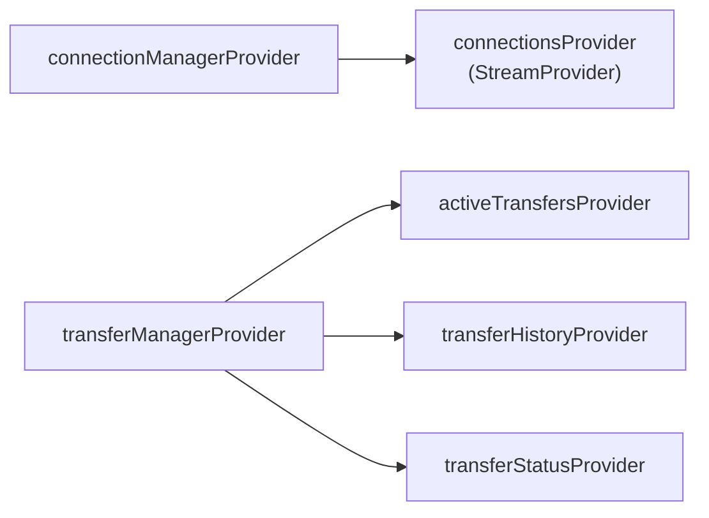

### 4.2 Provider Catalog

| Provider | Type | Depends on | Description |
|----------|------|-----------|-------------|
| `masterPasswordProvider` | Provider | — | MasterPasswordManager singleton |
| `sessionStoreProvider` | Provider | — | Singleton SessionStore (drift-backed) |
| `sessionProvider` | NotifierProvider | sessionStoreProvider | Session CRUD + undo/redo |
| `sessionTreeProvider` | Provider | sessionProvider | Hierarchical tree |
| `filteredSessionsProvider` | Provider | sessionProvider, sessionSearchProvider | Filtered session list |
| `sessionSearchProvider` | NotifierProvider<SessionSearchNotifier, String> | — | Search query string |
| `configStoreProvider` | Provider | — | Singleton ConfigStore (file-based) |
| `configProvider` | NotifierProvider | configStoreProvider | Configuration + sync logger (sequential save lock via `_pendingSave`) |
| `themeModeProvider` | Provider | configProvider | ThemeMode (dark/light/system) |
| `localeProvider` | Provider | configProvider | Locale? (null = system default) |
| `knownHostsProvider` | Provider | — | KnownHostsManager (drift-backed) |
| `keyStoreProvider` | Provider | — | KeyStore (drift-backed) |
| `sshKeysProvider` | FutureProvider | keyStoreProvider | List\<SshKeyEntry\> |
| `snippetStoreProvider` | Provider | — | SnippetStore (drift-backed) |
| `snippetsProvider` | FutureProvider | snippetStoreProvider | All snippets |
| `sessionSnippetsProvider` | FutureProvider.family | snippetStoreProvider | Snippets pinned to a session |
| `tagStoreProvider` | Provider | — | TagStore (drift-backed) |
| `tagsProvider` | FutureProvider | tagStoreProvider | All tags |
| `sessionTagsProvider` | FutureProvider.family | tagStoreProvider | Tags for a session |
| `folderTagsProvider` | FutureProvider.family | tagStoreProvider | Tags for a folder |
| `connectionManagerProvider` | Provider | knownHostsProvider | ConnectionManager singleton |
| `connectionsProvider` | StreamProvider | connectionManagerProvider | Real-time connection list |
| `transferManagerProvider` | Provider | — | TransferManager singleton |
| `activeTransfersProvider` | StreamProvider | transferManagerProvider | Active/queued tasks |
| `transferHistoryProvider` | StreamProvider | transferManagerProvider | Completed transfer history |
| `transferStatusProvider` | StreamProvider<ActiveTransferState> | transferManagerProvider | Active tasks + progress state |
| `workspaceProvider` | NotifierProvider<WorkspaceNotifier, WorkspaceState> | connectionManagerProvider | Workspace tiling tree + tabs (defined in `features/workspace/workspace_controller.dart`) |
| `foregroundServiceProvider` | Provider | — | ForegroundServiceManager singleton |
| `filteredSessionTreeProvider` | Provider | sessionProvider, sessionSearchProvider | Filtered + hierarchical session tree |
| `updateProvider` | NotifierProvider<UpdateNotifier, UpdateState> | — | Update check state + actions |
| `appVersionProvider` | NotifierProvider<AppVersionNotifier, String> | — | Current version from package_info_plus |

**Data flow pattern:**
```
UI watches provider → Provider reads/watches other providers →
Notifier.state updated → all dependent providers recompute → UI rebuilds
```

### 4.3 Widget-local controllers (`ChangeNotifier`)

App-wide state lives in Riverpod `NotifierProvider`s listed above. Widget-local state — dialog selection, pane navigation, per-tab caches — uses `ChangeNotifier` instead, read through `AnimatedBuilder`. The pattern:

```dart
class FooController extends ChangeNotifier {
  FooController({required this.arg});
  final SomeArg arg;
  // ... state fields + getters

  void mutate() {
    // ... update state
    notifyListeners();
  }
}

class _FooDialogState extends State<FooDialog> {
  late final FooController _ctrl;

  @override
  void initState() {
    super.initState();
    _ctrl = FooController(arg: widget.arg);
  }

  @override
  void dispose() {
    _ctrl.dispose();
    super.dispose();
  }

  @override
  Widget build(BuildContext context) {
    return AnimatedBuilder(
      animation: _ctrl,
      builder: (_, __) => /* renders from _ctrl */,
    );
  }
}
```

**When to pick this over Riverpod:**

| Criterion | `NotifierProvider` | `ChangeNotifier` |
|-----------|--------------------|------------------|
| Shared across widgets | Yes | No |
| Constructor-injected data (lists, maps) | Awkward (side-channel override needed) | Natural |
| Lifecycle bound to a single widget / dialog | Needs `.autoDispose` | Automatic via `dispose()` |
| Tested via `ProviderContainer` overrides | Yes | Direct instantiation, no container |

**Canonical examples:** [`FilePaneController`](#filepanecontroller) (one per file pane, SFTP / local), [`UnifiedExportController`](#53-session-manager-ui-featuressession_manager) (one per open export dialog).

---

## 5. Feature Modules

### 5.1 Terminal with Tiling (`features/terminal/`)

#### Files

| File | Class | Purpose |
|------|-------|---------|
| `terminal_tab.dart` | `TerminalTab` | Container: manages split tree, reconnect, shortcuts |
| `terminal_pane.dart` | `TerminalPane` | Single terminal: xterm widget + SSH shell pipe |
| `cursor_overlay.dart` | `CursorTextOverlay` | Paints inverted character on block cursor (xterm overlay) |
| `tiling_view.dart` | `TilingView` | Recursive split tree renderer |
| `split_node.dart` | `SplitNode`, `LeafNode`, `BranchNode` | Sealed class for split tree |

#### Split tree (tiling)

```dart
sealed class SplitNode {}

class LeafNode extends SplitNode {
  final String id;   // unique pane ID
}

class BranchNode extends SplitNode {
  final SplitDirection direction;  // horizontal | vertical
  final double ratio;              // 0.0-1.0, divider position
  final SplitNode first;
  final SplitNode second;
}
```

**Example:**

```
BranchNode(horizontal, 0.5)
├── LeafNode("pane-1")           ← left half
└── BranchNode(vertical, 0.5)   ← right half
    ├── LeafNode("pane-2")      ← top right
    └── LeafNode("pane-3")      ← bottom right
```

**Operations:**
- `replaceNode(oldId, newNode)` — split a pane (leaf → branch)
- `removeNode(id)` — remove a pane (branch → remaining child)
- `collectLeafIds()` — all pane IDs (for iteration)

#### TerminalPane — internals

```
TerminalPane(connection, paneId)
  ├── ProgressWriter subscribes to connection.progressStream
  │   └── writes ANSI-styled steps to terminal: [*] → [✓] / [✗]
  ├── await connection.waitUntilReady()
  ├── on success: clear terminal → ShellHelper.openShell()
  │   ├── xterm Terminal() ← pipe ← shell.stdout
  │   │                    → pipe → shell.stdin
  │   └── resize → connection.resizeTerminal(cols, rows)
  ├── on error: progress log stays visible with error text
  └── hardwareKeyboardOnly: true (on desktop)
```

**Connection progress:** Instead of a spinner, TerminalPane writes structured progress steps directly into the xterm buffer using ANSI color codes (yellow `[*]` for in-progress, green `[✓]` for success, red `[✗]` for failure). On successful connection the terminal clears and the shell appears; on failure the log stays visible. Cursor is hidden during progress display via `\x1B[?25l` and restored on clear/error.

**Why `hardwareKeyboardOnly: true` on desktop:** xterm TextInputClient is broken on Windows — causes input duplication.

**Focus indicator:** No border is drawn on panes — the 4 px divider in `TilingView` already separates them visually. The focused pane is identifiable by the active cursor and toolbar highlight.

**Context menu:** Right-click is handled by a `Listener(onPointerDown:)` wrapping `TerminalView`, not by xterm's `onSecondaryTapUp`. This ensures the context menu works even when the terminal is in mouse mode (htop, vim, etc.), because `Listener` operates at the raw pointer level before xterm's gesture detector can consume the event.

**Shift-bypass for mouse mode (desktop):** When a TUI app enables mouse mode (htop, vim, mc, etc.), all mouse events are forwarded to the app. Holding **Shift** temporarily suspends pointer-input forwarding via `TerminalController.setSuspendPointerInput(true)`, letting the user drag-select text locally — standard behaviour matching xterm, GNOME Terminal, and other emulators. State is updated via a `HardwareKeyboard` handler registered in `TerminalPaneState`; the handler fires on every key event and recalculates based on current Shift state + `Terminal.mouseMode`.

#### Keyboard Shortcuts

Terminal uses `Ctrl+Shift+` prefix to avoid conflicts with terminal escape sequences (Ctrl+C = SIGINT). Other panels use classic shortcuts since they don't contain a terminal.

**Global** (`main.dart` — `CallbackShortcuts`):

| Shortcut | Action |
|----------|--------|
| Ctrl+N | New session dialog |
| Ctrl+W | Close active tab |
| Ctrl+Tab / Ctrl+Shift+Tab | Next / previous tab |
| Ctrl+B | Toggle sidebar |
| Ctrl+\\ / Ctrl+Shift+\\ | Duplicate tab right / down (any tab type) |
| Ctrl+Shift+M | Toggle panel maximize (zoom) |
| Ctrl+, | Toggle settings |

**Terminal** (`terminal_pane.dart`):

| Shortcut | Action |
|----------|--------|
| Ctrl+Shift+C | Copy selection |
| Ctrl+Shift+V | Paste clipboard |
| Ctrl+Shift+F | Toggle search bar |
| Escape | Close search bar |

**SFTP file browser** (`file_pane.dart` — `Focus.onKeyEvent`):

| Shortcut | Action |
|----------|--------|
| Ctrl+A | Select all files |
| Ctrl+C | Copy selected entries to SFTP clipboard |
| Ctrl+V | Paste — transfer clipboard entries to this pane |
| F2 | Rename (single selection) |
| F5 | Refresh |
| Delete | Delete selected files |

SFTP clipboard is managed by `FileBrowserTab` — stores entries + source pane ID. Ctrl+C in local pane → Ctrl+V in remote pane = upload (and vice versa). Separate from session clipboard.

**Session panel** (`session_panel.dart` — `Focus.onKeyEvent`):

| Shortcut | Action |
|----------|--------|
| Ctrl+C | Copy focused session to session clipboard |
| Ctrl+V | Paste — duplicate copied session |
| Ctrl+Z / Ctrl+Y | Undo / redo session changes |
| F2 | Edit focused session |
| Delete | Delete focused session |

Session clipboard stores a session ID. Ctrl+V duplicates that session via `SessionNotifier.duplicate()`. Independent from SFTP clipboard.

---

### 5.2 File Browser (`features/file_browser/`)

#### Files

| File | Class | Purpose |
|------|-------|---------|
| `file_browser_tab.dart` | `FileBrowserTab` | Dual-pane container: local + remote |
| `file_pane.dart` | `FilePane` | Single pane: table + path bar + navigation |
| `file_pane_dialogs.dart` | — | Dialogs: New Folder, Rename, Delete |
| `file_row.dart` | `FileRow` | Row in the file table |
| `breadcrumb_path.dart` | `BreadcrumbPath`, `parseBreadcrumbPath()`, `buildPathForSegment()` | Shared breadcrumb path parsing for desktop and mobile file browsers |
| `column_widths.dart` | `FileBrowserColumns` | Shared default widths for Size + Modified/Time columns. `FilePane` and `TransferPanelController` both use these so the SFTP tab and transfer queue stay visually aligned |
| `file_browser_controller.dart` | `FilePaneController` | Pane state: listing, navigation, selection, sort |
| `sftp_browser_mixin.dart` | `SftpBrowserMixin` | Shared mixin: SFTP init, upload, download — used by `FileBrowserTab` and `MobileFileBrowser` |
| `sftp_initializer.dart` | `SFTPInitializer` | SFTP initialization factory (injectable) |
| `transfer_panel.dart` | `TransferPanel` | Bottom panel: progress + history (resizable columns, sorting, column dividers). State (expand, height, column widths, sort column + direction) lives on `TransferPanelController` |
| `transfer_panel_controller.dart` | `TransferPanelController`, `TransferSortColumn` | Headless `ChangeNotifier` — resize clamps, sort-cycle rules, auto-expand edge (fires once per false→true `isRunning` transition), pure `sorted(history)` comparator. Same pattern as [`FilePaneController`](#filepanecontroller) |
| `transfer_helpers.dart` | `TransferHelpers` | Upload/download helpers; `enqueueUpload`/`enqueueDownload` accept `required S loc` for localized status strings |

#### FilePaneController

```dart
class FilePaneController extends ChangeNotifier {
  FilePaneController(FileSystem fs, String initialPath);

  // Navigation
  Future<void> navigateTo(String path);
  void goBack();
  void goForward();
  void goUp();
  String get currentPath;

  // File listing
  List<FileEntry> get entries;        // current contents
  bool get isLoading;

  // Sorting
  SortColumn get sortColumn;          // name, size, mode, modified, owner
  SortOrder get sortOrder;            // asc, desc
  void sort(SortColumn column);

  // Selection
  Set<int> get selectedIndices;
  void select(int index, {bool ctrl, bool shift});
  void selectAll();
  void clearSelection();

  // Folder sizes
  Future<void> calculateFolderSizes(); // async, max 2 concurrent
}
```

**Why `ChangeNotifier` instead of Riverpod:** Lightweight per-pane state. Each pane creates its own controller. Riverpod adds overhead not justified for such local state.

#### Desktop vs Mobile file browser

| Aspect | Desktop | Mobile |
|--------|---------|--------|
| Layout | Dual-pane (local + remote) | Single-pane (toggle local/remote) |
| Selection | Marquee + click + Ctrl/Shift | Long-press → bulk mode |
| Drag & drop | Between panes + from OS | None |
| Navigation | Click + path bar | Tap + swipe |

---

### 5.3 Session Manager UI (`features/session_manager/`)

#### Files

| File | Class | Purpose |
|------|-------|---------|
| `session_panel.dart` | `SessionPanel` | Sidebar: tree view + search + actions + bulk select. Header has "New Folder" and "New Connection" buttons. State (multi-select, focus, marquee, clipboard) lives on `SessionPanelController`; the widget is wired through `AnimatedBuilder` |
| `session_panel_controller.dart` | `SessionPanelController` | Headless `ChangeNotifier` holding the panel's selection set, focused session / folder, marquee progress, and copied-session clipboard. Same pattern as [`FilePaneController`](#filepanecontroller) |
| `session_tree_view.dart` | `SessionTreeView` | Hierarchical list with drag & drop. Uses `FolderDrag` for folder drag data. Session icon color: green (connected), yellow (connecting), grey (disconnected) |
| `session_edit_dialog.dart` | `SessionEditDialog` | Create/edit session form. Auth tab: password, key file/PEM, or key from central store (via `keyId`). Key store selector shown when keys exist |
| `session_connect.dart` | `SessionConnect` | Connection logic: Session → resolve keyId → SSHConfig → ConnectionManager. Async to support key store lookup |
| `quick_connect_dialog.dart` | `QuickConnectDialog` | Quick connect without saving |
| `qr_display_screen.dart` | `QrDisplayScreen` | QR code display for session sharing (scan or copy link). The bottom badge switches between a neutral "No passwords in QR" info and an orange warning (`qrContainsCredentialsWarning`) depending on the `containsCredentials` flag the caller passes — so the screen doesn't claim there are no passwords when the user enabled `includePasswords` / `includeManagerKeys` in the preceding export dialog |
| `qr_export_dialog.dart` | `QrExportDialog` | Session selection for QR export (legacy, replaced by UnifiedExportDialog) |
| `unified_export_dialog.dart` | `UnifiedExportDialog` | Unified export dialog for both QR and .lfs. Preset chips ("Full backup" / "Sessions"), session tree with checkboxes, data type selection (passwords, embedded keys, session-bound manager keys, all manager keys, config, known_hosts, tags, snippets), QR size indicator. Widget is a thin `AnimatedBuilder` shell over `UnifiedExportController` — selection / options / cached-size logic lives in the controller so it can be tested without a widget tree |
| `unified_export_controller.dart` | `UnifiedExportController`, `ExportPreset` | Headless `ChangeNotifier` driving the dialog: session selection set, `ExportOptions` with preset helpers, mutually-exclusive key-scope flags, cached payload / credential / empty-folder sizing. Same pattern as [`FilePaneController`](#filepanecontroller) — widget-local state that does not belong in a Riverpod provider |
| `lfs_import_preview_dialog.dart` | `LfsImportPreviewDialog` | Preview .lfs archive contents before import. Filename header, preset chips (Full / Selective), collapsible checkbox grid with per-type counts on the right, merge/replace mode selector. Every checkbox is always clickable so replace mode can express "wipe this type" via a checked row even when the archive carries zero entries |
| `link_import_preview_dialog.dart` | `LinkImportPreviewDialog` | Mirror of `LfsImportPreviewDialog` for `letsflutssh://import?…` deep links and scanned QR payloads. Same preset chips / checkbox grid / merge+replace selector, counts come from an in-memory `ExportPayloadData` instead of a decrypted archive, so link/QR imports share the archive flow's opt-in/out UX |
| `ssh_dir_import_dialog.dart` | `SshDirImportDialog` | Unified picker for `~/.ssh` contents. Two collapsible sections — "Hosts from config" (from `~/.ssh/config`) and "Keys in ~/.ssh" (scanner output). Each section has a tristate "select all" row, a divider, then the indented per-item list. A "Browse files…" button per section opens a `FilePicker` rooted at `~/.ssh` so the user can pull in an extra config file or key files from elsewhere. Parsed hosts whose `user@host:port` already exists as a session, and keys whose fingerprint matches an entry in the key store, are flagged with an "already in sessions" / "already in store" trailing tag and default to **unchecked** — the same dedup contract the .lfs / QR import flow applies to session IDs and key fingerprints. New picks are deduped by session id (hosts) or private-key fingerprint (keys). Returns one combined `ImportResult` routed through the same `_applyFilteredImport` path as the .lfs archive import |
| `data_checkboxes.dart` | `CollapsibleCheckboxesSection`, `DataCheckboxRow` | Shared visual primitives for checkbox grids. Used by [`UnifiedExportDialog`](#unified-export-dialog), `LfsImportPreviewDialog`, and `SshDirImportDialog` so every checkbox list in the app has identical chevron/hover/label/trailing layout |

#### SessionConnect — flow

```dart
class SessionConnect {
  // Terminal:
  static Future<void> connectTerminal(Session session, WidgetRef ref) {
    // 1. Session → SSHConfig (with credentials from CredentialStore)
    // 2. connectionManager.connectAsync(config)
    // 3. workspaceProvider.addTerminalTab(connection)
  }

  // SFTP:
  static Future<void> connectSftp(Session session, WidgetRef ref) {
    // 1-2. Same as above
    // 3. workspaceProvider.addSftpTab(connection)
  }
}
```

---

### 5.4 Tab & Workspace System

#### Tab Model (`features/tabs/`)

| File | Class | Purpose |
|------|-------|---------|
| `tab_model.dart` | `TabEntry`, `TabKind` | Tab model (id, label, connection, kind) |
| `welcome_screen.dart` | `WelcomeScreen` | Minimal empty state — icon, heading, subtitle; no buttons or shortcuts |

```dart
class TabEntry {
  final String id;          // UUID
  final String label;
  final Connection connection;
  final TabKind kind;       // terminal | sftp

  TabEntry copyWith({String? label});  // same id
  TabEntry duplicate();                // new UUID, same connection/label/kind
}
```

#### Workspace Tiling (`features/workspace/`)

| File | Class | Purpose |
|------|-------|---------|
| `workspace_node.dart` | `WorkspaceNode`, `PanelLeaf`, `WorkspaceBranch` | Sealed split tree for screen-level tiling |
| `workspace_controller.dart` | `WorkspaceNotifier`, `WorkspaceState` | State management: add/close/move/split/copy/select tabs across panels |
| `workspace_view.dart` | `WorkspaceView`, `WorkspaceViewState` | Recursive renderer: panels with dividers, tab bars, connection bars |
| `panel_tab_bar.dart` | `PanelTabBar`, `TabDragData` | Per-panel tab bar with cross-panel drag-and-drop |
| `drop_zone_overlay.dart` | `PanelDropTarget`, `DropZone`, `buildDropZoneOverlay()` | Snap/dock zones for tab dragging; shared overlay builder used by both panel and workspace edge targets |

#### Two-level tiling architecture

```
WorkspaceNode (screen-level — splits panels on screen)
  ├── WorkspaceBranch (direction + ratio)
  │     ├── PanelLeaf (tab stack A — own tab bar, own IndexedStack)
  │     └── PanelLeaf (tab stack B — own tab bar, own IndexedStack)
  └── ...recursive...

PanelLeaf → TabEntry → TerminalTab → SplitNode (internal pane tiling — unchanged)
```

**Screen-level split:** `WorkspaceNode` tree divides the screen into panels. Each `PanelLeaf` holds its own `List<TabEntry>` with an active index and renders its own `PanelTabBar` + `IndexedStack`.

**Terminal-level split:** `SplitNode` tree inside each `TerminalTab` divides a single terminal tab into panes. These two tiling levels are independent.

**Duplicate Right / Duplicate Down:** Toolbar buttons and Ctrl+\\ / Ctrl+Shift+\\ duplicate the active tab (any type) into a new adjacent panel via `WorkspaceNotifier.copyToNewPanel()`. The duplicate reuses the same `Connection` object (no new SSH connection), getting its own shell/SFTP channel.

**Panel maximize (zoom):** `WorkspaceState.maximizedPanelId` temporarily renders a single panel full-screen while preserving the workspace tree. Toggle via Ctrl+Shift+M, the connection bar button, or the tab context menu. Maximize is cleared automatically when the maximized panel is closed or the tree collapses to a single panel. Edge drop zones are disabled while maximized.

**Drag-and-drop:** Tabs can be dragged between panels. Dropping on a panel's tab bar inserts the tab. Dropping on a panel's content area shows drop zone overlays (center = add to panel, edges = split panel in that direction).

**IndexedStack:** Each panel uses its own `IndexedStack` — all tabs in a panel stay in memory, only the current one is visible. This preserves terminal state when switching tabs.

**GlobalKey for cross-panel moves:** Both `TerminalTab` and `FileBrowserTab` use `GlobalKey` (managed by `WorkspaceViewState._terminalKeys` / `_fileBrowserKeys`). When a tab is dragged to a new panel, `GlobalKey` lets Flutter reparent the widget state instead of destroying and recreating it. Without this, SFTP tabs would re-run `_initSftp()` and show connection progress on every tiling split.

**Tab styling:** Active tab has `AppTheme.bg2` background with a 2 px `AppTheme.accent` top bar. Inactive tabs have `AppTheme.bg1` background. Icons are colored by kind (blue = terminal, yellow = SFTP) when active, `AppTheme.fgFaint` when inactive. Height: `AppTheme.barHeightSm` (34 px).

**Connection lifecycle:** When all tabs referencing a connection are closed across **all** panels, `WorkspaceNotifier` automatically disconnects the orphaned connection via `ConnectionManager.disconnect()`.

**Panel collapse:** When the last tab in a panel is closed (or moved out), the panel is removed from the workspace tree and its sibling is promoted up.

---

### 5.5 Settings (`features/settings/`)

| File | Class | Purpose |
|------|-------|---------|
| `settings_screen.dart` | `SettingsScreen` | Mobile-only route (collapsible sections in a scrollable list) |
| `settings_screen.dart` | `SettingsDialog` | Desktop full-screen modal (VS Code style) — sidebar nav + content pane |
| `settings_dialogs.dart` | — | Dialog helpers (part of `settings_screen.dart`) |
| `settings_logging.dart` | — | Logging section widgets (part of `settings_screen.dart`) |
| `settings_widgets.dart` | — | Shared settings tiles/controls (part of `settings_screen.dart`) |
| `settings_sections.dart` | — | Section-specific build methods (part of `settings_screen.dart`) |
| `known_hosts_manager.dart` | `KnownHostsManagerDialog` | Known hosts management dialog (search, delete, import, export, clear) |
| `export_import.dart` | — | Export/import .lfs archives (UI + logic) |
| `tools/tools_dialog.dart` | `ToolsDialog` | Desktop full-screen modal — SSH Keys, Snippets, Tags, Known Hosts |
| `tools/tools_screen.dart` | `ToolsScreen` | Mobile Tools route — list of tool tiles (same entries as desktop dialog) |
| `key_manager/key_manager_dialog.dart` | `KeyManagerPanel` / `KeyManagerDialog` | SSH key panel (embeddable) + dialog wrapper |
| `snippets/snippet_manager_dialog.dart` | `SnippetManagerPanel` / `SnippetManagerDialog` | Snippet panel (embeddable) + dialog wrapper |
| `tags/tag_manager_dialog.dart` | `TagManagerPanel` / `TagManagerDialog` | Tag panel (embeddable) + dialog wrapper |

**Sections:** Appearance (language picker, theme, UI scale, font size), Terminal, Connection, Transfers, Security (known hosts manager), Data (export/import, QR, path), Logging, Updates, About. Language picker uses `PopupMenuButton` with native language names + English secondary labels. Theme selector labels (Dark/Light/System) are localized via `S.of(context)`.

**Desktop:** Toolbar has two buttons — **Tools** (wrench icon, opens `ToolsDialog` with SSH Keys / Snippets / Tags) and **Settings** (gear icon, opens `SettingsDialog`). Both are full-screen modal dialogs with sidebar navigation and content pane (VS Code style). Sessions and terminals remain visible behind the dialog overlay.

**Mobile:** Two separate routes — `SettingsScreen` (gear icon) for settings, `ToolsScreen` (wrench icon) for SSH Keys / Snippets / Tags / Known Hosts. Both pushed as routes from the mobile shell top bar.

---

### 5.6 Mobile (`features/mobile/`)

| File | Class | Purpose |
|------|-------|---------|
| `mobile_shell.dart` | `MobileShell` | Bottom navigation: Sessions / Terminal / SFTP |
| `mobile_terminal_view.dart` | `MobileTerminalView` | Full-screen terminal + keyboard bar |
| `mobile_file_browser.dart` | `MobileFileBrowser` | Single-pane SFTP (toggle local/remote) |
| `ssh_keyboard_bar.dart` | `SshKeyboardBar` | Quick access panel: Ctrl, Alt, arrows, Fn, Paste, Select. Main row is horizontally scrollable (`ListView`); Paste + Select + Fn buttons are fixed at right edge |
| `ssh_key_sequences.dart` | — | Escape sequences for keys |

**Text selection (mobile):** The Select button (📋 icon, fixed at right edge of keyboard bar) toggles text-select mode. When active, `TerminalController.setSuspendPointerInput(true)` prevents mouse events from reaching the TUI app, so the user can drag-select text for copying. Long-press word selection (built into xterm's `TerminalGestureHandler`) works independently of select mode. When text is selected (via either method), a floating **selection toolbar** with Copy/Paste buttons appears between the terminal and the keyboard bar. Copying auto-exits select mode (`exitSelectMode()`). A dedicated **Paste button** in the keyboard bar provides always-available paste access. Note: the outer `GestureDetector` does NOT handle `onLongPressStart` — xterm handles long-press internally for word selection, and the `TerminalController` (a `ChangeNotifier`) listener detects selection changes to show/hide the toolbar.

**Architectural difference:** Mobile is NOT a responsive version of desktop. It's a separate `features/mobile/` module with different interaction patterns (bottom nav instead of sidebar+tabs, long-press instead of right-click, swipe navigation).

**Mobile session panel interactions:**
- **Single tap** on session → connects immediately (no double-tap needed)
- **Long-press** on session → bottom sheet context menu: Terminal, Files, Edit, Duplicate, Move, Delete, **Select**
- **Long-press** on folder → bottom sheet: New Connection, New Folder, Rename, Delete, **Select**
- **Select** action in bottom sheet → enters multi-select mode with that item pre-checked. Further taps toggle items. Bulk actions (Select All, Move, Delete, Cancel) in `_SelectActionBar` (height: 36 px, matching `_PanelHeader`). No checklist icon in header — multi-select is entered exclusively through the bottom sheet.

**Nav guard:** Terminal and Files destinations are disabled (dimmed, tap blocked) when no tabs of that type exist. If the user is on Terminal/Files and the last tab closes, auto-switches to Sessions.

**Shared styling with desktop:** Mobile tab chips match desktop's rectangular tab style (top accent bar, colored icons — blue for terminal, yellow for SFTP, connection status dot). SSH↔SFTP companion buttons (`_MobileCompanionButton`) mirror desktop's `_companionButton` styling (colored background, border, icon + label). Saved-sessions, active-connections, and open-tabs counts use `StatusIndicator` icons in the global header bar (matching desktop's sidebar footer style), not duplicated in the session panel footer. Bottom nav items are plain icons without badges — the total tab count lives in the header bar. The tab chip bar and companion button share a parent `Container` with `AppTheme.bg1` background (no border), ensuring consistent background across both elements.

```dart
// main.dart
if (isMobilePlatform) {
  return const MobileShell();    // bottom nav, one tab
} else {
  return const MainScreen();     // sidebar + tab bar
}
```

---

## 6. Widgets — Public API Reference

### AppShell

```dart
AppShell({
  required Widget toolbar,        // content inside the decorated toolbar container
  double toolbarHeight = 34,      // toolbar container height
  Widget? sidebar,                // left panel content (null → no sidebar)
  double initialSidebarWidth = 220,
  double minSidebarWidth = 140,
  double maxSidebarWidth = 400,
  bool sidebarOpen = true,        // inline visibility toggle
  bool useDrawer = false,         // true → sidebar becomes a Drawer (narrow viewports)
  double drawerWidth = 280,
  required Widget body,           // main content between toolbar and status bar
  Widget? statusBar,              // optional bottom bar
})
```
Desktop layout shell shared by the main screen and settings. Provides the consistent visual frame: toolbar (surfaceContainerLow, no border), main body area, and optional status bar. Sidebar resize uses a `Stack` overlay — panels sit flush, a 6 px invisible hit zone with a 1 px `dividerColor` line overlays the boundary. On narrow viewports, set `useDrawer: true` to render the sidebar as a pull-out `Drawer` instead of an inline panel.

**Toolbar layout:** `[sidebar toggle | AppTabBar (embedded) | copy right / copy down | settings]`. Tabs are embedded directly in the toolbar row via `AppTabBar(embedded: true)` to save vertical space. When no tabs are open or in settings mode, the tab area is replaced by a `Spacer`.

State class `AppShellState` exposes `sidebarWidth` getter. Sidebar width is managed internally and persists as long as the widget stays mounted.

### ClippedRow

Drop-in `Row` replacement that clips overflowing children **and** suppresses Flutter's debug overflow indicator (yellow-and-black stripes). Extends `Flex` and uses a custom `RenderFlex` subclass (`_ClippedRenderFlex`) that overrides `paint()` to always clip via `pushClipRect` and skip `paintOverflowIndicator` entirely. The built-in `Flex.clipBehavior: Clip.hardEdge` only clips children painting — the debug indicator is still painted unconditionally by `RenderFlex`. Use in any row whose parent can be resized (sidebar, split panes, column headers, status bars).

### AppIconButton

```dart
AppIconButton({
  required IconData icon,
  VoidCallback? onTap,         // null → disabled (30% opacity)
  String? tooltip,
  double? size,                // null → AppTheme.iconBtnIcon / iconBtnIconDense
  double? boxSize,             // null → AppTheme.iconBtnBox / iconBtnBoxDense
  bool dense = false,          // true → pick the tighter AppTheme defaults
  Color? color,
  Color? hoverColor,
  Color? backgroundColor,      // permanent bg (e.g. mobile buttons)
  bool active = false,         // active state highlight
  BorderRadius? borderRadius,
})
```
Rectangular hover, no splash/ripple. **Replaces Material `IconButton` everywhere.**
When `size`/`boxSize` are left unset the widget resolves them from responsive getters on `AppTheme`: `iconBtnBox`/`iconBtnIcon` return **40/20 on mobile, 26/14 on desktop**, and the dense pair (`iconBtnBoxDense`/`iconBtnIconDense`) drops to **36/18 on mobile, 22/14 on desktop** — use `dense: true` in tight toolbars (dialog header close, toast close, file-browser breadcrumbs, transfer panel).
When `tooltip` is set, `Tooltip` provides semantics. When absent, `Semantics(button: true)` is added for screen readers.

### HoverRegion

```dart
HoverRegion({
  required Widget Function(bool hovered) builder,
  VoidCallback? onTap,
  VoidCallback? onDoubleTap,
  void Function(TapUpDetails)? onSecondaryTapUp,
  void Function(LongPressStartDetails)? onLongPressStart,
  MouseCursor cursor = SystemMouseCursors.basic,
})
```
**Replaces `MouseRegion` + `GestureDetector` + `setState(_hovered)`.** Skips `MouseRegion` on mobile platforms (Android/iOS) — no pointer, saves an unnecessary widget. Exception: `context_menu.dart` (keyboard nav state).

### ModeButton

```dart
ModeButton({
  required String label,
  required IconData icon,
  required bool selected,
  required VoidCallback onTap,
})
```
Pill-shaped toggle button for import mode selection (merge/replace). Accent-colored when selected, neutral when not. Used in `settings_dialogs.dart` and `lfs_import_dialog.dart`.

### AppDialog

```dart
AppDialog({
  required String title,
  double maxWidth = 460,
  required Widget content,
  List<Widget> actions = const [],
  EdgeInsets contentPadding = const EdgeInsets.all(16),
  bool scrollable = true,
  bool dismissible = true,
})
```
Unified dialog shell matching the app's dark visual language. Background `AppTheme.bg1`, 24 px inset padding, constrained width, header bar with title + close button, optional footer with action buttons. **Replaces Material `AlertDialog` everywhere.** Exception: mobile keyboard buttons (`ssh_keyboard_bar.dart`, `mobile_file_browser.dart`) keep `Material` + `InkWell` for touch ripple feedback.

For complex dialogs (e.g. with tabs between header and content), compose from the building blocks directly:
- `AppDialogHeader({title, onClose})` — header bar
- `AppDialogFooter({actions})` — footer bar (uses `Wrap` layout — actions flow to the next line on narrow mobile screens)
- `AppDialogAction` — compact button (`.cancel()`, `.primary()`, `.secondary()`, `.destructive()`)
- `AppProgressBarDialog.show(context, reporter)` — non-dismissible labelled progress bar (see [§7 ProgressReporter](#progressreporter)). Replaced the old `AppProgressDialog` spinner — every long operation must report phase/step so users see what is happening and how far it has progressed.

Static helper: `AppDialog.show<T>(context, builder:)` wraps `showDialog` with `AnimationStyle.noAnimation` and consistent barrier settings.

### FormSubmitChain

```dart
FormSubmitChain({required int length, required VoidCallback onSubmit});
FocusNode nodeAt(int index);
TextInputAction actionAt(int index);      // .next for non-last, .done for last
ValueChanged<String> handlerAt(int index); // advances focus / submits on last
void dispose();
```

Shared Enter-key wiring for any multi-field input dialog. Owns a fixed-length list of `FocusNode`s and returns the per-field `textInputAction` + `onSubmitted` callback that implement "Enter advances to the next field; Enter on the last field submits". Flutter `TextField`s intercept Enter before parent `CallbackShortcuts` can, so a dialog-level shortcut cannot implement dialog-wide Enter-submit; each field must wire `onSubmitted` individually. Centralising the wiring here keeps dialogs short and prevents per-dialog regressions (e.g. a field that silently fails to submit).

Every password dialog in `features/settings/settings_dialogs.dart` uses it: `_EnableBiometricDialog`, `_ExportPasswordDialog`, `_ImportPasswordDialog`. Any new input dialog must use this helper instead of re-rolling `FocusNode`s and `TextInputAction` defaults by hand. The pre-tier master-password dialogs that also lived in this file were deleted when the tier wizard became the single entry point for every security change (see §3.6).

### AppBorderedBox

```dart
AppBorderedBox({
  required Widget child,
  Color? borderColor,           // default: AppTheme.borderLight
  Color? color,                 // background color
  BorderRadius? borderRadius,   // default: AppTheme.radiusSm
  double borderWidth = 1,
  EdgeInsetsGeometry? padding,
  double? height,
  double? width,
  BoxConstraints? constraints,
  AlignmentGeometry? alignment,
})
```
**Replaces manual `BoxDecoration(border: Border.all(...))` patterns.** Guarantees `borderRadius` is always applied — prevents sharp-corner containers. Use this instead of hand-coded `Container` + `BoxDecoration` with `Border.all`.

### AppDivider

```dart
AppDivider({
  double indent = 0,
  double endIndent = 0,
  Color? color,                  // default: AppTheme.border
})
AppDivider.indented({Color? color})  // indent = 8, endIndent = 8
```
**Replaces bare `Divider(height: 1)` everywhere.** Standardises height (1 px), thickness (1 px), and color. Use `.indented()` for folder separators in menus.

### ColumnResizeHandle

```dart
ColumnResizeHandle({required void Function(double dx) onDrag})
```
Draggable column-resize handle for table headers. Place between a flexible column and a fixed-width column. The `onDrag` callback receives the raw horizontal delta (positive = right). Callers negate the delta when the fixed column is to the right of the handle. Used in `FilePane` and `TransferPanel` column headers.

### StyledFormField / FieldLabel / StyledInput

```dart
StyledFormField({
  required String label,               // uppercase label above the input
  required TextEditingController controller,
  String? hint,
  bool obscure = false,
  Widget? suffixIcon,
  TextInputType? keyboardType,
  String? Function(String?)? validator,
  bool fixedHeight = false,            // wrap in SizedBox(controlHeightMd)
  bool autofocus = false,
  ValueChanged<String>? onSubmitted,
})
```
Reusable styled form field combining `FieldLabel` + `StyledInput`. Eliminates duplication across `SessionEditDialog`, `QuickConnectDialog`, and `LfsImportDialog`. Uses `AppFonts.mono()` for input text, `AppTheme.bg3` fill, `AppTheme.radiusSm` borders. Set `fixedHeight: true` for compact bottom-sheet layouts (wraps input in `SizedBox(height: controlHeightMd)` with zero vertical padding).

`FieldLabel(text)` — standalone uppercase label widget. `StyledInput(controller, ...)` — standalone text input with full decoration, accepts `labelText` and `contentPadding` overrides for non-standard layouts (e.g. `.lfs` import dialog).

### SplitView

```dart
SplitView({
  required Widget left,
  required Widget right,
  double initialLeftWidth = 220,
  double minLeftWidth = 150,
  double maxLeftWidth = 400,
})
```
Horizontal resizable split. Draggable divider 4px.

### Toast

```dart
Toast.show(context, {
  required String message,
  ToastLevel level,      // info | success | warning | error
  Duration duration,     // default 3s
});
```
Stacked notifications, fade + slide animation, auto-dismiss.

### ContextMenu

```dart
showAppContextMenu({
  required BuildContext context,
  required Offset position,
  required List<ContextMenuItem> items,
});

ContextMenuItem({
  String? label,
  IconData? icon,
  Color? color,
  String? shortcut,
  bool divider = false,
  VoidCallback? onTap,
});
ContextMenuItem.divider()
```
Keyboard nav (arrows, enter, esc), hover highlighting, repositioning.
Re-entrant: right-clicking a new location auto-dismisses the previous menu and opens a new one.
Styled with `AppTheme` colors directly (no Material surface tint).
Each item is wrapped in `Semantics(button: true, label: item.label)` for accessibility.

### HostKeyDialog

```dart
HostKeyDialog.showNewHost(context, {host, port, keyType, fingerprint})    → Future<bool>
HostKeyDialog.showKeyChanged(context, {host, port, keyType, fingerprint}) → Future<bool>
```
TOFU dialogs: new host / key changed.

### PassphraseDialog

```dart
PassphraseDialog.show(context, {required String host, int? attempt}) → Future<PassphraseResult?>
class PassphraseResult { String passphrase; bool remember; }
```
Interactive prompt for encrypted SSH key passphrase. Shows "wrong passphrase" on retry (attempt > 1).
Checkbox "Remember for this session" (default: checked). Returns null on cancel.
Wired via `ConnectionManager.onPassphraseRequired` → `SSHConnection.onPassphraseRequired`.

### ConfirmDialog

```dart
ConfirmDialog.show(context, {
  required String title,
  required Widget content,
  String? confirmLabel,  // null → S.of(context).delete
  bool destructive = true,
}) → Future<bool>
```

### FileConflictDialog

```dart
FileConflictDialog.show(context, {
  required String targetPath,
  required bool isRemoteTarget,
  bool showApplyToAll = true,
}) → Future<ConflictDecision>
```

Prompts the user when a transfer's destination already exists. Actions: `skip`, `keepBoth`, `replace`, `cancel`. When `showApplyToAll` is true, an "apply to all remaining" checkbox lets the resolver cache the decision for the rest of a batch — see `BatchConflictResolver` in `core/transfer/conflict_resolver.dart`. Dismissing via the scrim returns a `cancel` decision. Directory transfers bypass this dialog (silent merge-overwrite).

### ErrorState

```dart
ErrorState({
  required String message,
  VoidCallback? onRetry,
  String retryLabel = 'Retry',
  IconData retryIcon = Icons.refresh,
  VoidCallback? onSecondary,
  String? secondaryLabel,
  IconData? secondaryIcon,
})
```

### ConnectionProgress

```dart
ConnectionProgress({
  required Connection connection,
  String? channelLabel,   // e.g. "Opening SFTP channel"
})
```
Terminal-styled progress display for non-terminal tabs (SFTP file browser). Dark background (`AppTheme.bg2`), monospace font, text markers `[*]`/`[✓]`/`[✗]` — visually identical to the terminal progress output. Subscribes to `connection.progressStream` with history replay. Exposes `ConnectionProgressState.addStep()` for channel-specific steps (e.g. SFTP channel open) not covered by the SSH connection progress.

### LfsImportDialog

```dart
LfsImportDialog.show(context, {required String filePath})
  → Future<({String password, ImportMode mode})?>
```

### PasteImportLinkDialog

```dart
PasteImportLinkDialog.show(context) → Future<ExportPayloadData?>
```

Camera-less QR-import flow: accepts either a full `letsflutssh://import?d=…` deep link or the raw base64url payload, decodes via `decodeImportUri` / `decodeExportPayload`, pops the parsed `ExportPayloadData` on success. Paste-from-clipboard button reads `Clipboard.getData('text/plain')`; on mobile an additional "Scan QR code" button launches the native scanner via [`scanQrCode()`](#qr-scanner-coreqr). Rejects invalid input with an inline error instead of closing.

### LocalDirectoryPicker

```dart
LocalDirectoryPicker.show(
  context, {
  required String initialPath,
  required String title,
}) → Future<String?>
```

In-app directory browser that walks the filesystem via `dart:io` (no SAF, no `file_picker`). Used on Android when the app holds `MANAGE_EXTERNAL_STORAGE` — replaces SAF's `ACTION_OPEN_DOCUMENT_TREE`, which would otherwise prompt for per-folder consent on every export. Returns the selected directory's absolute path; callers append the filename.

### MarqueeMixin

```dart
mixin MarqueeMixin<T extends StatefulWidget> on State<T> {
  // Abstract methods (implement in host):
  double get marqueeRowHeight;
  int get marqueeItemCount;
  bool isMarqueeItemSelected(int index);
  void applyMarqueeSelection(int firstIndex, int lastIndex, {required bool ctrlHeld});

  // Ready-made handlers:
  void handleMarqueePointerDown(PointerDownEvent e);
  void handleMarqueePointerMove(PointerMoveEvent e);
  void handleMarqueePointerUp(PointerUpEvent e);
  Widget buildMarqueeOverlay(Color color);
}
```

### StatusIndicator

```dart
StatusIndicator({
  required IconData icon,     // Icon to display
  required int count,         // Numeric count next to the icon
  required String tooltip,    // Tooltip text on hover
  Color? iconColor,           // Override icon color (default: dim)
})
```

Compact icon + number indicator with tooltip. Used in sidebar footer to display session/connection/tab counts. Connection indicator counts both `connecting` and `connected` states; icon is green when any connection is established, yellow when all are still connecting. Reusable for any status bar needing icon + count pairs.

**File:** `lib/widgets/status_indicator.dart`

### ReadOnlyTerminalView

```dart
ReadOnlyTerminalView({
  required Terminal terminal,
  double fontSize = 14.0,
})
```
Read-only xterm `TerminalView` wrapper — no keyboard input, no context menu, cursor hidden. Used by `ConnectionProgress` for SFTP tab progress/error display. Wraps in `FocusScope(canRequestFocus: false)`.

### ThresholdDraggable

```dart
ThresholdDraggable<T extends Object>({
  // All standard Draggable params +
  double moveThreshold = 8.0,   // min pixels before drag begins
})
```
`Draggable` variant that requires `moveThreshold` pixels of pointer movement before initiating a drag. Prevents accidental drags when clicking close buttons or double-clicking items. Uses a custom `MultiDragGestureRecognizer`.

### MobileSelectionBar

```dart
MobileSelectionBar({
  required int selectedCount,
  required int totalCount,
  required VoidCallback onCancel,
  required VoidCallback onSelectAll,
  required VoidCallback onDeselectAll,
  required VoidCallback? onDelete,
  List<Widget> actions = const [],
})
```
Shared selection-mode action bar for mobile screens. Used by both the file browser and session panel. Shows: close button, count, select/deselect all toggle, custom action buttons, and delete.

### SortableHeaderCell

```dart
SortableHeaderCell({
  required String label,
  required bool isActive,
  required bool sortAscending,
  required VoidCallback onTap,
  required TextStyle style,
  double? width,
  TextAlign? textAlign,
})
```
Reusable sortable column-header cell for table views. Shows a label with optional sort-direction arrow (↑/↓). Highlights on hover and when active. Used in `FilePane` and `TransferPanel`.

Also provides `columnDivider()` — thin vertical divider between table columns (for data rows, not headers).

---

## 7. Utilities — Public API Reference

### AppLogger

```dart
class AppLogger {
  static AppLogger get instance;

  static const maxLogSizeBytes = 5 * 1024 * 1024;  // 5 MB
  static const _maxRotatedFiles = 3;

  String? get logPath;
  bool get enabled;

  Future<void> setEnabled(bool value);
  Future<void> init();
  void log(String message, {String? name, Object? error, StackTrace? stackTrace});
  Future<String> readLog();
  Future<void> dispose();   // sets enabled=false, closes sink
  Future<void> clearLogs(); // deletes all log files, reopens if enabled
}
```
File: `<appSupportDir>/logs/letsflutssh.log`. Rotation: 5 MB, 3 files.
`dispose()` sets `_enabled = false` so no writes occur after disposal.

**Rule:** `AppLogger.instance.log(message, name: 'Tag')` everywhere. Never `print()` / `debugPrint()`. Never log sensitive data. Use `stackTrace` parameter for full stack traces.

### Sanitize

```dart
String sanitizeErrorMessage(String message);
// Redacts: user@host → <user>@host, IPv4 → <ip>, port → :<port>,
// file paths with usernames → <path>/ or /<user>/
```

Use `sanitizeErrorMessage()` before logging any error message that may contain connection details, usernames, IPs, or file paths. The global error handler in `main.dart` applies this automatically.

**Rule:** Always sanitize error messages that may contain user data, server addresses, or file paths.

### FileUtils

```dart
Future<void> writeFileAtomic(String path, String content);
Future<void> writeBytesAtomic(String path, List<int> bytes);
Future<void> restrictFilePermissions(String path);  // async chmod 600
```

### Platform

```dart
String get homeDirectory;
  // Desktop: HOME or USERPROFILE
  // Android: EXTERNAL_STORAGE or /storage/emulated/0

bool get isMobilePlatform;     // Android || iOS
bool get isDesktopPlatform;    // Linux || macOS || Windows

// Testing:
@visibleForTesting bool? debugMobilePlatformOverride;
@visibleForTesting bool? debugDesktopPlatformOverride;
```

### TerminalClipboard

```dart
static void copy(Terminal terminal, TerminalController controller);
static Future<void> paste(Terminal terminal);
```

### Format

```dart
String formatSize(int bytes);         // "1.5 MB"
String formatTimestamp(DateTime dt);   // "2024-01-15 14:30"
String formatDuration(Duration d);    // "2m 15s"
String sanitizeError(Object error);   // strips OS-locale text, handles SSHError chain, 43 errno codes (POSIX + Winsock) — for logging only
String localizeError(S l10n, Object error); // maps errno/SSHError to localized strings via S — for UI display
```

<a id="progressreporter"></a>
### ProgressReporter (`core/progress/`)

```dart
final reporter = ProgressReporter(l10n.progressReadingArchive);
AppProgressBarDialog.show(context, reporter);
try {
  reporter.phase(l10n.progressDecrypting);      // indeterminate phase
  reporter.step(l10n.progressImportingSessions, 3, 12);  // 3 of 12, 25 %
} finally {
  if (context.mounted) Navigator.of(context).pop();
  reporter.dispose();
}
```

Long-running operations own a `ProgressReporter` and push updates as they work; `AppProgressBarDialog` subscribes via `ValueListenableBuilder` and rebuilds only the progress panel. Two update shapes:

- `phase(label)` — **indeterminate** bar with a caption. Use when the current step is an atomic call (PBKDF2 inside an isolate, ZIP decode) where no percent is observable.
- `step(label, current, total)` — **determinate** bar with `N / M` counter and percent. Use for per-row loops (importing sessions, tags, snippets).

All long operations surface progress through this type — `ExportImport.export/import_` and `ImportService.applyResult` take optional `ProgressReporter? progress, S? l10n` parameters. **Never** put a bare `CircularProgressIndicator` inside a modal dialog for long work; use `AppProgressBarDialog` so the user always sees a labelled phase and a percentage when it is available. Small in-list spinners (≤ 100 ms loads) are fine.

`LfsDecryptionFailedException` (from `ExportImport`) wraps GCM auth-tag failures and ZIP decoder failures so the UI can render a single localized "wrong master password or corrupted archive" message without leaking `InvalidCipherTextException` stack traces.

`LfsArchiveTooLargeException` is raised *before* any decryption when the encrypted file on disk exceeds `ExportImport.maxArchiveBytes` (50 MiB). Real archives are single-digit-MB; the cap catches zip-bomb-scale files before PBKDF2 + AES-GCM are forced to hold the full plaintext in memory. Legitimate UI paths surface both exceptions through `localizeError`.

`UnsupportedLfsVersionException` fires in three cases: missing `manifest.json`, malformed `schema_version`, and a `schema_version` that does not match `ExportImport.currentSchemaVersion`. Pre-v1 archives (headerless PBKDF2, v2 PBKDF2 header, missing manifest) all route through this one exception — users re-export from the current app version to recover.

`.lfs` writes use a tmp-then-rename pattern (`<path>.tmp` → `<path>`) so an I/O failure mid-export can't leave a partially-written file that would fail decryption on next import.

`OpenSshConfigImporter.isSuspiciousPath` rejects `IdentityFile` entries that contain `..` segments before the path is dereferenced — a maliciously crafted `~/.ssh/config` cannot coerce the importer into reading files outside the user's intended key directory.

---

## 8. Theme System

### AppTheme

Dark theme: **OneDark Pro** (binaryify/OneDark-Pro) exact hex values.
Light theme: **Atom One Light** (official) exact hex values.

Brightness-aware: all getters return the appropriate color based on current `_brightness`.
Every color in the UI MUST come from this class — no hardcoded hex or `Colors.*` outside `app_theme.dart`.

```dart
abstract final class AppTheme {
  static void setBrightness(Brightness brightness);
  static bool get isDark;

  // Backgrounds (dark / light)
  static Color get bg0;     // deepest surface           (#1B1D23 / #DBDBDC)
  static Color get bg1;     // sidebar, status bar       (#21252B / #EAEBEB)
  static Color get bg2;     // main content              (#282C34 / #FAFAFA)
  static Color get bg3;     // inputs, selection         (#2C313A / #E5E5E6)
  static Color get bg4;     // hover, inactive selection (#323842 / #DBDBDC)

  // Foreground
  static Color get fg;       // main text                (#ABB2BF / #383A42)
  static Color get fgDim;    // secondary text           (#7F848E / #696C77)
  static Color get fgFaint;  // disabled text            (#5C6370 / #A0A1A7)
  static Color get fgBright; // emphasized text          (#D7DAE0 / #232424)

  // Accent & syntax hues
  static Color get accent, blue, green, red, yellow, orange, cyan, purple;
  static Color get border;      // hard dividers         (#181A1F / #DBDBDC)
  static Color get borderLight; // panel borders         (#3E4452 / #DBDBDC)
  static Color get selection, hover, active;
  static Color get onAccent;    // text on accent bg     (#F8FAFD / #FFFFFF)

  // Terminal ANSI colors (OneDark Pro terminal palette / One Light syntax)
  static Color get termBlack, termRed, termGreen, termYellow;
  static Color get termBlue, termMagenta, termCyan, termWhite;
  static Color get termBrightBlack, termBrightRed, termBrightGreen, termBrightYellow;
  static Color get termBrightBlue, termBrightMagenta, termBrightCyan, termBrightWhite;
  static Color get termCursor;     // block cursor color (#528BFF / #526FFF)
  static Color get termSelection;  // mouse selection    (#677696 @ 38% / #4078F2 @ 38%)

  // Semantic colors (brightness-aware getters)
  static Color get connected;      // green  (#98C379 / #50A14F)
  static Color get connecting;     // yellow (#E5C07B / #C18401)
  static Color get disconnected;   // red    (#E06C75 / #E45649)
  static Color get info;           // cyan   (#56B6C2 / #0184BC)
  static Color get folderIcon;     // yellow (#E5C07B / #C18401)
  static Color get searchHighlight;// terminal search bg (#FFFF2B / #FFD700)
  static Color get searchHitFg;    // search hit text

  // Section border helpers (brightness-aware)
  static BorderSide get borderSide;  // BorderSide(color: border)
  static Border get borderTop;       // Border(top: borderSide)
  static Border get borderBottom;    // Border(bottom: borderSide)

  // Bar height scale
  static const double barHeightSm;  // 34 px — toolbars, headers, footers, status bars
  static const double barHeightMd;  // 40 px — dialog title bars, mobile breadcrumbs
  static const double barHeightLg;  // 44 px — mobile app bars, selection toolbars

  // Control height scale
  static const double controlHeightXs; // 26 px — compact buttons, file rows, settings items
  static const double controlHeightSm; // 28 px — context menu items, search inputs
  static const double controlHeightMd; // 30 px — input fields, auth-type selectors
  static const double controlHeightLg; // 32 px — tab selectors, mode selectors
  static const double controlHeightXl; // 38 px — dialog action buttons

  // Item height scale
  static const double itemHeightXs;  // 22 px — compact rows (path editors, transfer details)
  static const double itemHeightSm;  // 24 px — small items (resize handles, transfer entries)
  static const double itemHeightLg;  // 48 px — icon containers, mobile list items, drag targets
  static const double itemHeightXl;  // 56 px — mobile bottom navigation bar

  // Border radius scale
  static const radiusSm;  // 4 px — inputs, buttons, small elements
  static const radiusMd;  // 6 px — cards, containers, default rounding
  static const radiusLg;  // 8 px — toasts, mobile elements, larger containers

  // Shared builders — eliminate duplication across dialogs and terminal views
  static InputDecoration inputDecoration({
    String? labelText, String? hintText, TextStyle? hintStyle,
    EdgeInsetsGeometry contentPadding,
  });
  static TerminalTheme get terminalTheme; // xterm color theme from current brightness

  // Theme factory — both delegate to shared _buildTheme()
  static ThemeData dark();
  static ThemeData light();
}
```

### AppFonts

```dart
abstract final class AppFonts {
  // Platform-aware size scale (desktop / mobile)
  static double get tiny;  // 10 / 10 — transfer errors, smallest fine print
  static double get xxs;   // 11 / 11 — keyboard shortcuts, status badges
  static double get xs;    // 12 / 13 — captions, subtitles, metadata
  static double get sm;    // 13 / 14 — body text, inputs, default UI text
  static double get md;    // 14 / 14 — section headers, form labels
  static double get lg;    // 16 / 15 — dialog titles, sub-headings, toasts
  static double get xl;    // 19 / 18 — page headings

  static TextStyle inter({fontSize, fontWeight, color, height});  // UI text
  static TextStyle mono({fontSize, fontWeight, color});            // Code/data
}
```

Fonts: **Inter** (UI), **JetBrains Mono** (terminal, data). Assets: `assets/fonts/`.

**CJK & non-Latin in language picker:** Native language names (中文, 日本語, 한국어, العربية, فارسی, हिन्दी) rely on system fonts. Each entry has an English secondary label (Chinese, Japanese, Korean, Arabic, Persian, Hindi) as fallback for systems without those fonts. No bundled CJK/Arabic/Devanagari fonts — keeps the binary small.

**Rule:** Never use hardcoded `fontSize` numeric literals — always use `AppFonts.xs`, `AppFonts.sm`, etc. The constants are platform-aware: mobile gets +2 px automatically for touch readability.

**Rule:** Never use hardcoded `BorderRadius.circular(N)` or `BorderRadius.zero` — always use `AppTheme.radiusSm`, `radiusMd`, or `radiusLg`. Exception: pill-shaped elements (e.g. toggle tracks) that need full rounding.

**Rule:** Never hardcode height numeric literals for UI elements — always use `AppTheme` height constants. Three scales are available: `barHeight{Sm,Md,Lg}` for toolbars/headers/bars, `controlHeight{Xs..Xl}` for buttons/inputs/selectors, `itemHeight{Xs..Xl}` for rows/containers/list items. Panels sit flush without borders; resizable dividers use `Stack` overlays (6 px invisible hit zone, 1 px visible line where needed).

---

## 8.1 Internationalization (i18n)

All user-facing strings are externalized via Flutter's built-in `gen_l10n` system.

### Supported languages

| Code | Language | File |
|------|----------|------|
| `en` | English (template) | `app_en.arb` |
| `ru` | Russian | `app_ru.arb` |
| `zh` | Chinese (Simplified) | `app_zh.arb` |
| `de` | German | `app_de.arb` |
| `ja` | Japanese | `app_ja.arb` |
| `pt` | Portuguese | `app_pt.arb` |
| `es` | Spanish | `app_es.arb` |
| `fr` | French | `app_fr.arb` |
| `ko` | Korean | `app_ko.arb` |
| `ar` | Arabic (العربية) | `app_ar.arb` |
| `fa` | Persian (فارسی) | `app_fa.arb` |
| `tr` | Turkish | `app_tr.arb` |
| `vi` | Vietnamese | `app_vi.arb` |
| `id` | Indonesian | `app_id.arb` |
| `hi` | Hindi (हिन्दी) | `app_hi.arb` |

### Language selection

The user selects a language in **Settings → Appearance → Language**. Options: "System Default" (auto-detect from OS) or any of the 15 supported languages. Stored as `AppConfig.locale` (`null` = system default, `'ru'` = Russian, etc.). Wired via `localeProvider` → `MaterialApp.locale`.

iOS requires `CFBundleLocalizations` in `Info.plist` listing all supported locale codes for proper OS locale detection.

### Setup

| File | Purpose |
|------|---------|
| `l10n.yaml` | Config: ARB dir, template, output class `S`, non-nullable getter |
| `lib/l10n/app_en.arb` | English strings (template) — add new keys here |
| `lib/l10n/app_XX.arb` | Translations — one file per language |
| `lib/l10n/app_localizations.dart` | Generated — `S` class with all getters |
| `lib/l10n/app_localizations_XX.dart` | Generated — per-language implementations |

### Usage

```dart
import '../l10n/app_localizations.dart';

// In any widget with BuildContext:
Text(S.of(context).settings)
Text(S.of(context).nSessions(count))  // parameterized
```

`S.of(context)` is non-nullable — no `!` needed. `MaterialApp` in `main.dart` has `locale: ref.watch(localeProvider)`, `localizationsDelegates: S.localizationsDelegates` and `supportedLocales: S.supportedLocales`.

### Adding a new language

1. Copy `lib/l10n/app_en.arb` → `lib/l10n/app_XX.arb` (e.g., `app_it.arb`)
2. Set `"@@locale": "XX"` and translate all values (keep keys and placeholders intact)
3. Do NOT copy `@key` metadata entries — only the template needs them
4. Run `flutter gen-l10n` — generates `app_localizations_xx.dart` automatically
5. Add the locale code to `AppConfig.supportedLocales` list
6. Add the locale entry to `_LanguageTile._localeLabels` in `settings_screen.dart`
7. Add the locale code to `CFBundleLocalizations` in `ios/Runner/Info.plist`

### Adding a new string

1. Add the key + value to `lib/l10n/app_en.arb` (with `@key` metadata for placeholders)
2. Add the translated key to **ALL** `app_XX.arb` files — no locale may rely on English fallback
3. Run `flutter gen-l10n`
4. Use `S.of(context).newKey` in the widget

### Rules

- **Never hardcode user-facing strings** — always use `S.of(context).xxx`
- Constructor default parameters (e.g., `confirmLabel = 'Delete'`) stay hardcoded — no `context` available
- Strings only used in logs (`AppLogger`) stay hardcoded — not user-facing
- Tests must include `localizationsDelegates: S.localizationsDelegates` and `supportedLocales: S.supportedLocales` in every `MaterialApp`
- Generated files (`app_localizations*.dart`) are committed to the repo

---

## 9. Data Flow Diagrams

### 9.1 SSH Connection Flow

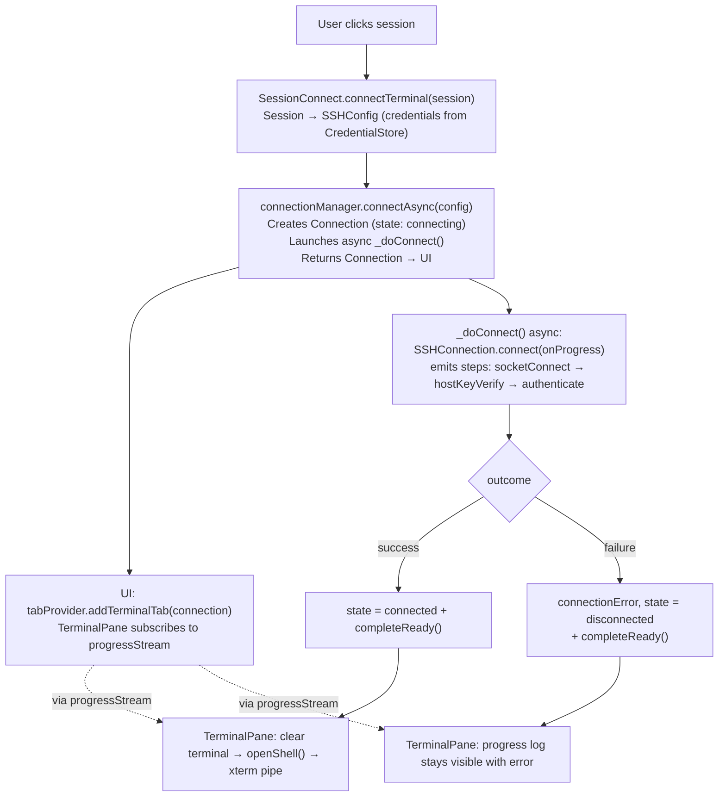

**Progress pipeline:** `SSHConnection.connect()` accepts an `onProgress` callback that emits `ConnectionStep` events at each phase boundary. `ConnectionManager._doConnect()` forwards these to `Connection.addProgressStep()`, which buffers them in `progressHistory` and broadcasts via `progressStream`. The UI subscribes to the stream (replaying history for late subscribers) and renders steps in real time.

**Reconnect flow:** When a terminal tab reconnects (user clicks "Reconnect" after disconnect), `TerminalTab._refreshConfig()` re-reads the `Session` from `sessionProvider` using `Connection.sessionId` and updates `Connection.sshConfig` before creating a new `SSHConnection`. This ensures reconnect picks up any session edits (e.g. added keys, changed password). Quick-connect tabs (`sessionId == null`) use the original config.

### 9.2 SFTP Init Flow

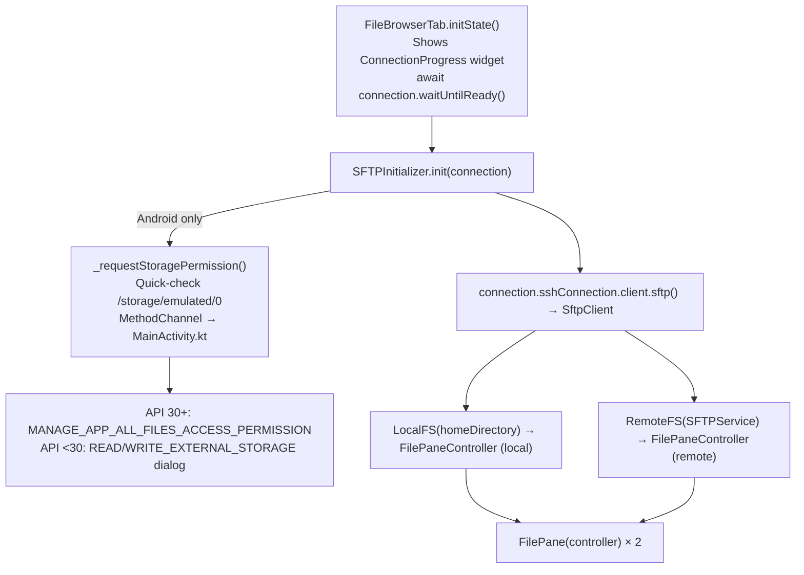

### 9.3 Session CRUD Flow

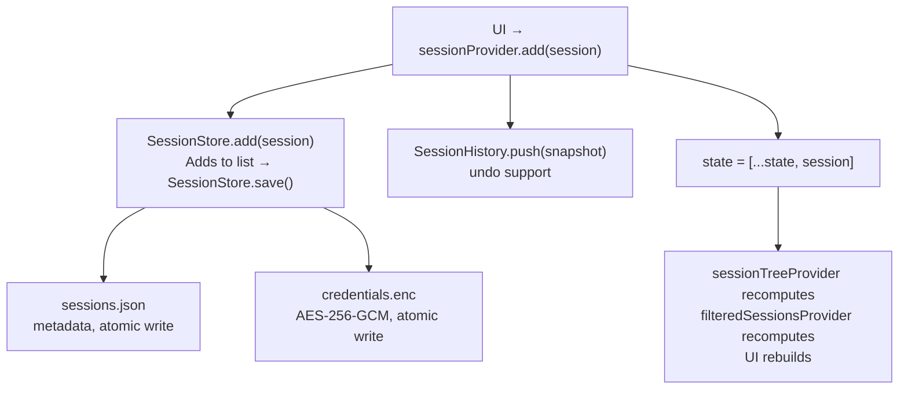

### 9.4 File Transfer Flow

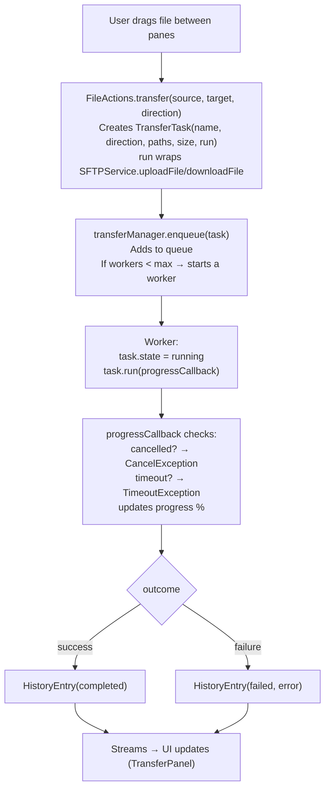

---

## 10. Data Models

### Session

```dart
Session {
  id: String              // UUID v4
  label: String           // display name
  folder: String           // folder path: "Production/Web" (/ separator)
  server: ServerAddress {
    host: String
    port: int             // default 22
    user: String
  }
  auth: SessionAuth {
    authType: AuthType    // password | key | keyWithPassword (Both)
    password: String      // empty if not used
    keyPath: String       // key file path (or ~)
    keyData: String       // PEM text (paste)
    passphrase: String    // for the key
  }
  createdAt: DateTime
  updatedAt: DateTime
  incomplete: bool        // QR import without credentials
}
```

### Connection

```dart
Connection {
  id: String              // UUID (bound to tab)
  label: String
  sshConfig: SSHConfig    // mutable — refreshed from session store on reconnect
  sessionId: String?      // links back to saved Session (null for quick-connect)
  knownHosts: KnownHostsManager  // for host key verification
  sshConnection: SSHConnection?
  state: SSHConnectionState  // disconnected | connecting | connected
  connectionError: Object?
  _readyCompleter: Completer // resolves after connect attempt
}
```

### TabEntry

```dart
TabEntry {
  id: String              // UUID
  label: String
  connection: Connection
  kind: TabKind           // terminal | sftp

  copyWith({label})       // same id, updated label
  duplicate()             // new UUID, same connection/label/kind
}
```

### FileEntry

```dart
FileEntry {
  name: String
  path: String            // full POSIX path
  size: int               // bytes
  mode: int               // Unix permissions (octal)
  modTime: DateTime
  isDir: bool
  owner: String           // parsed from ls -l longname
}
```

### TransferTask

```dart
TransferTask {
  name: String            // display name
  direction: TransferDirection  // upload | download
  sourcePath: String
  targetPath: String
  sizeBytes: int
  run: Future<void> Function(ProgressCallback)
  // Note: id, state, progress are managed by TransferManager (ActiveEntry wrapper),
  // not stored on TransferTask itself
}
```

### AppConfig

```dart
AppConfig {
  terminal: TerminalConfig {
    fontSize: double      // 6-72, default 14.0
    theme: String         // 'dark'|'light'|'system'
    scrollback: int       // ≥100, default 5000
  }
  ssh: SshDefaults {
    keepAliveSec: int     // default 30
    defaultPort: int      // default 22
    sshTimeoutSec: int    // default 10
  }
  ui: UiConfig {
    windowWidth: double
    windowHeight: double
    uiScale: double       // 0.5-2.0
    showFolderSizes: bool
    toastDurationMs: int  // default 4000
  }
  transferWorkers: int    // 1+, default 2
  maxHistory: int         // ≥0, default 500
  enableLogging: bool
  checkUpdatesOnStart: bool
  skippedVersion: String?
  locale: String?           // null = OS auto-detect, or supported locale code
}
```

---

## 11. Persistence & Storage

### Drift (SQLite) database

All application data is stored in a single SQLite database via the drift ORM:

| Table | Purpose | Key relationships |
|-------|---------|-------------------|
| `Sessions` | SSH sessions (metadata + credentials) | FK → Folders, FK → SshKeys |
| `Folders` | Folder tree (self-referencing `parentId`) | self-ref FK |
| `SshKeys` | SSH key pairs | — |
| `KnownHosts` | TOFU host key database | unique(host, port) |
| `AppConfigs` | Single-row config JSON blob | — |
| `Tags` | User-defined color tags | unique(name) |
| `SessionTags` | M2M: sessions ↔ tags | cascade on delete |
| `FolderTags` | M2M: folders ↔ tags | cascade on delete |
| `Snippets` | Reusable command snippets | — |
| `SessionSnippets` | M2M: sessions ↔ snippets | cascade on delete |
| `SftpBookmarks` | Saved remote paths per session | FK → Sessions, cascade |

### Files on disk

All files live in the platform's app-support directory (see **Location** below). Inside that directory:

| Path | Encryption | Format | Purpose | Created when |
|------|-----------|--------|---------|--------------|
| `letsflutssh.db` | SQLite3MultipleCiphers (PRAGMA key) | SQLite | All app data — sessions, folders, SSH keys, known hosts, tags, snippets, bookmarks, app config row | First write (after security setup) |
| `letsflutssh.db-wal` / `letsflutssh.db-shm` | inherits DB encryption | SQLite WAL | SQLite write-ahead log + shared memory; auto-managed by sqlite3 | Whenever DB is open |
| `config.json` | No | JSON | App config — theme, locale, font size, scrollback, transfer workers, update prefs. Loaded **before** the DB opens (needed for splash screen). Auto-lock timeout has been moved to the encrypted DB; the field is kept here only for one-shot migration | First config save |
| `credentials.kdf` | No | `'LFKD'` magic + version + KdfParams + 32-byte salt | Argon2id salt + params for master-password key derivation. Presence = master password is enabled. Legacy `credentials.salt` (PBKDF2, pre-migration) is detected by `MasterPasswordManager.hasLegacyFormat()` and routes through `LegacyKdfDialog` — no runtime read of PBKDF2 material | Master password setup |
| `credentials.verify` | No | AES-256-GCM | Encrypted known-plaintext blob — used to verify the entered master password matches | Master password setup |
| `logs/letsflutssh.log` | No | Text | App debug log (rotates at 5 MB, keeps 3 rotated copies). Disabled by default | First log write after user enables logging |
| `logs/letsflutssh.log.1`…`.3` | No | Text | Rotated log files | After log rotation |
| `app.lock` | No | PID text | Single-instance lock — exclusive `RandomAccessFile.lock`. OS releases on process exit | Each app start (desktop only) |

**Legacy files** (created by older versions, no longer used — safe to delete):
- `sessions.json`, `sessions.enc` — replaced by `letsflutssh.db` in v4.0
- `keys.json`, `keys.enc` — replaced by `SshKeys` table
- `known_hosts`, `known_hosts.enc` — replaced by `KnownHosts` table
- `credentials.enc` — replaced by SQLCipher-encrypted DB
- `credential.key` — eliminated; key now lives only in the OS keychain

### Database initialization

`database_opener.dart` opens the database with optional encryption:
- `openDatabase(encryptionKey: null)` → plain SQLite
- `openDatabase(encryptionKey: key)` → SQLite3MultipleCiphers with `PRAGMA key = "x'hex'"`
- `openTestDatabase()` → in-memory SQLite for tests
- Foreign keys enabled via `PRAGMA foreign_keys = ON` in setup callback
- **POSIX permissions:** `restrictDatabaseFilePermissions()` runs on every open and forces `chmod 600` on `letsflutssh.db` and any existing `-journal` / `-wal` / `-shm` sidecar (Linux/macOS via `chmod`, Windows via `icacls`). Idempotent; logs and continues if the call fails so a permission-system quirk never blocks startup. The file is pre-created before SQLite touches it so the very first encrypted page lands on a 0600 inode.

**Config split:** `config.json` is loaded before the database opens because it carries pre-unlock UI state (theme, locale, window size) — anything that has to render before the user types the master password. The auto-lock timeout, by contrast, is a security control: it now lives in the encrypted DB (`AppConfigs.auto_lock_minutes`) so an attacker with disk access cannot weaken it. The legacy field in `config.json` is read once on first DB unlock for migration, then zeroed.

**Location:** `path_provider` → `getApplicationSupportDirectory()`
- Linux: `~/.local/share/letsflutssh/`
- macOS: `~/Library/Application Support/letsflutssh/`
- Windows: `%APPDATA%\letsflutssh\`
- Android: app internal storage
- iOS: app sandbox

**Atomicity:** Handled by SQLite transactions — no manual atomic write pattern needed. `ImportService.applyResult` wraps its entire body in `AppDatabase.transaction(...)` via the injected `runInTransaction` hook, so a bulk import either fully lands or leaves the DB unchanged (a mid-import exception triggers SQLite rollback before the replace-mode snapshot restore runs).

**Schema migrations:** `AppDatabase` defines a `MigrationStrategy` (`onCreate` → `m.createAll()`, `onUpgrade` → per-version steps, `beforeOpen` → `PRAGMA foreign_keys = ON`). Bump `schemaVersion` when adding/renaming columns or tables and append a `from{N-1}to{N}` branch to `onUpgrade`. Never skip a version — the schema history above the `schemaVersion` getter documents every bump.

### Uninstall behavior

User data lives **outside** the install directory in `getApplicationSupportDirectory()`, so removing the app binary leaves the data behind by design — protects against accidental data loss on reinstall/upgrade. Users who want a clean uninstall:

| Platform | How user data is removed |
|----------|--------------------------|
| Windows (Inno Setup) | Uninstaller offers a "Also delete user data" checkbox. Unchecked by default. If checked, `%APPDATA%\letsflutssh\` is recursively deleted post-uninstall |
| Linux (.deb) | `apt-get remove` keeps user data; `apt-get purge` also removes config, but user data in `~/.local/share/letsflutssh/` must be deleted manually |
| Linux (AppImage) | No installer — delete `~/.local/share/letsflutssh/` manually |
| macOS (.dmg) | Drag-to-Trash leaves user data in `~/Library/Application Support/letsflutssh/` — delete manually |
| Android | OS uninstall removes the entire app sandbox including user data |
| iOS | OS uninstall removes the entire app sandbox including user data |

### Store → DAO pattern

Each store wraps a drift DAO and is injected with the database at startup:

```
main.dart → _injectDatabase()
  → sessionStoreProvider.setDatabase(db)
  → keyStoreProvider.setDatabase(db)
  → knownHostsProvider.setDatabase(db)
  → snippetStoreProvider.setDatabase(db)
  → tagStoreProvider.setDatabase(db)
```

Stores keep domain model APIs unchanged; DAOs handle SQL. Mappers (`mappers.dart`) translate between domain objects and drift companions.

---

## 12. Platform-Specific Behavior

| Aspect | Desktop (Linux/macOS/Windows) | Mobile (Android/iOS) |
|--------|-------------------------------|---------------------|
| Entry point | `MainScreen` (sidebar + tabs) | `MobileShell` (bottom nav) |
| Navigation | Sidebar + tab bar | Bottom nav: Sessions / Terminal / SFTP |
| Terminal | Tiling (split panes) | Full screen, single pane |
| File browser | Dual-pane (local + remote) | Single-pane (toggle) |
| Selection | Click + Ctrl/Shift + marquee | Long-press → bulk mode |
| Context menu | Right-click | Long-press |
| Keyboard | Hardware only (`hardwareKeyboardOnly: true`) | SSH keyboard bar + system |
| SSH keep-alive | OS keeps process alive | Foreground service (Android) |
| Home directory | `HOME` / `USERPROFILE` | Android: `EXTERNAL_STORAGE` / `/storage/emulated/0`; iOS: app Documents dir + folder picker |
| Drag & drop | desktop_drop + inter-pane | None |
| Deep links | `app_links` (URL scheme) | `app_links` (URL scheme + file intents) |
| Single instance | File lock (`app.lock`) | OS-managed natively |
| Font scaling | UI scale in settings | Pinch-to-zoom terminal |

### Android specifics

- **Storage permission** — `MANAGE_EXTERNAL_STORAGE` for full file access. Requested via the `com.letsflutssh/permissions` MethodChannel in `MainActivity.kt` — shared helper `utils/android_storage_permission.dart`. Android 11+ opens the system "All files access" settings page (`ACTION_MANAGE_APP_ALL_FILES_ACCESS_PERMISSION`); older versions use the standard `READ_EXTERNAL_STORAGE`/`WRITE_EXTERNAL_STORAGE` runtime dialog. No external plugin (avoids `permission_handler` GPS side-effects)
- **Export folder picker** — once `MANAGE_EXTERNAL_STORAGE` is granted, `.lfs` exports use the in-app [`LocalDirectoryPicker`](#widgets---public-api-reference) (a `dart:io` directory browser) instead of SAF's `ACTION_OPEN_DOCUMENT_TREE`. SAF asks for per-folder consent on every export even when all-files access is already granted — that's the UX bug the picker sidesteps. Without `MANAGE_EXTERNAL_STORAGE` the flow still falls back to the SAF picker via `file_picker.getDirectoryPath`
- **QR scanner** — native `QrScannerActivity.kt` using CameraX (AndroidX) for the preview pipeline and ZXing-core (Apache 2.0 jar) for decoding. Exposed through the `com.letsflutssh/qrscanner` MethodChannel, `method: scan`. **No Google Play Services / MLKit** — works offline on AOSP builds and degoogled devices
- `flutter_foreground_task` for keep-alive on screen lock
- APK split per ABI: arm64-v8a, armeabi-v7a, x86_64

### iOS specifics

- `NSLocalNetworkUsageDescription` required for local TCP
- `NSCameraUsageDescription` required for the QR scanner (scan-only)
- No foreground service (iOS background modes)
- **Local file browser** — starts in app's Documents directory (`getApplicationDocumentsDirectory()`), which is accessible via Files.app. Users can browse outside the sandbox via a "Pick Folder" button (iOS only, uses `file_picker` → `UIDocumentPickerViewController` in folder mode). Security-scoped access is granted for the session after the user picks a folder
- **QR scanner** — `QrScannerController.swift` built on `AVCaptureSession` with `AVMetadataMachineReadableCodeObject` restricted to `.qr`. System framework only, zero external dependencies. Registered on the shared `com.letsflutssh/qrscanner` channel from `AppDelegate`

### Desktop window constraints

All desktop platforms enforce a minimum window size of **480 × 360** logical pixels to prevent layout overflow:

| Platform | File | Mechanism |
|----------|------|-----------|
| Windows | `windows/runner/win32_window.cpp` | `WM_GETMINMAXINFO` with DPI scaling |
| Linux | `linux/runner/my_application.cc` | `gtk_window_set_geometry_hints` (`GDK_HINT_MIN_SIZE`) |
| macOS | `macos/Runner/MainFlutterWindow.swift` | `NSWindow.contentMinSize` |

Additionally, internal resizable elements (sidebar, file browser columns, split panes) use overflow-safe patterns:
- **`ClippedRow`** (`widgets/clipped_row.dart`): drop-in `Row` replacement with custom `_ClippedRenderFlex` that clips overflow and suppresses the debug overflow indicator entirely. Used in file browser rows, column headers, breadcrumb paths, connection bar, and transfer panel
- **Sidebar text** (`_SidebarFooter`, `_PanelHeader`, session tree rows): `Flexible` / `Expanded` with `TextOverflow.ellipsis`
- **Welcome screen**: `SingleChildScrollView` prevents vertical overflow on small windows

### Single-instance protection (desktop only)

Prevents multiple app instances from running simultaneously, which would corrupt the shared database.

**Mechanism:** exclusive file lock via `RandomAccessFile.lock(FileLock.exclusive)` on `app.lock` in the app data directory (`getApplicationSupportDirectory()`). The OS kernel automatically releases the lock when the process exits (even on crash), so there are no stale lock files.

**Flow:**
1. `main()` → `SingleInstance.acquire()` before `runApp()`
2. If lock acquired → proceed normally
3. If lock fails → show `_AlreadyRunningApp` (minimal dialog: "Another instance is already running" + OK button → `exit(0)`)

**Mobile:** skipped — Android/iOS manage single instance natively.

**File:** `core/single_instance/single_instance.dart`

### Windows specifics

- `hardwareKeyboardOnly: true` — xterm TextInputClient bug
- Inno Setup for EXE installer
- `USERPROFILE` for home directory

---

## 13. Security Model

### Three-level encryption

All data stores support three security levels (see §3.6):

| Level | Key source | Database encryption |
|-------|-----------|---------------------|
| Plaintext | None | `letsflutssh.db` — unencrypted SQLite |
| Keychain | OS keychain (`flutter_secure_storage`) | `letsflutssh.db` — SQLite3MultipleCiphers (PRAGMA key) |
| Master Password | Argon2id-derived | `letsflutssh.db` — SQLite3MultipleCiphers (PRAGMA key) + `credentials.kdf` + `credentials.verify` |

Encryption is applied at the database level via SQLite3MultipleCiphers — a single encrypted DB file replaces the old per-store AES-256-GCM files.

### First-launch wizard

`SecuritySetupDialog` shown on first launch (no data files on disk):
1. Probes OS keychain via `SecureKeyStorage.isAvailable()` — a write+read+delete cycle on macOS/iOS/Windows/Android, an env-only check on Linux until the user has opted into keychain storage (see [SecureKeyStorage](#securekeystorage))
2. Keychain found → offers "Continue with Keychain" or "Set Master Password"
3. Keychain not found → offers "Continue without Encryption" or "Set Master Password"

### Startup security flow

`_initSecurity()` in `main.dart` — database file is the sole source of truth for detecting existing installs (no legacy file detection):
1. DB file exists + `hasLegacyFormat()` → show `LegacyKdfDialog` → reset or quit
2. DB file exists + master-password enabled → biometric first, else `UnlockDialog` → derive key
3. DB file exists + keychain has key → read from keychain
4. DB file exists but no encryption → plaintext mode
5. No DB file → first launch → show `SecuritySetupDialog` wizard
6. Open database via `_injectDatabase(key, level)` → `openDatabase(encryptionKey)` → `setDatabase()` on all stores + update `securityStateProvider`

### Master password

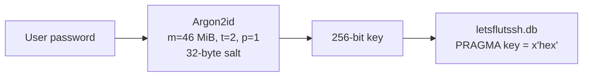

- **Detection:** `credentials.kdf` exists (or legacy `credentials.salt` — routes through `LegacyKdfDialog`)
- **Verification:** `credentials.verify` = AES-256-GCM(known plaintext "LetsFLUTssh-verify")
- **Enable flow:** derive key → re-open database with new key → delete keychain key if present
- **Disable flow:** try keychain → generate random key → re-open database → delete `credentials.kdf` (+ any residual legacy salt) + verifier. No keychain → plaintext fallback
- **Change flow:** verify old → derive new → re-open database with new key
- **Forgot password:** deletes encrypted database + kdf/salt/verifier files

### Update channel integrity

Every release artefact (`.deb`, `.AppImage`, `.tar.gz`, `.zip`, `.exe`,
`.dmg`, `.apk`) ships with a detached Ed25519 signature produced in CI
by `openssl pkeyutl -sign` against the `RELEASE_SIGNING_KEY` secret
(see `.github/workflows/build-release.yml` step *Sign release artefacts
(Ed25519)*). The `<asset>.sig` is uploaded alongside the binary and
mirrored from the same GitHub release.

On the client, `UpdateService.downloadAsset`:

1. Downloads the binary under `<targetDir>/`
2. Validates the SHA-256 from the Releases JSON (secondary — catches
   disk corruption and "attacker replaced only the binary" on its own)
3. Delegates to `ReleaseArtifactVerifier`, which by default
   fetches `<asset>.sig` and calls `ReleaseSigning.verifyFile` —
   Ed25519 verify against **two** pinned public keys (current + backup).
   Either key matches → accept.
4. Any failure deletes both the binary and the sig, throws
   `InvalidReleaseSignatureException`. The install step never runs on
   an unverified artefact.

**Why this is independent of SHA-256 / TLS:** SHA-256 and the asset
URL come from the same `api.github.com` response, so a MITM who can
rewrite that response supplies both. TLS protects the channel only if
DNS, every trusted CA, and the network path are intact — attackers
have compromised all three historically. The Ed25519 signature comes
from a private key held offline by the maintainer and verified by a
public key compiled into the binary; the updater does not consult any
online service at verify time.

**Rotation:** the app embeds two public keys. If the current private
key ever leaks the maintainer swaps the `RELEASE_SIGNING_KEY` secret
to the backup, generates a fresh backup pair offline, and ships the
next release with `[backup, fresh-backup]` in `release_signing.dart`.
Already-installed builds keep verifying via the (now-active) backup
pin. Full playbook in `.github/SECURITY.md`.

**SPKI pinning (optional, off by default):** `CertPinning` adds a
`badCertificateCallback` on the update HTTP client that checks the
presented leaf cert's SPKI against a per-host pin set. Pin map is
empty until the maintainer captures the current GitHub SPKI hashes
via the `openssl s_client | x509 -pubkey | sha256 | base64` pipeline
documented in the class. Shipping empty pins keeps behaviour at
system-CA validation (same as before); populated pins strengthen the
transport layer on top of the release signature.

### .lfs export

```
v3 header (current writer):
  ['LFSE' 4] [0x02 version 1] [KdfParams block ≤16] [salt 32B] [IV 12B]
  [AES-256-GCM(ZIP(sessions + keys + config + known_hosts + tags + snippets))]

Key = Argon2id(password, salt, m=46 MiB, t=2, p=1)
```

Read-only legacy paths: v2 archives (`[LFSE][0x01][iters][salt][iv][ct]`)
and v1 headerless archives (raw salt, no magic) still decrypt via
PBKDF2-SHA256 for backward compatibility with user backups. See the
.lfs format table in §3.7 for the full layout.

Export decrypts known_hosts via `KnownHostsManager.exportToString()`. Import returns content for caller to import via `KnownHostsManager.importFromString()`.

Sessions are serialized with credentials via `toJsonWithCredentials()`. Empty folders are stored as a JSON array of folder paths. Manager keys, tags (with session/folder assignments), and snippets (with session links) are each stored in separate JSON files inside the ZIP archive (see [§3.9](#39-import-coreimport) for full file list).

The archive also carries a `manifest.json` with `schema_version` (current: `ExportImport.currentSchemaVersion`, sourced from `SchemaVersions.archive`), optional `app_version`, and `created_at`. Archives whose `schema_version` is missing, malformed, or does not match the current build are rejected with `UnsupportedLfsVersionException` — the user re-exports from the current app version. Future format bumps ship a `Migration` registered in `lib/core/migration/archive_registry.dart` (see §3.7) instead of a permanent read-only fallback.

### TOFU (Trust On First Use)

- New host → dialog with SHA256 fingerprint → user accepts/rejects
- Changed key → warning dialog → user accepts/rejects
- Without callback → reject (fail-safe)
- Known hosts stored in DB `KnownHosts` table (encrypted with rest of DB)

### Deep link validation

- URL scheme whitelist
- Path traversal rejection (`../`)
- Host/port sanitization

### Error sanitization & localization

- `sanitizeError()` translates OS-locale error text to English using errno codes — **for logging only**
- `localizeError(S l10n, Object error)` maps errno codes, `SSHError` subtypes, and `TimeoutException` to localized strings via `S` — **for UI display**
- Handles `SSHError` chain: preserves structured data (`host`, `port`, `user`), sanitizes `cause` recursively
- 43 errno codes mapped (30 POSIX/Linux + 13 Windows Winsock)
- `SSHError` subtypes carry structured fields: `AuthError(user, host)`, `ConnectError(host, port)`, `HostKeyError(host, port)`
- `SFTPError` (`core/sftp/errors.dart`) — typed SFTP error with `message`, `cause`, `path`, `statusCode`, `userMessage`. Factory `SFTPError.wrap(error, op, path)` for wrapping raw exceptions with operation context
- `Connection.connectionError` stores raw `Object?` — localized at display time with `localizeError`
- Unknown errno → original OS text preserved as-is
- Applied in: `ConnectionManager`, `TerminalTab.reconnect()`, `TransferManager` (+ path stripping, inline error in transfer panel)

### Error Handling Architecture

#### Global Error Boundary (`main.dart`)

Three-layer error handling catches all errors at appropriate levels:

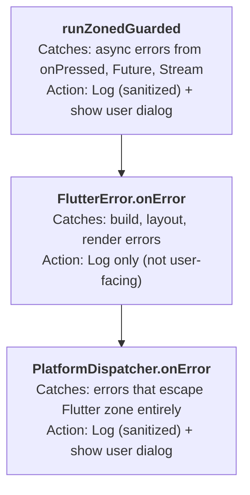

**Error dialog behavior:**
- Shows via `WidgetsBinding.instance.addPostFrameCallback` — ensures Navigator is available
- Uses `useRootNavigator: true` — works even if current Navigator is broken
- Wrapped in `try/catch` — if dialog fails to show, error is logged
- User sees brief message; full details saved to log file (if logging enabled)

#### Sensitive Data Sanitization (`utils/sanitize.dart`)

All error messages are sanitized before logging to prevent accidental exposure of:

| Pattern | Redacted to | Example |
|---------|-------------|---------|
| `user@host` | `<user>@host` | `admin@example.com` → `<user>@example.com` |
| IPv4 | `<ip>` | `192.168.1.100` → `<ip>` |
| `host:port` | `host:<port>` | `example.com:2222` → `example.com:<port>` |
| Windows paths | `<path>` | `C:\Users\john\Documents\file.pem` → `<path>\Documents\file.pem`; bare `C:\Users\john` → `<path>` |
| Unix paths | `/<user>` | `/Users/john/.ssh/id_rsa` → `/<user>/.ssh/id_rsa`; bare `/home/john` → `/<user>` |

Usage: `sanitizeErrorMessage(message)` before logging any error that may contain connection details or file paths.

#### AppLogger (`utils/logger.dart`)

```dart
void log(String message, {String? name, Object? error, StackTrace? stackTrace});
```

- File logging is **disabled by default** — user enables via Settings → Enable Logging
- Auto-rotation at 5 MB, keeps 3 rotated files
- **Never** log sensitive data — use `sanitizeErrorMessage()` for error messages
- `stackTrace` parameter writes full stack trace to log file for debugging

#### Local Error Handling

Global handler is a safety net. Expected errors should be caught locally with `try/catch`:

```dart
try {
  await FilePicker.pickFiles(...);
} catch (e, stack) {
  AppLogger.instance.log('Failed to pick file: $e', name: 'Tag', error: e, stackTrace: stack);
  // Show user-friendly message or fallback
}
```

This provides:
- Immediate, context-aware error handling
- Graceful fallback (e.g., show "file picker unavailable" instead of crash)
- Clearer log messages with operation context

---

## 14. Testing Patterns & DI Hooks

### Injectable factories

| Class | DI parameter | Purpose |
|-------|------------|---------|
| `SSHConnection` | `socketFactory`, `clientFactory` | Mock TCP/SSH |
| `ConnectionManager` | `connectionFactory` | Mock connection creation |
| `TerminalTab` | `reconnectFactory` | Mock reconnect logic |
| `FileBrowserTab` | `sftpInitFactory` | Mock SFTP initialization |
| `MobileFileBrowser` | `sftpInitFactory` | Mock SFTP initialization (mobile) |
| `ForegroundServiceManager` | `create()` factory | Platform-specific impl |

### Platform overrides

```dart
debugMobilePlatformOverride = true;    // force mobile layout in tests
debugDesktopPlatformOverride = true;   // force desktop layout in tests
```

### Shared test helpers (`test/helpers/`)

| File | Contents |
|------|----------|
| `test_notifiers.dart` | `TestConfigNotifier`, `PrePopulatedConfigNotifier`, `PrePopulatedSessionNotifier`, `PrePopulatedWorkspaceNotifier`, `PrePopulatedUpdateNotifier`, `FixedVersionNotifier` |
| `fake_session_store.dart` | `FakeSessionStore` (in-memory), `ThrowingSessionStore` |

### Test file mapping

Rule: **one test file per source file** (`lib/core/ssh/ssh_client.dart` → `test/core/ssh/ssh_client_test.dart`). No `_extra_test.dart` files.

### Mock generation

Uses `mockito` + `@GenerateMocks`. Generated mocks: `*.mocks.dart`.

### Fuzz testing

Two layers of fuzz testing:

**Dart property-based tests** (`test/fuzz/`): run as part of `make test` (included in `test/`). Generate random/malformed inputs for parsers and verify they never crash with unhandled exceptions. Targets:

| Test file | Fuzzed function | Input type |
|-----------|----------------|------------|
| `fuzz_session_json_test.dart` | `Session.fromJson()` | Random JSON maps |
| `fuzz_qr_codec_test.dart` | `decodeExportPayload()`, `decodeImportUri()` | Random strings, URIs |
| `fuzz_app_config_test.dart` | `AppConfig.fromJson()` + sub-configs | Random JSON maps |
| `fuzz_deeplink_test.dart` | `DeepLinkHandler.parseConnectUri()` | Random URIs |
| `fuzz_format_test.dart` | `sanitizeError()`, `formatSize()`, `formatDuration()` | Random strings, errno patterns, objects |

**Standalone fuzz harnesses** (`fuzz/`): compiled to native via `dart compile exe` (`make fuzz-build`). Read from stdin, exercise parsing logic, used by ClusterFuzzLite/AFL++ in CI. Targets: `fuzz_json_parser`, `fuzz_known_hosts`, `fuzz_uri_parser`.

**CI integration**: `.github/workflows/cfl-fuzz.yml` runs ClusterFuzzLite on push to main and PRs to main. Detected by OpenSSF Scorecard's Fuzzing check.

---

## 15. CI/CD Pipeline

### 15.1 Branching Model

Two branches: **`dev`** (daily work) and **`main`** (releases only).

- All app development happens on `dev`. Push freely — CI and security scans run on PRs (not on every push). No tags, no builds, no releases.
- To release: merge `dev` → `main`. Everything is automatic: CI → auto-tag → build → release.
- Never push app changes directly to `main`. Dependabot PRs and CI/docs-only fixes are exceptions.
- **Contributors** work via forks → PR into `dev`. CI runs on PRs automatically. Maintainer reviews and merges.

**Branch Protection (GitHub Rulesets):**

| Ruleset | Branch | Rules | Bypass |
|---------|--------|-------|--------|
| `main` | `main` | No deletion, no force-push, PR required, all CI checks required | None |
| `dev-protect` | `dev` | No deletion, no force-push | None |
| `dev-checks` | `dev` | All CI checks required (`ci`, `osv-scan`, `semgrep-scan`, `codeql-scan`) | Admin — allows direct push |

### 15.2 Workflow Graph

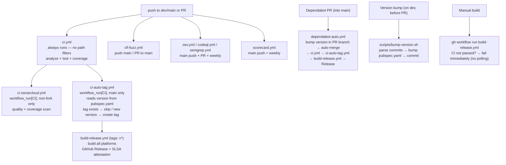

### 15.3 Workflow Catalog

| Workflow | Trigger | Branches | Purpose | Blocks release? |
|----------|---------|----------|---------|-----------------|
| `ci.yml` | push main / PR (all) | main, dev | analyze + test + coverage | Yes (required) |
| `ci-auto-tag.yml` | workflow_run[CI] success | main only | Reads version, creates tag if new | — |
| `build-release.yml` | push tag v* / manual | — | Build all platforms + release | — |
| `ci-sonarcloud.yml` | workflow_run[CI] / manual | main, dev | Quality + coverage scan | No (warn-only) |
| `dependabot-auto.yml` | PR (dependabot) | main | Bump version in PR branch + auto-merge patch/minor | — |
| `osv.yml` | push main / PR (all) / weekly | main | CVE scan (pubspec.lock) | Yes on PR |
| `codeql.yml` | push main / PR (all) / weekly | main | GitHub Actions analysis | Yes on PR |
| `semgrep.yml` | push main / PR (all) / weekly | main | SAST scan (Dart code) | Yes on PR |
| `cfl-fuzz.yml` | push main / PR to main | main | cfl-fuzz | No |
| `scorecard.yml` | push main / weekly | main | OpenSSF supply chain assessment | No |

**External Integrations:**

| Service | Config | Purpose |
|---------|--------|---------|
| GitGuardian | `.gitguardian.yml` | Secret detection on PRs. Test files (`test/**`) and localization files (`lib/l10n/**`) are excluded — they contain fake credentials and translated "password" labels that trigger false positives |

### 15.4 Makefile Targets

#### Development

| Target | Command | Purpose |
|--------|---------|---------|
| `make run` | `flutter run` | Run (debug) |
| `make run-release` | `flutter run --release` | Run (release) |
| `make test` | `flutter test --coverage --timeout 30s` | Tests with coverage |
| `make analyze` | `flutter analyze --fatal-infos` | Lint + analyze |
| `make check` | analyze + test | Full check |
| `make format` | `dart format .` | Format code |
| `make gen` | `build_runner build` | Code generation |
| `make deps` | `flutter pub get` | Install dependencies |
| `make fuzz-build` | `dart compile exe fuzz/*.dart` | Compile native fuzz targets |

#### Build

| Target | Platform |
|--------|----------|
| `make build-linux` | Linux x64 |
| `make build-macos` | macOS universal |
| `make build-apk` | Android per-ABI |
| `make build-aab` | Android App Bundle |
| `make build-ios` | iOS |

#### Packaging

| Target | Format |
|--------|--------|
| `make package-linux` | tar.gz |
| `make package-appimage` | AppImage |
| `make package-deb` | .deb |
| `make package-windows` | .zip |
| `make package-exe` | Inno Setup EXE |

---

## 16. Design Decisions & Rationale

### 16.1 Architecture Choices

| Decision | Why |
|----------|-----|
| **Self-contained binary, zero manual setup** for end-user | App must run from a single extracted bundle. External OS deps allowed only if (1) graceful degradation with in-UI message and (2) install documented in README per platform. Preference order: bundle > built-in fallback > documented optional install. See [§1 Self-contained-binary principle](#1-high-level-overview) |
| **Shared modules over local one-offs** at every layer | Single source of truth for visual, behavioural, and persistence patterns; second caller triggers extraction, third makes it mandatory. Produced `AppDialog`/`AppIconButton`/`AppDataRow`/`StyledFormField` (UI), `AppTheme.radius*`/`AppFonts.*`/`*ColWidth` (theme), `SftpBrowserMixin`/`key_file_helper.dart`/`breadcrumb_path.dart` (logic), `Store → DAO` template (persistence). See [§1 Reuse principle](#1-high-level-overview) |
| drift (SQLite) instead of JSON files | Referential integrity, folder tree with FK, M2M tags/snippets, single encrypted DB file via SQLite3MultipleCiphers |
| SQLite3MultipleCiphers (build hooks) | DB-level encryption replaces per-store AES-GCM. Bundled via `hooks: user_defines: sqlite3: source: sqlite3mc` — no external native libs needed |
| Config stays file-based | Theme/locale needed before DB opens (chicken-and-egg with encryption key) |
| `pointycastle` instead of `encrypt` | Version conflict with dartssh2 |
| Three-level security (plaintext/keychain/master password) | Honest security: DB-level encryption via PRAGMA key. OS keychain optional with graceful fallback |
| Accept per-platform asymmetry, don't escalate working baselines | Cross-platform packages with documented per-platform limits are the chosen budget across all domains (storage, file pickers, notifications, biometrics, IPC, hardware probes). Per-platform native rewrites are out of scope unless explicitly requested — N× code paths rarely worth a marginal upgrade. See [AGENT_RULES § Don't Escalate Working Baselines](AGENT_RULES.md#dont-escalate-working-baselines) |
| `flutter_secure_storage` as optional dep | OS keychain for automatic encryption; app works without it (libsecret on Linux is optional) |
| `app_links` instead of `uni_links` | Desktop support |
| Widget-local controllers (`FilePaneController`, `UnifiedExportController`, `SessionPanelController`, `TransferPanelController`) use `ChangeNotifier` | Match tool to scope: app-state lives in Riverpod `NotifierProvider`, dialog / pane / panel state that takes constructor args or owns caches uses `ChangeNotifier + AnimatedBuilder` — side-channel Riverpod overrides would be pure ceremony |
| Sealed class `SplitNode` | Recursive split tree with type safety |
| Each terminal pane → own SSH shell | Shared `SSHConnection`, independent shells |
| `Listener` for marquee | Raw pointer events don't conflict with `Draggable` |
| `IndexedStack` for tabs | Preserves terminal state when switching tabs |
| `GlobalKey` for tab widgets | Preserves widget state when tab is dragged to a new panel |
| Separate `features/mobile/` | Different interaction patterns, not a responsive adaptation |
| Global `navigatorKey` for host key dialog | SSH callback arrives without BuildContext |
| `AnimationStyle.noAnimation` | Animations disabled (Flutter 3.41+), design decision |
| `AppShortcutRegistry` singleton | Centralized shortcut definitions; all key combos in one place, ready for future user-override settings page |
| `matches()` checks only ctrl/shift | Original handlers didn't check alt/meta; WSLg can report phantom meta, causing false negatives |

### 16.2 API Gotchas

| Problem | Solution |
|---------|----------|
| `ConnectionState` conflict with Flutter async.dart | Use `SSHConnectionState` |
| dartssh2 host key callback: `FutureOr<bool> Function(String type, Uint8List fingerprint)` | Not SSHPublicKey — remember the signature |
| dartssh2 SFTP: `attr.mode?.value` | Not `.permissions?.mode` |
| dartssh2 SFTP: `remoteFile.writeBytes()` | Not `.write()` |
| xterm TextInputClient broken on Windows | `hardwareKeyboardOnly: true` on desktop |

### 16.3 Security Decisions

| Decision | Rationale |
|----------|-----------|
| Argon2id m=46 MiB t=2 p=1 | OWASP 2024 recommended floor — memory-hard, resists GPU/ASIC cracking much better than PBKDF2 |
| Force-breaking DB KDF migration | No backward compat for `credentials.salt`: `LegacyKdfDialog` forces reset-or-exit. Keeps the attack surface to a single KDF at runtime |
| .lfs import keeps PBKDF2 read path | User backups can't be regenerated; new writes use Argon2id |
| chmod 600 | Minimal permissions on sensitive files |
| TOFU reject without callback | Fail-safe: if no UI → reject |
| `CredentialStoreException` with two types | Distinguish "no credentials" from "corrupt key" |
| SessionStore abort on credential load failure | Prevents overwriting encrypted store |
| SessionStore concurrent load guard | Prevents race condition when multiple lifecycle events fire simultaneously |
| `RandomAccessFile` + try/finally for upload | Guarantees file handle cleanup |
| Error sanitization | Don't expose file paths to user |
| Deep link path traversal rejection | URL handling security |

### 16.4 Platform Decisions

| Decision | Platform | Rationale |
|----------|----------|-----------|
| `EXTERNAL_STORAGE` env + fallback | Android | Not all devices set the env var |
| `MANAGE_EXTERNAL_STORAGE` permission | Android | Access files outside sandbox |
| `NSLocalNetworkUsageDescription` | iOS | Required for local TCP (SSH connections) |
| Foreground service | Android | Prevents SSH kill on screen lock |
| Per-ABI APK split | Android | Reduces APK size |
| Universal binary | macOS | Intel + Apple Silicon in one binary |

---

## 17. Dependencies

> **Versions are NOT listed here** — `pubspec.yaml` is the single source of truth.
> Run `flutter pub deps` to see the resolved dependency tree.

### Runtime

| Package | Purpose |
|---------|---------|
| `flutter_localizations` | Flutter i18n delegates (SDK package) |
| `intl` | ICU message formatting for l10n |
| `dartssh2` | SSH2 protocol (auth, shell, SFTP) |
| `xterm` | Terminal emulator widget |
| `flutter_riverpod` | State management |
| `drift` | Typed SQLite ORM (database, DAOs, codegen) |
| `drift_flutter` | Flutter integration for drift (NativeDatabase) |
| `pointycastle` | AES-256-GCM encryption (transitive via dartssh2) |
| `pinenacl` | Ed25519 verify for release-signature check |
| `crypto` | SHA-256 over DER for SPKI pinning |
| `path_provider` | App data directories |
| `archive` | ZIP for .lfs export/import |
| `desktop_drop` | OS drag & drop |
| `flutter_foreground_task` | Android foreground service |
| `app_links` | Deep links + file intents |
| `qr_flutter` | QR code generation |
| `file_picker` | File selection |
| `package_info_plus` | App version at runtime |
| `url_launcher` | Open URLs |
| `uuid` | UUID generation |
| `path` | Cross-platform path utils |
| `json_annotation` | JSON serialization |

### Dev

| Package | Purpose |
|---------|---------|
| `flutter_lints` | Lint rules |
| `mockito` | Test mocking |
| `build_runner` | Code generation |
| `drift_dev` | Drift code generator |
| `json_serializable` | JSON code gen |
| `build_verify` | Verifies build_runner output is up-to-date |
| `plugin_platform_interface` | Platform interface for plugin packages |
| `flutter_launcher_icons` | App icon gen |

### Bundled Fonts

| Font | Purpose | Location |
|------|---------|----------|
| Inter | UI text | `assets/fonts/` |
| JetBrains Mono | Terminal, monospaced data | `assets/fonts/` |

### SDK Constraints

- **Flutter** ≥ 3.41.0 (stable channel)
- **Dart** ≥ 3.11.3 (ships with Flutter ≥ 3.41.0)

See `pubspec.yaml` → `environment` section for the canonical constraint. Run `flutter --version` to check.

### Lint Rules

Base: `flutter_lints/flutter.yaml` + custom:
- `prefer_const_constructors`, `prefer_const_declarations`
- `prefer_final_locals`, `prefer_single_quotes`
- `sort_child_properties_last`, `use_key_in_widget_constructors`
- `avoid_print`, `prefer_relative_imports`
- Excludes: `*.g.dart`, `*.freezed.dart`
